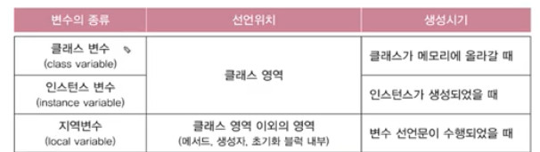

# Ch06
## 객체지향 프로그래밍(OOP)의 4가지 핵심개념
- 캡슐화
- 상속
- 추상화
- 다형성
## 객체지항 개념 공부법
- 객체지향 개념은 규칙이기 때문에 일단 외워라.
- A4용지 2장정도 되는데 그거 외우삼
- 계속 기억하고 있어야 코딩이 가능하다.
## 클래스와 객체
### 클래스와 객체의 정의와 용도
- 클래스의 정의: 클래스란 객체를 정의해 놓은 것임
- 클래스의 용도: 객체를 생성하는데 사용

<br>

- 객체의 정의: 실제로 존재하는 것. 사물 또는 개념
- 객체의 용도: 객체의 속성과 기능에 따라 다름  
```
클래스: 제품 설계도
객체: 제품
```
## 객체의 구성요소 - 속성과 기능
- `객체 = 속성(변수) + 기능(메서드)`
## 하나의 소스파일에 여러 클래스 있는 경우
- public 클래스가 있는 경우, 소스파일의 이름은 반드시 public 클래스의 이름과 일치해야한다. (대소문자까지 일치해야함.)
- 하나의 소스파일에 둘 이상의 public클래스가 존재하면 안된다.
- main 메서드가 있는 클래스 이름이 소스파일 이름과 일치해야 한다.

## 객체의 생성과 사용
```java
클래스명 변수명;            // 클래스의 객체를 참조하기 위한 참조변수를 선언
변수명 = new 클래스명();    // 클래스의 객체를 생성 후, 객체의 주소를 참조변수에 저장
```
### 참조변수와 인스턴스
- 하나의 인스턴스를 여러 개의 참조변수가 가리키는 경우는 가능.
- 여러 인스턴스를 하나의 참조변수가 가리키는 경우는 불가능.

## 객체 배열
객체 배열 == 참조변수 배열
```java
Tv[] tvArr = new Tv[3];     // 길이가 3인 Tv타입의 참조변수 배열
```
- 아래와 같이 객체를 배열에 꼭 넣어줘야 한다.
```java
// 객체를 생성해서 배열의 각 요소에 저장
tvArr[0] = new Tv();
tvArr[1] = new Tv();
tvArr[2] = new Tv();

// 위의 코드와 아래의 코드는 실행결과가 같다.
Tv[] tvArr = {new Tv(), new Tv(), new Tv()};
```
## 클래스의 정의
1. 설계도
2. 데이터 + 함수
3. 사용자 정의 타입

### 클래스 == 데이터 + 함수
- 변수: 하나의 데이터를 저장할 수 있는 공간
- 배열: 같은 종류의 여러 데이터를 하나로 저장할 수 있는 공간
- 구조체: 서로 관련된 여러 데이터를 **데이터의 종류와 상관없이** 하나로 저장할 수 있는 공간
- 클래스: 데이터와 함수의 결합 (구조체 + 함수)
### 클래스 == 사용자 정의 타입
- 사용자 정의 타입: 원하는 타입을 직접 만들 수 있다.
```java
// 비객체지향적 코드
int hour = 12;
int minute = 34;
int second = 56;
```
```java
// 객체지향적 코드
class Time{
    int hour;
    int minute;
    int second;
}

Time t = new Time();

t.hour = 12;
t.minute = 34;
t.second = 56;
```

## 선언 위치에 따른 변수의 종류
### 변수 3가지
1. 인스턴스 변수(iv)
2. 클래스 변수(cv)
3. 지역변수(lv)
### 영역 2가지
1. 클래스 영역
2. 메서드 영역
```java
class Variables {
    static int cv;      // 클래스 변수(static변수, 공유변수)
    int iv;             // 인스턴스 변수

    void method() {
        int lv = 0;     // 지역변수
    } // 메서드 영역
} // 클래스 영역 : 선언문만 가능
```
- 선언 순서 상관 x, 보통 변수를 위에, 메서드를 밑에 선언

- **객체는 프로그래밍 관점에서 보면 iv를 여러개 묶어놓은 것이다.**
- cv는 객체생성 안해도 자동으로 메모리에 올라감
- iv는 객체 생성되었을 때 사용가능
- lv는 메서드 종료시 자동 제거
    - 매개변수도 지역변수

## 클래스 변수와 인스턴스 변수
```java
class Card {
    // 개별적인 속성은 인스턴스 변수로 지정한다.
    String kind;
    int number;

    // 공통적인 속성은 클래스 변수로 지정한다.
    static int width = 100;
    static int height = 250;
}
```
- 객체를 여러개 만들면 iv도 여러개 생성되지만 cv는 하나만 생성된다.
### 클래스 변수와 인스턴스 변수의 사용에는 차이점이 있다.
- 먼저, 다음과 같이 Card 객체를 생성한다.
```java
Card c = new Card();
```
- 변수를 사용해보자.
```java
// iv 사용
c.kind = "HEART";
c.number = 5;

// 잘못된 cv 사용
c.width = 200;
c.height = 300;
```
- iv는 참조변수를 통해 사용하지만, 클래스 변수는 위와 같이 사용하는 것이 바람직하지 않다.
    - 왜냐면 하나의 참조변수를 통해 cv를 변경하면, 다른 참조변수의 cv도 모두 변경되기 때문이다.
- 따라서 클래스 변수는 혼동을 방지하기 위해 아래와 같이 사용한다.
```java
Card.width = 200;
Card.height = 300;
```
## 메서드란? 메서드의 선언부와 구현부
- 메서드
    - 작업단위로 문장들을 묶어서 이름 붙인 것
    - 값(입력)을 받아서 처리하고, 결과를 반환(출력)
    ```java
    반환타입 메서드이름(타입 변수명1, 타입 변수명2) {      // 선언부
            // 메서드 호출시 수행될 코드                   // 구현부
    }

    int add(int x, int y) {
        int result = x + y;

        return result;
    }
    ```
### 메서드의 작성
- 반복적으로 수행되는 여러 문장을 메서드로 작성
- 하나의 메서드는 한가지 기능만 수행하도록 작성

## 메서드의 실행흐름
1. 객체 생성
2. 메서드 호출
3. 메서드의 구현부가 실행되고 호출한 곳으로 돌아와 이후의 문장을 실행

## return문
- 실행 중인 메서드를 종료하고 호출한 곳으로 되돌아간다.
- 반환타입이 void가 아닌 경우, 반드시 return문 필요
- 반환값을 저장할 변수도 메서드의 반환 타입과 같아야한다.(자동형변환 가능)

## 호출 스택(call stack)
- 스택(stack): 밑이 막힌 상자. 위에 차곡차곡 쌓인다. (LIFO)
- 호출 스택: 메서드 수행에 필요한 메모리가 제공되는 공간
    - 메서드가 호출되면 호출 스택에 메모리 할당, 종료되면 해제
    - 맨 위의 메서드 하나만 실행 중이고 나머지는 대기중

## 기본형/참조형 매개변수
- 기본형 매개변수: 변수의 값을 읽기만 할 수 있다.(read only)
- 참조형 매개변수: 변수의 값을 읽고 변경할 수 있다. (read & write)

## 참조형 반환타입
- 객체(객체주소)를 반환한다.

## static 메서드와 인스턴스 메서드
- iv 사용여부로 나뉨
### 인스턴스 메서드
- 인스턴스 생성 후, `참조변수.메서드이름()`으로 호출
- 인스턴스 멤버(iv, im)와 관련된 작업을 하는 메서드
- 메서드 내에서 iv 사용가능
### static 메서드(클래스 메서드)
- 객체생성없이 `클래스이름.메서드이름()`으로 호출
- 인스턴스 멤버(iv, im)와 관련없는 작업을 하는 메서드
- 메서드 내에서 iv 사용불가
    - static 메서드 호출됐을 때 객체가 생성됐는지 안됐는지 불확실하기 때문(iv는 객체가 생성돼야 사용가능하니까!)
#### 그럼 언제 static을 붙이면 되냐!
- 변수의 경우: 공통 속성일 때
- 메서드의 경우: **iv를 사용하지 않을 때!!!**
```java
class MyMath {
    long a, b;

    long add() { return a + b; }    // 인스턴스 메서드

    static long add(long a, long b) { return a + b; }   // 클래스 메서드
}

class MyMathTest{
    public static void main(String args[]) {
        // 클래스 메서드 호출
        System.out.println(MyMath.add(200L, 100L)); 

        MyMath mm = new MyMath();
        mm.a = 200L;
        mm.b = 100L;
        // 인스턴스 메서드 호출
        System.out.println(mm.add());
    }
}
```
## 메서드 오버로딩
- 한 클래스 안에 같은 이름의 메서드를 여러개 정의하는 것
```java
void println()
void println(boolean x)
void println(char x)
void println(char[] x)
void println(double x)
void println(int x)
void println(float x)
...
```
### 오버로딩이 성립하기 위한 조건
1. 메서드 이름이 같아야 한다.
2. 매개변수의 개수 또는 타입이 달라야 한다.
```java
int add(int a, int b) { return a+b; }
int add(int x, int y) { return x+y; }
```
- 에러: 매개변수의 개수와 타입이 같으므로 오버로딩이 아니고 메서드 중복정의.
```java
long add(int a, long b) { return a+b; }
long add(long a, int b) { return a+b; }
```
- 에러: 오버로딩 성립하지만 `add(3, 3)`과 같이 호출 시 어떤 메서드를 호출할 지 헷갈리기 때문에 ambiguous 에러 발생
3. 반환 타입은 영향없다.
```java
int add(int a, int b) { return a+b; }
long add(int a, int b) { return (long)(a+b); }
```
- 에러: 중복정의. 오버로딩 아님

## 생성자(constructor)
- 인스턴스가 생성될 때마다 호출되는 **인스턴스 초기화 메서드**(iv초기화)
- 인스턴스 생성시 수행할 작업(iv초기화)에 사용
```java
Time t = new Time();
t.hour = 12;
t.minute = 34;
t.second = 56;
```
위와같은 코드를 아래와같이 바꿀 수 있다면 편할 것이다.
```java
Time t = new Time(12, 34,56);
```
- 이 코드는 생성자를 추가해야 사용할 수 있다.
### 생성자 규칙
- 생성자의 이름이 클래스 이름과 같아야 한다.
- 리턴값이 없다.(void 안붙임)
- 모든 클래스는 반드시 생성자를 가져야 한다.
    - 생성자가 하나도 없을 때는 컴파일러가 자동으로 기본생성자를 추가해준다.
```java
클래스이름( 타입 변수명, ...) {
    // 인스턴스 생성 시 수행될 코드,
    // 주로 인스턴스 변수의 초기화 코드를 적는다.
}
```
```java
class Card {
    ...
    Card(){     // 매개변수 없는 생성자
        // 인스턴스 초기화 작업
    }
    Card(String kind, int number) {     // 매개변수 있는 생성자
        // 인스턴스 초기화 작업
    }   // 생성자 오버로딩
}
```
## 기본 생성자
- 매개변수가 없는 생성자
- 생성자가 하나도 없을 때**만**, 컴파일러가 자동 추가

## 매개변수가 있는 생성자
```java
class Car {
    String color;
    String gearType;
    int door;

    Car() {}    // 기본 생성자
    Car(String c, String g, int d) {    // 매개변수가 있는 생성자
        color = c;
        gearType = g;
        door = d;
    }
}
```
- new 연산자 : 객체 생성
- 생성자 : 객체 초기화

## 생성자 this()
- 동일 클래스 내의 생성자에서 다른 생성자를 호출할 때 사용
- 다른 생성자 호출 시 첫 줄에서만 사용가능
```java
class Car2 {
    String color;
    String gearType;
    int door;

    Car2() {
        // Car2(String color, String gearType, int door)를 호출
        this("white", "auto", 4);   // 첫 줄에서만 사용 가능한 생성자 this
        // 아래의 코드를 대체하여 중복을 제거한다.
        // color = "white";
        // gearType = "auto";
        // door = 4;
    }
    Car2(String color) {
        // Car2(String color, String gearType, int door)를 호출
        this(color, "auto", 4);     // 첫 줄에서만 사용 가능한 생성자 this
    }
    Car2(String color, String gearType, int door) {
        this.color = color;
        this.gearType = gearType;
        this.door = door;
    }
}
```
## 참조변수 this
- 인스턴스 자신을 가리키는 참조변수
    - 생성자 this()와 전혀 다른 것이므로 연관지어 생각하지 말 것
    - 인스턴스의 주소가 저장되어 있다.
    - 모든 인스턴스 메서드에 지역변수로 숨겨진 채로 존재한다.(선언 안해도 된다는 말)
- 인스턴스 메서드(생성자 포함)에서 사용가능 (클래스 메서드에서는 사용 불가능!)
- 지역변수(lv)와 인스턴스 변수(iv)를 구별할 때 사용
```java
Car2(String color, String gearType, int door) {
    // iv = lv
    this.color = color;
    this.gearType = gearType;
    this.door = door;
}
```
## 변수의 초기화
- 지역변수(lv)는 수동 초기화 해야한다.(사용하기 전 꼭!!!)
- 멤버변수(iv, cv)는 자료형의 default 값으로 자동 초기화된다.
```java
class InitTest {
    int x;              // iv             
    int y = x;          // iv   

    void method1() {
        int i;          // lv   
        int j = i;      // 에러: 지역변수를 초기화하지 않고 사용해서            
    }
}
```
## 멤버변수의 초기화
1. 명시적 초기화(=)
- 선언 시 대입연산자 사용해서 초기화  
Engine이라는 클래스가 있다고 가정하자.  
참조형 변수가 초기화로 가질 수 있는 값은 default값인 `null`과 `객체주소`가 있다.  
하지만 null로 초기화 하는 것은 초기화가 아니다.  
```java
// 객체 생성해서 참조변수 초기화
Engine e = new Engine();    

// null값으로 참조변수 초기화. 이렇게 하면 안됨
Engine e;   
```
2. 초기화 블럭
- 복잡한 초기화의 경우 사용
- 인스턴스 초기화 블럭 : `{}`
    - iv 초기화 시 사용
- 클래스 초기화 블럭 : `static {}`
    - cv 초기화 시 사용
3. 생성자
- 복잡한 초기화의 경우 사용
- iv 초기화 시 사용

## cv, iv 초기화 정리
1. 자동 초기화
- default로 초기화됨
2. 간단 초기화
- 대입연산자 사용
3. 복잡 초기화
- {}
    - 잘 안씀
- static {}
    - cv 초기화
- 생성자
    - iv 초기화

### static 블럭 사용한 초기화의 예시
- int 배열의 요소들을 난수로 초기화하고 싶을 때
```java
class StaticBlockTest {
    static int[] arr = new int[10];     // 명시적 초기화 (간단초기화)

    static {    // 클래스 초기화 블럭 - 배열 arr을 난수로 채운다.(복잡초기화)
        for(int i=0;i<arr.length;i++) {
            arr[i] = (int)(Math.random()*10)+1;
        }
    }
}
```
## 멤버변수의 초기화 시점
- 클래스 변수 초기화 시점: 클래스가 처음 메모리에 로딩될 때 단 한번
- 인스턴스 변수 초기화 시점: 인스턴스가 생성될 때 마다
## 멤버변수의 초기화 순서
```java
class InitTest {        
    static int cv = 1;  // 1. cv=0 기본값으로 초기화 2. cv=1로 명시적 초기화
    int iv = 1;         // 4. iv=0 기본값으로 초기화 5. iv=1로 명시적 초기화

    static { cv = 2; }  // 3. cv=2로 클래스 초기화 블럭을 사용해 초기화하는 복잡 초기화
    { iv = 2; }         // 6. iv=2로 인스턴스 초기화 블럭을 사용해 초기화하는 복잡 초기화

    InitTest() {        // 7. iv=3로 생성자를 사용해 초기화하는 복잡 초기화
        iv = 3;
    }
}
```
- cv 먼저 초기화 된 후 iv 초기화
- 자동 -> 간단 -> 복잡 초기화 순서로 초기화