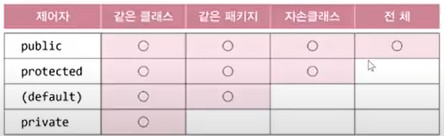

# Ch07
## 상속
- 기존의 클래스로 새로운 클래스를 작성하는 것(코드의 재사용)
- 두 클래스를 부모와 자식으로 관계를 맺어주는 것
```java
class 자식클래스 extends 부모클래스{
    ...
}
```
```java
class Parent { }
class Child extends Parent {
    ...
}
```
- 자손은 조상의 모든 멤버를 상속받는다. (생성자, 초기화블럭 제외)
- 자손의 멤버 개수는 조상보다 적을 수 없다. (같거나 많다.)
- 자손의 변경은 조상에 영향을 미치지 않는다.
```java
class Point {
    int x;
    int y;
}

class Point3D extends Point {
    int z;
}
```
- 위와 아래의 코드는 객체 생성하면 똑같은 결과를 갖는다.
```java
class Point3D {
    int x;
    int y;
    int z;
}
```
## 포함 관계
- 클래스의 멤버로 참조변수를 선언하는 것
- 작은 단위의 클래스를 만들고, 이 들을 조합해서 클래스를 만든다.
```java
class Circle {
    int x;
    int y;
    int r; 
}
```
- ```java
  Circle c = new Circle();
  // x에 접근
  c.x = ...
  ```
```java
class Point {
    int x;
    int y;
}

class Circle {
    Point p = new Point();
    int r;
}
```
- ```java
  Circle c = new Circle();
  // x에 접근
  c.p.x = ...
  ```
## 클래스의 관계 결정하기
- 상속관계 : `A는 B다.(is-a)`
    - 제약이 많기 때문에 꼭 필요할때만 상속
- 포함관계 : `A는 B를 가지고있다.(has-a)`
    - 90% 이상이 포함관계

## 단일상속
- 단일상속 : 하나의 부모만 상속 가능한 것
- Java는 단일 상속만을 허용한다. (C++은 다중상속 허용)
```java
class TvDVD extends Tv, DVD {   // 에러. 조상은 하나만 허용된다.
    ...
}
```
- 비중이 높은 클래스 하나만 상속관계로, 나머지는 포함관계로 하면 다중상속의 효과를 낼 수 있다.

## Object 클래스 - 모든 클래스의 조상
- 부모가 없는 클래스는 자동적으로 Object클래스를 상속받게 된다.
    - 컴파일러가 자동으로 `extends Object`를 추가해줌
- 모든 클래스는 Object클래스에 정의된 11개의 메서드를 상속받는다.
    - ex) toString()...
- println()은 참조변수가 들어오면 toString()을 호출하기 때문에 `println(참조변수.toString)`이나 `println(참조변수)`나 같은 값을 호출한다.
    - toString은 기본으로 `클래스이름@주소`를 반환한다.
## 오버라이딩(overriding)
- 상속받은 조상의 **메서드**를 자신에 맞게 변경하는 것
```java
class Point {
    int x;
    int y;

    String getLocation() {
        return "x :" + x + ", y :" + y;
    }

}

class Point3D extends Point {
    int z;

    String getLocation() {
        return "x :" + x + ", y :" + y+ ", z :" + z;
    }
}
```
- 선언부 변경불가, 구현부만 변경 가능

## 오버라이딩의 조건
1. 선언부가 조상 클래스의 메서드와 일치해야 한다.
    - 선언부 : 반환타입, 메서드이름, 매개변수들
2. 접근 제어자를 조상 클래스의 메서드보다 좁은 범위로 변경할 수 없다.
3. 예외는 조상 클래스의 메서드보다 많이 선언할 수 없다.

## 오버로딩 vs 오버라이딩
- 이름만 비슷하지 전혀 관계 없음
- 오버로딩(overloading): 기존에 없는 새로운 메서드를 정의하는 것(new)
    - 상속과 관계 x
- 오버라이딩(overriding): 상속받은 메서드의 내용을 변경하는 것(change, modify)
```java
class Parent {
    void parentMethod() {}
}

class Child extends Parent {
    void parentMethod() {}          // 오버라이딩
    void parentMethod(int i) {}     // 오버로딩

    void childMethod() {}           
    void childMethod(int i) {}      // 오버로딩
    void childMethod() {}           // 에러: 메서드 중복정의
}
```
## 참조변수 super
- 객체 자신을 가리키는 참조변수. 인스턴스 메서드(생성자 포함)내에만 존재
- 조상의 멤버(super)와 자신의 멤버(this)를 구별할 때 사용

## super() - 조상의 생성자
- 조상의 생성자를 호출할 때 사용
- 조상의 멤버는 조상의 생성자를 호출해서 초기화
- **모든 생성자는 생성자의 첫 줄에 반드시 생성자(super()나 this())를 호출해야 한다.**
    - 그렇지 않으면 컴파일러가 생성자의 첫 줄에`super();`를 삽입
### Ex1
```java
class Point {
    int x, y;

    Point(int x, int y) {
        this.x = x;
        this.y = y;
    }
}
```
```java
class Point3D extends Point {
    int z;

    Point3D(int x, int y, int z) {
        this.x = x;     // 조상의 멤버를 초기화
        this.y = y;     // 조상의 멤버를 초기화
        this.z = z;
    }
}
```
- 위의 경우 자손이 조상의 멤버를 초기화하고 있는 형태이므로 이런 방식은 바람직하지 않다.
```java
Point3D(int x, int y, int z) {
    super(x, y);    // 조상클래스의 생성자 Point(int x, int y)를 호출
    this.z = z;     // 자신의 멤버를 초기화
}
```
- 위의 방법으로 해야한다.
### Ex2.
```java
class Point {
    int x;
    int y;

    Point(int x, int y) {
        // super();     // Object(); 자동 호출
        this.x = x;
        this.y = y;
    }

    String getLocation() {
        return "x :"+x+", y :"+y;
    }
}

class Point3D extends Point {
    int z;

    Point3D(int x, int y, int z) {
        // super();     // 첫 줄에 생성자 호출 안했으니까 Point()가 자동 호출됨
        
        // 근데 Point에는 기본생성자Point()가 없으므로 에러가 발생
        // 따라서 기본생성자는 클래스 만들 때 컴파일러가 만들어주기를 기대하지말고 반드시 만들라는 것임
        this.x = x;
        this.y = y;
        this.z = z;
    }

    String getLocation() {
        return "x :"+x+", y :"+y+", z :"+z;
    }
}
```
- 이 에러를 해결하기 위한 두 가지 방법이 있다.
1. Point 클래스에 Point() 기본 생성자 작성
    - **하지만 이 방법은 클래스를 만들 때 기본적으로 우선 수행되어야 하는 것이다.**
    - 클래스 만들 때 항상 기본 생성자를 작성하는 버릇을 들이도록 하자.
2. 조상의 생성자 `Point(int x, int y)`를 super()로 호출
```java
Point3D(int x, int y, int z) {
    super(x, y);
    this.z = z;
}
```

## 패키지
- 서로 관련된 클래스의 묶음
- 클래스는 클래스 파일(*.class), 패키지는 폴더. 하위 패키지는 하위 폴더
- 클래스의 실제이름(full name)은 패키지를 포함(java.lang.String)

### 패키지의 선언
- 패키지는 소스파일의 첫 번째 문장으로 단 한번 선언
- 같은 소스 파일의 클래스들은 모두 같은 패키지에 속하게 된다.
- 패키지 선언이 없으면 이름없는(unnamed) 패키지에 속하게 된다.

### 클래스 패스(classpath)
- 클래스 파일(*.class)의 위치를 알려주는 경로(path)
- 환경변수 classpath로 관리하며, 경로간의 구분자는 ';'를 사용
    - classpath(환경변수)에 패키지의 루트를 등록해줘야 함

## import문
- 클래스를 사용할 때 패키지 이름을 생략할 수 있게 한다.
- `ctrl + shift + O` 이클립스 단축키
- java.lang 패키지의 클래스는 import하지 않고도 사용할 수 있다.
    - String, Object, System, Thread...
### import문의 선언
```java
import 패키지명.클래스명;
또는
import 패키지명.*;
```
- import문의 선언은 패키지 선언 다음, 클래스 선언 전에 위치한다.
- import문은 컴파일 시 처리되므로 프로그램의 성능에 영향없음.
- `.*`은 모든 클래스를 의미한다. (패키지는 포함되지 않는다.)
    - 따라서 다음의 두 코드는 의미가 다르다.
    ```java
    import java.util.*;
    import java.text.*;
    ```
    ```java
    import java.*;
    ```
- 이름이 같은 클래스가 속한 두 패키지를 import할 때는 클래스 앞에 패키지명을 붙여줘야 한다.
```java
import java.sql.*;      // java.sql.Date
import java.util.*;     // java.util.Date

public class ImportTest {
    public static void main (String[] args) {
        java.util.Date today = new java.util.Date();
    }
}
```

## static import문
- static멤버를 사용할 때 클래스 이름을 생략할 수 있게 해준다.
- `import static 패키지.클래스명.*` : 클래스 내의 모든 static멤버 사용
- `import static 패키지.클래스명.static변수`
- `import static 패키지.클래스명.static메서드`
```java
import static java.lang.System.out;
import static java.lang.Math.*;

class Ex {
    public static void main(String[] args) {
        // System.out.println(Math.random());
        out.println(random());

        // System.out.println("Math.PI :" + Math.PI);
        out.println("Math.PI :" + PI);
    }
}
```

## 제어자(modifier)
- 클래스와 클래스의 멤버(멤버 변수, 메서드)에 부가적인 의미 부여
- 하나의 대상에 여러 제어자를 같이 사용 가능(접근 제어자는 하나만)
    - 순서는 상관없지만 관례적으로 접근제어자를 맨 왼쪽에 씀
### 접근제어자
- public, protected, (default), private
    - 하나만 붙일 수 있음
### 그 외
- static, final, abstract, synchronized....

### static - 클래스의, 공통적인
|대상|의미|
|---|---|
|멤버변수|- 모든 인스턴스에 공통적으로 사용되는 클래스 변수가 된다.<br>- 클래스 변수는 인스턴스를 생성하지 않고도 사용 가능하다.<br> - 클래스가 메모리에 로드될 때 생성된다.|
|메서드|- 인스턴스를 생성하지 않고도 호출이 가능한 static 메서드가 된다.<br>- static메서드 내에서는 인스턴스멤버들을 직접 사용할 수 없다.|

### final - 마지막의, 변경될 수 없는
|대상|의미|
|---|---|
|클래스|변경될 수 없는 클래스, 확장될 수 없는 클래스가 된다.<br>그래서 final로 지정된 클래스는 다른 클래스의 조상이 될 수 없다.|
|메서드|변경될 수 없는 메서드, final로 지정된 메서드는 오버라이딩을 통해 재정의 될 수 없다.|
|멤버변수/지역변수|변수 앞에 final이 붙으면, 값을 변경할 수 없는 상수가 된다.|


### abstract - 추상의, 미완성의

|대상|의미|
|---|---|
|클래스|클래스 내에 추상 메서드가 선언되어 있음을 의미한다.|
|메서드|선언부만 작성하고 구현부는 작성하지 않은 추상 메서드임을 알린다.|
```java
abstract class AbstractTest {   // 추상 클래스(추상 메서드를 포함한 클래스)
    abstract void move();       // 추상 메서드(구현부가 없는 메서드)
}
```
```java
AbstractTest a = new AbstractTest();    // 에러. 추상 클래스의 인스턴스는 생성 불가
```

- 추상 클래스는 미완성 클래스.
- 추상 클래스를 상속받은 완전한 클래스만이 new 가능

## 접근 제어자(access modifier)
- private: 같은 클래스 내에서만 접근이 가능하다.
- (default): 같은 패키지 내에서만 접근이 가능하다.
- protected: 같은 패키지 내에서, 그리고 다른 패키지의 자손클래스에서 접근이 가능하다.
- public: 접근 제한이 전혀 없다.



- 클래스에는 public과 (default)만 가능
- 멤버에는 모두 가능
```java
package pkg1;

public class MyParent{
	private   int prv;	// 같은 클래스
			  int dft;	// 같은 패키지
	protected int prt;	// 같은 패키지 + 자손(다른 패키지)
	public 	  int pub;	// 접근제한 없음.

	public void printMembers() {
		System.out.println(prv);
		System.out.println(dft);
		System.out.println(prt);
		System.out.println(pub);
	}
}

class MyParentTest {
	public static void main(String[] args) {
		MyParent p = new MyParent();
//		System.out.println(p.prv);	// 에러
		System.out.println(p.dft);	// OK
		System.out.println(p.prt);	// OK
		System.out.println(p.pub);	// OK
	}

}
```
```java
package pkg2;

import pkg1.MyParent;

//import pkg1.MyParent;

class MyChild extends MyParent {
	public void printMembers() {
//		System.out.println(prv);	//에러
//		System.out.println(dft);	//에러
		System.out.println(prt);
		System.out.println(pub);
	}
}

public class MyParentTest2 {

	public static void main(String[] args) {
		MyParent p = new MyParent();
//		System.out.println(p.prv);	// 에러
//		System.out.println(p.dft);	// 에러
//		System.out.println(p.prt);	// 에러
		System.out.println(p.pub);	// OK
	}

}
```
## 캡슐화와 접근제어자
- 접근 제어자를 사용하는 이유
    - 외부로부터 데이터를 보호하기 위해서
    - 외부에는 불필요한, 내부적으로만 사용되는 부분을 감추기 위해서
```java
public class Time {
    public int hour;
    public int minute;
    public int second;
}

Time t = new Time();
t.hour = 25;    // 멤버변수에 직접 접근
```
- 이렇게 멤버변수에 접근하게 되면 hour의 범위를 넘어서는 값도 받게 되기 때문에 아래와 같이 데이터를 보호해야한다.
```java
public class Time {
    private int hour;
    private int minute;
    private int second;

    public int getHour() { return hour; }
    public void setHour(int hour) {
        if (hour < 0 || hour > 23) return;
        this.hour = hour;
    }
}
```
- 직접 멤버변수에 접근하는 것은 막고 메서드를 통한 간접 접근을 허용하는 방식으로 코딩을 해야한다.
- `Alt + shift + M`: 조건식 추출해서 메서드로 만드는 이클립스 단축키

## 다형성(polymorphism)
- **객체지향에서 다형성이 제일 중요!**
- 다형성: **조상 타입 참조 변수로 자손 타입 객체를 다루는 것**
    ```java
    class Tv {
        boolean power;
        int channel;

        void power() { power = !power; }
        void channelUp() { ++channel; }
        void channelDown() { --channel; }
    }

    class SmartTv extends Tv {
        String text;
        void caption() {...}
    }
    ```
    위와 같이 부모의 클래스를 상속받은 자손 클래스가 있을 때, 자손 타입의 객체를 생성하기 위해서는 아래와 같이 했다.
    ```java
    SmartTv s = new SmartTv();
    ```
    하지만 다형성이란 조상 타입 참조변수로 자손 타입 객체를 다룰 수 있으므로 아래와 같이 수행할 수 있다.
    ```java
    Tv t = new SmartTv();   // 타입 불일치 OK
    ```
    `부모타입 참조변수 = new 자식타입();`
- 자손 타입의 참조변수로 조상 타입의 객체를 가리킬 수 없다.
```java
Tv      t = new SmartTv();   // OK. 허용
SmartTv s = new Tv();        // 에러. 허용 안 됨.
```
### 객체와 참조변수의 타입이 일치할 때와 일치하지 않을 때의 차이?
- 참조변수로 사용할 수 있는 멤버의 개수가 달라진다.
```java
SmartTv s = new SmartTv();  // 1번. 참조 변수와 인스턴스의 타입이 일치
Tv      t = new SmartTv();  // 2번. 조상 타입 참조변수로 자손 타입 인스턴스 참조
```
- 1번의 경우 SmartTv가 가지는 7개의 멤버를 모두 다룰 수 있다.
- 2번의 경우 SmartTv인스턴스에 7개의 멤버가 존재해도 부모로부터 상속받은 Tv의 5개 멤버만 다룰 수 있다.

## 👀 복습 후 의문이 생긴 내용 정리!
```java
class TestParent {
	int x;
	int y;
	
	void parentMet() {
		System.out.println("x: "+ x + ", y: "+ y);
	}
}

class TestChild extends TestParent{
	int z;
	
	void parentMet() {
		System.out.println("x: "+ x + ", y: "+ y + ", z: "+ z);
	}
}

public class Test {

	public static void main(String[] args) {
		TestParent t = new TestChild();
		
		/* 조상타입의 참조변수로 자식타입 객체 생성 시 조상타입의 멤버만 다룰 수 있다고 알고 있는데,
		 * 자식타입에서 오버라이딩 한 메서드가 정상 사용되는 것은 어떤 의미일까?*/
		t.parentMet();  //	x: 0, y: 0, z: 0
	}

}
```

---

## 참조변수의 형변환
- 사용할 수 있는 멤버의 갯수를 조절하는 것
    - 값이 바뀌는게 아님
- 조상/자손 관계의 참조변수는 서로 형변환 가능

```java
class Car {
    String color;
    int door;

    void drive() {
        ...
    }
    void stop() {
        ...
    }
}

class FireEngine extends Car {
    void water() {...}
}

class Ambulance  extends Car {...}
```
```java
FireEngine f = new FireEngine();

Car c = (Car)f;                 // OK. 조상인 Car타입으로 형변환(생략가능)
FireEngine f2 = (FireEngine)c;  // OK. 자손인 FireEngine타입으로 형변환(생략불가)
Ambulance a = (Ambulance)f;     // 에러. 상속관계가 아닌 클래스 간의 형변환 불가
```
- f와 c는 같은 객체 주소 가리킴
    - f는 5개의 멤버에 접근 가능, c는 4개의 멤버에 접근 가능.

## 참조변수의 형변환 2
- 실제 인스턴스의 멤버 갯수를 넘어서는 형변환은 안된다
- Ex
```java
Car car = new Car();
FireEngine fe = (FireEngine)car;
fe.water();
```
- 컴파일은 되지만 실행시키면 ClassCastException 발생!
- 생성된 인스턴스의 멤버 갯수는 4개인데 멤버를 5개로 늘리려고 하면 안되는것임.

## instanceof 연산자
- 참조변수의 형변환 가능여부 확인에 사용. 가능하면 true 반환
- 형변환 전에 반드시 instanceof로 확인해야 함
```java
void doWork(Car c) {
    if (c instanceof FireEngine) {      // 1. 형변환이 가능한지 확인
        FireEngine fe = (FireEngine)c;  // 2. 형변환
        fe.water();
    }
}
```

```java
FireEngine fe = new FireEngine();
system.out.println(fe instanceof Object);       // true
system.out.println(fe instanceof Car);          // true
system.out.println(fe instanceof FireEngine);   // true
```
- 자기 자신과 자신의 조상에 대해서 참이 나온다
### 정리
- 참조변수의 형변환은 왜하나요?
    - 참조변수(리모콘)를 변경함으로써 사용할 수 있는 멤버의 갯수를 조절하기 위해
- instanceof 연산자는 언제 사용하나요?
    - 참조변수를 형변환하기 전에 형변환 가능여부를 확인할 때
    - 무조건 자기자신과 조상만 true가 나오는게 아니라 위에서 봤던 실제 인스턴스의 멤버보다 많은 멤버의 접근하게 형변환 하는 경우를 방지할 수 있음
    ```java
    FireEngine fe = new FireEngine();
    Car car = new Car();
    System.out.println(car instance of FireEngine); // false
    ```
    ```java
    FireEngine fe = new FireEngine();
    Car car = (Car)fe;
    System.out.println(car instance of FireEngine); // true
    ```
    ```java
    FireEngine fe = new FireEngine();
    Car car = new Car();
    Car car2 = (Car)fe;
    System.out.println(car2 instanceof FireEngine); // true
    ```

## 매개변수의 다형성
- 장점
    - 1. 다형적 매개변수
    - 2. 하나의 배열로 여러 종류 객체 다루기
- 참조형 매개변수는 메서드 호출시, 자신과 같은 타입 또는 자손타입의 인스턴스를 넘겨줄 수 있다.
```java
class Product {...}

class Tv extends Product {...}
class Computer extends Product {...}
class Audio extends Product {...}
```
만약 buy라는 메서드를 만드려고 한다면
```java
void buy(Tv t) {...}
void buy(Computer c) {...}
void buy(Audio a) {...}
```
이처럼 세가지의 매개변수 타입으로 오버로딩하는 것이 아니라
```java
void buy(Product p) {...}
...
buy(new Computer);
```
이처럼 부모의 매개변수 타입으로 세 자손을 모두 넘겨줄 수 있다.(다형성이 되니까)
```java
Product p = new Tv();   // 다형성
```
## 