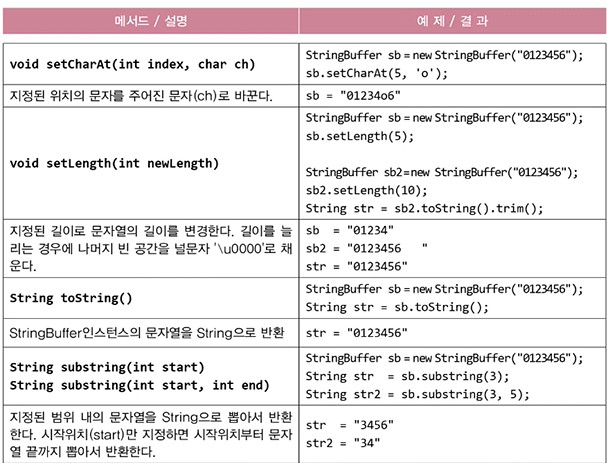

# Ch09
## Object 클래스
- 모든 클래스의 최고 조상. 오직 11개의 메서드만을 가지고 있다.
- `notify()`, `wait()` 등은 쓰레드와 관련된 메서드이다.

|Object클래스의 메서드|설명|
|---|---|
|**protected** Object clone()|객체 자신의 복사본을 반환한다.|
|public boolean equals(Object obj)|객체 자신과 객체 obj가 같은 객체인지 알려준다.(같으면 true)|
|**protected** void finalize()|객체가 소멸될 때 가비지 컬렉터에 의해 자동적으로 호출된다. 이 때 수행되어야 하는 코드가 있으면 오버라이딩한다.(거의 사용안함)|
|public Class getClass()|객체 자신의 클래스 정보를 담고 있는 Class 인스턴스를 반환한다.(앞글자 대문자임)|
|public int hashCode()|객체 자신의 해시코드를 반환한다.|
|public String toString()|객체 자신의 정보를 문자열로 반환한다.|
|public void notify()|객체 자신을 사용하려고 기다리는 쓰레드를 하나만 깨운다.|
|public void notifyAll()|객체 자신을 사용하려고 기다리는 모든 쓰레드를 깨운다.|
|public void wait()<br>public void wait(long timeout)<br>public void wait(long timeout, int nanos)|다른 쓰레드가 notify()나 notifyAll()을 호출할 때까지 현재 쓰레드를 무한히 또는 지정된 시간(timeout, nanos)동안 기다리게 한다.(timeout은 천 분의 1초, nanos는10^9분의 1초)|

- 이 메서드들은 우리가 작성하는 클래스에 맞게 기본적으로 오버라이딩 하는 경우가 많다.
- 메서드에 접근제어자가 protected로 되어있는 것들은 오버라이딩 해서 public으로 변경해야한다.
- `public Class getClass()`
    - Hello.java라는 파일을 컴파일한 Hello.class 파일이 메모리에 올라갈 때 Hello의 Class객체가 생성된다. 
    - Class객체에는 클래스에 대한 모든 정보가 들어있다(iv는 몇개인지 생성자는 몇개인지와 같은...)
    - 따라서 해당 메서드를 사용하면 Class객체를 반환하기 때문에
        - 객체를 생성할 수 있고
        - 객체의 정보를 알 수 있다.
## boolean equals(Object obj)
- 객체 자신(this)과 주어진 객체의 주소를 비교한다. 같으면 true, 다르면 false
```java
public boolean equals(Object obj) {
    return (this==obj)
}
```
- 인스턴스 변수(iv)의 값을 비교하도록 equals()를 오버라이딩해야 한다.
```java
class Person {
	long id;

	public boolean equals(Object obj) {
		if(!(obj instanceof Person))
			return false;
		
		return id == ((Person)obj).id;
	}

	Person(long id) {
		this.id = id;
	}
}

class Ex9_2 {
	public static void main(String[] args) {
		Person p1 = new Person(8011081111222L);
		Person p2 = new Person(8011081111222L);

		if(p1.equals(p2))
			System.out.println("p1과 p2는 같은 사람입니다.");   
		else
			System.out.println("p1과 p2는 다른 사람입니다.");
	}
}
```
## int hashCode()
- 객체의 해시코드(hash code)를 반환하는 메서드
- Object클래스의 hashCode()는 객체의 주소를 int로 변환해서 반환
```java
public class Object {
    ...
    public native int hashCode();
}
```
- native메서드 : OS의 메서드(C언어로 작성됨). 이미 작성되어있는 메서드이기 때문에 내용이 없음.
- equals()를 오버라이딩하면, hashCode()도 오버라이딩해야 한다.
    - **equals()의 결과가 true인 두 객체의 해시코드는 같아야 하기 때문**
	- 이클립스의 source 메뉴에서 쉽게 할수있음.
- `System.identityHashCode(Object obj)`는 Object클래스의 hashCode()와 동일.
    - hashCode()를 보통 오버라이딩해서 사용하기 때문에 오버라이딩 하기 전 해시코드 값이 필요할 경우 사용
### 참고
32bit JVM에서는 주소가 4byte int값이고,  
64bit JVM에서는 주소가 8byte long값이다.  
따라서 8byte에서 4byte로 바꾸면 겹치는 주소값이 생길수도 있다.
## toString(), toString()의 오버라이딩
- toString(): 객체를 문자열(String)으로 변환하기 위한 메서드
```java
public String toString() {	// Object클래스의 toString()
    return getClass().getName()+"@"+Integer.toHexString(hashCode());
}
```
### 정리
```java
import java.util.Objects;

class Card {
	String kind;
	int number;

	Card() {
		this("SPADE", 1);
	}

	Card(String kind, int number) {
		this.kind = kind;
		this.number = number;
	}
	
	// equals()를 오버라이딩하면 hashCode()도 오버라이딩 해야한다.
	public int hashCode() {
		return Objects.hash(kind, number);
	}
	
	public boolean equals(Object obj) {
		if (!(obj instanceof Card))
			return false;
		Card c = (Card)obj;
		return this.kind.equals(c.kind) && this.number == c.number;
	}
	
	public String toString() {
		return "kind: "+kind+", number: "+number;
	}
}

class Ex9_4 {
	public static void main(String[] args) {
		Card c1 = new Card();
		Card c2 = new Card();
		System.out.println(c1.equals(c2));
		System.out.println(c1.hashCode());
		System.out.println(c2.hashCode());
		System.out.println(c2.toString());
	}
}
```
output
```
true
-1842861219
-1842861219
kind: SPADE, number: 1
```

## String클래스
- String클래스 = 데이터(char[]) + 메서드(문자열 관련)
- 내용을 변경할 수 없는 불변(immutable) 클래스
	- 따라서 덧셈 연산자(+)를 이용한 문자열 결합은 성능이 떨어짐
	- 문자열의 결합이나 변경이 잦다면 내용을 변경가능한 StringBuffer를 사용

## 문자열의 비교
- `String str = "abc";`와 `String str = new String("abc");`의 비교
```java
String str1 = "abc";	// 문자열 리터럴 "abc"의 주소가 str1에 저장됨
String str2 = "abc";	// 문자열 리터럴 "abc"의 주소가 str2에 저장됨
String str3 = new String("abc");	// 새로운 String인스턴스를 생성
String str4 = new String("abc");	// 새로운 String인스턴스를 생성

str1 == str2	// true
str3 == str4	// false
str1.equals(str2)	// true
str3.equals(str4)	// true
```


## 빈 문자열("", empty string)
- 내용이 없는 문자열. 크기가 0인 char형 배열을 저장하는 문자열  
`String str = "";`	// str을 빈 문자열로 초기화
- 크기가 0인 배열을 생성하는 것은 어느 타입이나 가능
```java
char[] chArr = new char[0];	// 길이가 0인 char배열
int[] iArr = {}; 			// 길이가 0인 int배열
```
- 문자(char)와 문자열(String)의 초기화
```java
// 적절하지 않은 방식
String s = null;
char c = '\u0000';

// 적절한 방식
String s = "";	// 빈 문자열로 초기화
char c = ' ';	// 공백으로 초기화
```
## String클래스의 생성자와 메서드
- `String(String s)`: 주어진 문자열(s)을 갖는 String 인스턴스를 생성한다.
```java
String s = new String("Hello");	// s = "Hello"
```
- `String(char[] value)`: 주어진 문자열(value)을 갖는 String 인스턴스를 생성한다.
	- 반대로 String을 char array로 바꿀 때는 `toCharArray()`
```java
char[] c = {'H','e','l','l','o'};
String s = new String(c);	// s = "Hello"
```

- `String(StringBuffer buf)`: StringBuffer인스턴스가 갖고 있는 문자열과 같은 내용의 String인스턴스를 생성한다.
```java
StringBuffer sb = new StringBuffer("Hello");
String s = new String(sb);	// s = "Hello"
```
- `char charAt(int index)`: 지정된 위치(index)에 있는 문자를 알려준다.(index는 0부터 시작)
```java
String s = "Hello";
String n = "0123456";
char c = s.charAt(1);	// c = 'e'
char c2 = n.charAt(1);	// c2 = '1'
```
- `int compareTo(String str)`: 문자열(str)과 사전순서로 비교한다. 같으면 0을, 사전순으로 이전이면 음수를, 이후면 양수를 반환한다.
	- 11장 collection framework에서 정렬할 때 사용
```java
int i = "aaa".compareTo("aaa");		// i = 0
int i2 = "aaa".compareTo("bbb");	// i2 = -1
int i3 = "bbb".compareTo("aaa");	// i3 = 1
```
- `String concat(String str)`: 문자열(str)을 뒤에 덧붙인다.
```java
String s = "Hello";
String s2 = s.concat(" World");		// s2 = "Hello World"
```
- `boolean contains(CharSequence s)`: 지정된 문자열(s)이 포함되었는지 검사한다.
	- CharSequence: CharBuffer, Segment, String, StringBuffer, StringBuilder가 구현한 인터페이스
		- 인터페이스의 장점: 서로 관계없는 클래스들의 관계를 맺어줄 수 있다.
```java
String s = "abcdefg";
boolean b = s.contains("bc");	// b = true
```
- `boolean endsWith(String suffix)`: 지정된 문자열(suffix)로 끝나는지 검사한다.
```java
String file = "Hello.txt";
boolean b = file.endsWith("txt")	// b = true
```
- `boolean equals(Object obj)`: 매개변수로 받은 문자열(obj)과 String인스턴스의 문자열을 비교한다. <br>obj가 String이 아니거나 문자열이 다르면 false를 반환한다.
```java
String s = "Hello";
boolean b = s.equals("Hello");		// b = true
boolean b2 = s.equals("hello");		// b2 = false
```
- `boolean equalsIgnoreCase(String str)`: 문자열과 String인스턴스의 문자열을 대소문자 구분없이 비교한다.
```java
String s = "Hello";
boolean b = s.equalsIgnoreCase("HELLO");	// b = true
boolean b2 = s.equalsIgnoreCase("heLLo");	// b2 = true
```
- `int indexOf(int ch)`: 주어진 문자(ch)가 문자열에 존재하는지 확인하여 위치(index)를 알려준다. 못 찾으면 -1을 반환한다. (index는 0부터 시작)
```java
String s = "Hello";
int idx1 = s.indexOf('o');	// idx1 = 4
int idx2 = s.indexOf('k');	// idx2 = -1
```
- `int indexOf(int ch, int pos)`: 주어진 문자(ch)가 문자열에 존재하는지 지정된 위치(pos)부터 확인하여 위치(index)를 알려준다. 못 찾으면 -1을 반환한다.
```java
String s = "Hello";
int idx1 = s.indexOf('e', 0);	// idx1 = 1
int idx2 = s.indexOf('e', 2);	// idx2 = -1
```
- `int indexOf(String str)`: 주어진 문자열이 존재하는지 확인하여 그 위치(index)를 알려준다. 없으면 -1을 반환한다.
```java
String s = "ABCDEFG";
int idx = s.indexOf("CD");	// idx = 2
```
- `int lastIndexOf(int ch)`: 지정된 문자 또는 문자코드를 문자열의 오른쪽 끝에서부터 찾아서 위치(index)를 알려준다. 못 찾으면 -1을 반환한다.
```java
String s = "java.lang.Object";
int idx1 = s.lastIndexOf('.');	// idx1 = 9
int idx2 = s.indexOf('.');		// idx2 = 4
```
- `int lastIndexOf(String str)`: 지정된 문자열을 인스턴스의 문자열 끝에서 부터 찾아서 위치(index)를 알려준다. 못 찾으면 -1을 반환한다.
```java
String s = "java.lang.java";
int idx1 = s.lastIndexOf('java');	// idx1 = 10
int idx2 = s.indexOf('java');		// idx2 = 0
```
- `int length()`: 문자열의 길이를 알려준다.
```java
String s = "Hello";
int length = s.length();	// length = 5
```
- `String[] split(String regex)`: 문자열을 지정된 분리자(regex)로 나누어 문자열 배열에 담아 반환한다.
```java
String animals = "dog,cat,bear";
String[] arr = animals.split(",");	
// arr[0] = "dog"
// arr[1] = "cat"
// arr[2] = "bear"
```
- `String[] split(String regex, int limit)`: 문자열을 지정된 분리자(regex)로 나누어 문자열 배열에 담아 반환한다. 단, 문자열 전체를 지정된 수(limit)로 자른다.
```java
String animals = "dog,cat,bear";
String[] arr = animals.split(",", 2);	
// arr[0] = "dog"
// arr[1] = "cat,bear"
```
- `boolean startsWith(String prefix)`: 주어진 문자열(prefix)로 시작하는지 검사한다.
```java
String s = "java.lang.Object";
boolean b = s.startsWith("java");	// b = true
boolean b2 = s.startsWith("lang");	// b2 = false
```
- `String substring(int begin)`
  `String substring(int begin, int end)` : 주어진 시작위치(begin)부터 끝 위치(end)범위에 포함된 문자열을 얻는다. 이 때, 시작위치의 문자는 범위에 포함되지만, 끝 위치의 문자는 포함되지 않는다.
```java
String s = "java.lang.Object";
String c = s.substring(10);		// c = "Object"
String p = s.substring(5, 9);	// p = "lang"
```
- `String toLowerCase()`: String인스턴스에 저장되어있는 모든 문자열을 소문자로 변환하여 반환한다.
```java
String s = "Hello";
String s1 = s.toLowerCase();	// s1 = "hello"
```
- `String toUpperCase()`: String인스턴스에 저장되어있는 모든 문자열을 대문자로 변환하여 반환한다.
```java
String s = "Hello";
String s1 = s.toUpperCase();	// s1 = "HELLO"
```
- `String trim()`: 문자열의 왼쪽 끝과 오른쪽 끝에 있는 공백을 없앤 결과를 반환한다. 이 때 문자열 중간에 있는 공백은 제거되지 않는다.
```java
String s = "   Hello World   ";
String s1 = s.trimg();	// s1 = "Hello World"
```
- `static String valueOf(boolean b)`
  `static String valueOf(char c)`
  `static String valueOf(int i)`
  `static String valueOf(long l)`
  `static String valueOf(float f)`
  `static String valueOf(double d)`
  `static String valueOf(Object o)`
  : 지정된 값을 문자열로 변환하여 반환한다.<br> 참조변수의 경우 toString()을 호출한 결과를 반환한다.
	- `true + "" -> "true"` 보다 이 메서드를 사용하는 것이 빠르다
```java
String b = String.valueOf(true);			// b = "true"
String c = String.valueOf('a');				// c = "a"
String i = String.valueOf(100);				// i = "100"
String l = String.valueOf(100L);			// l = "100"
String f = String.valueOf(10f);				// f = "10.0"
String d = String.valueOf(10.0);			// d = "10.0"
java.util.Date dd = new java.util.Date();
String date = String.valueOf(dd);			// date = "Sun Apr 18 22:39:29 KST 2021"
```
## join()과 StringJoiner
- join()은 여러 문자열 사이에 구분자를 넣어서 결합한다.
```java
String animals = "dog,cat,bear";
String[] arr   = animals.split(",");	// 문자열을 ','를 구분자로 나눠서 배열에 저장
String str 	   = String.join("-", arr);	// 배열의 문자열을 '-'로 구분해서 결합
System.out.println(str);				// dog-cat-bear
```

## 문자열과 기본형 간의 변환
- 숫자를 문자열로 바꾸는 방법
```java
int i = 100;
String str1 = i + "";				// "100"
String str2 = String.valueOf(i);	// "100"
```
- 문자열을 숫자로 바꾸는 방법
```java
int i = Integer.parseInt("100");	// 방법 1: 100, 래퍼클래스를 사용하는 옛날방법
int i2 = Ingeter.valueOf("100");	// 방법 2: 100, parseInt의 새로운 방법
Integer i2 = Integer.valueOf("100");	// valueOf 메서드의 반환타입은 원래 Integer인데 오토 박싱으로 인해 참조형 Integer를 기본형 int로 바꿔줌
```
## StringBuffer클래스
- 문자열을 저장하고 다루기 위판 클래스
- String처럼 문자열 배열(char[])을 내부적으로 가지고 있다.
- 그러나, String과 달리 내용을 변경할 수 있다.(mutable)
## StringBuffer의 생성자
- 배열은 길이 변경불가. 공간이 부족하면 새로운 배열 생성해야
	- 1. 새로운 배열 생성
	- 2. 내용 복사
	- 3. 참조 변경
- StringBuffer는 저장할 문자열의 길이를 고려해서 적절한 크기로 생성해야 함
```java
public StringBuffer(int length) {
	value = new char[length];
	shared = false;
}

public StringBuffer() {
	this(16);		// 버퍼의 크기를 지정하지 않으면 16으로 설정한다.
}

public StringBuffer(String str) {
	this(str.length() + 16);
	append(str);	// 지정한 문자열의 길이보다 16이 더 크게 버퍼를 생성한다.
}
```
- StringBuffer는 String과 달리 내용 변경이 가능하다.
```java
StringBuffer sb = new StringBuffer("abc");
sb.append("123");	// sb = "abc123"
```
- append()는 지정된 내용을 StringBuffer에 추가 후, StringBuffer의 참조를 반환
```java
StringBuffer sb2 = sb.append("ZZ");
System.out.println(sb);		// abc123ZZ
System.out.println(sb2);	// abc123ZZ
```
- StringBuffer는 equals()가 오버라이딩되어있지 않다.(주소비교를 한다.)
	- 따라서 StringBuffer를 String으로 변환 후에 equals()로 비교해야 한다.
	```java
	StringBuffer sb  = new StringBuffer("abc");
	StringBuffer sb2 = new StringBuffer("abc");

	System.out.println(sb==sb2);		// false
	System.out.println(sb.equals(sb2));	// false

	String s  = sb.toString();		// sb를 String으로 변환
	String s2 = sb2.toString();

	System.out.println(s.equals(s2));	// true
	```

## StringBuffer의 생성자와 메서드
### 1
  

### 2


### 3


### 4


## StringBuilder
- StringBuffer는 동기화 되어있지만, StringBuilder는 동기화가 안되어있다.
	- 동기화: 멀티 쓰레드에서도 안전하게 해줌(thread-safe)
- 멀티쓰레드 프로그램이 아닌 경우, 동기화는 불필요한 성능저하를 일으킴
	- 이럴 땐 StringBuffer대신 StringBuilder를 사용하면 성능이 향상됨

## Math클래스
- 수학관련 static메서드의 집합
- round()로 원하는 소수점 아래 세번째 자리에서 반올림하기
```
1. 원래 값에 100을 곱한다.
	90.7552 * 100 -> 9075.52
2. 위의 결과에 Math.round()를 사용한다.
	Math.round(9075.52) -> 9076
3. 위의 결과를 다시 100.0으로 나눈다
	9076 / 100.0 -> 90.76
	9076 / 100 	 -> 90
```

## Math클래스의 메서드


- `Math.rint(double a)`는 .5를 반올림해서 짝수를 만드는 메서드이고,
- `Math.round(var)`는 일반적으로 알고있는 반올림이다.

## 래퍼(wrapper) 클래스
- 기본형값을 감싸는 클래스
- 8개의 기본형을 객체로 다뤄야할 때 사용하는 클래스
```java
class Ex9_14 {
	public static void main(String[] args) {
		Integer i  = new Integer(100);
		Integer i2 = new Integer(100);

		System.out.println("i==i2 ? "+(i==i2));					// i==i2 ? false
		System.out.println("i.equals(i2) ? "+i.equals(i2));		// i.equals(i2) ? true
		System.out.println("i.compareTo(i2)="+i.compareTo(i2)); // i.compareTo(i2)=0
		System.out.println("i.toString()="+i.toString());		// i.toString()=100

		System.out.println("MAX_VALUE="+Integer.MAX_VALUE);		// MAX_VALUE=2147483647
		System.out.println("MIN_VALUE="+Integer.MIN_VALUE);		// MIN_VALUE=-2147483648
		System.out.println("SIZE="+Integer.SIZE+" bits");		// SIZE=32 bits
		System.out.println("BYTES="+Integer.BYTES+" bytes");	// BYTES=4 bytes
		System.out.println("TYPE="+Integer.TYPE);				// TYPE=int
	}
}
```
## Number클래스
- 모든 숫자 래퍼 클래스의 조상
### 래퍼 객체 -> 기본형
Inter(var).intValue() -> int
Long(var).longValue() -> long
...

## 문자열을 숫자로 변환하기
- 문자열을 숫자로 변환하는 다양한 방법
```java
int i 	   = new Integer("100").intValue();
int i2 	   = Integer.parseInt("100");		// 주로 이 방법을 많이 사용
Integer i3 = Integer.valueOf("100");
```
  

- n진법의 문자열을 숫자로 변환하는 방법
```java
int i4 = Integer.parseInt("100", 2);	// 100(2) -> 4	
int i5 = Integer.parseInt("100", 8);	// 100(8) -> 64
int i6 = Integer.parseInt("100", 16);	// 100(16) -> 256
int i7 = Integer.parseInt("FF", 16);	// FF(16) -> 255
// int i8 = Integer.parseInt("FF");		// NumberFormatException발생
```
## 오토박싱 & 언박싱
- 오토박싱: 컴파일러가 기본형을 객체로 자동으로 바꿔주는 것
- 언박싱: 컴파일러가 객체를 기본형으로 자동으로 바꿔주는 것
```java
ArrayList<Integer> list = new ArrayList<Integer>();

// list.add(new Integer(100));
list.add(100);

// Integer i = list.get(0).intValue();
int i = list.get(0);
```

