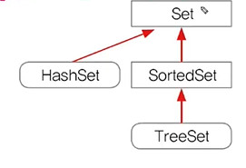
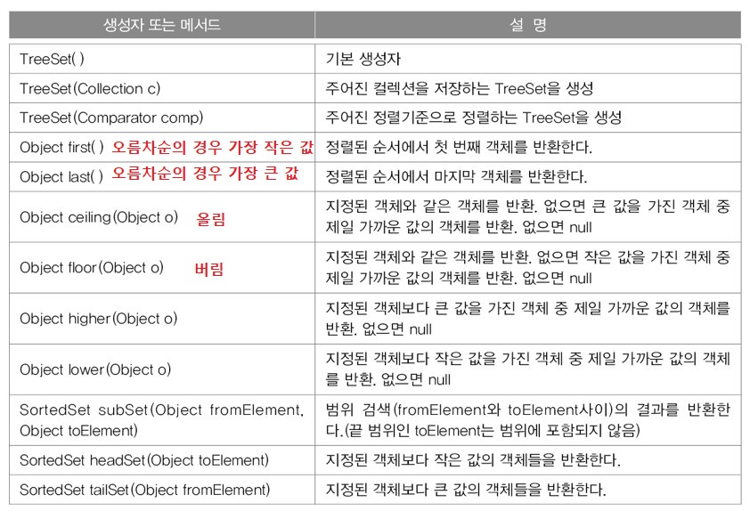
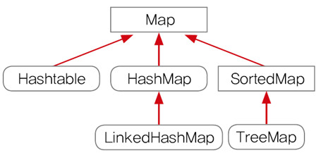
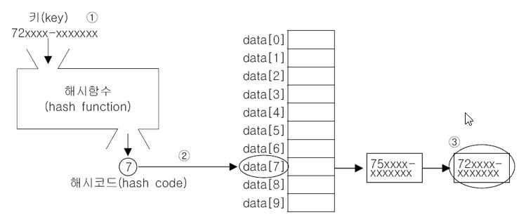

# Ch11 
- 컬렉션 프레임웍은 객체지향 다음으로 중요한 부분!
- 빠르게 전체적으로 여러번 반복하는 것이 중요!
## 컬렉션 프레임웍(collections framework)
- 컬렉션 
    - 여러 객체(데이터)를 모아 놓은 것을 의미
- 프레임웍(framework)
    - 표준화, 정형화된 체계적인 프로그래밍 방식
- 컬렉션 프레임웍
    - 컬렉션(다수의 객체)을 다루기 위한 표준화된 프로그래밍 방식
    - 컬렉션을 쉽고 편리하게 다룰 수 있는 다양한 클래스를 제공
    - java.util패키지에 포함.
- 컬렉션 클래스(collection class)
    - 다수의 데이터를 저장할 수 있는 클래스(ex. Vector, ArrayList, HashSet)

## 컬렉션 프레임웍의 핵심 인터페이스

- List와 Set의 공통 부분을 뽑아 Collection 인터페이스로 만듦

### Collection인터페이스의 메서드


### List인터페이스 - 순서O, 중복O

- ArrayList와 LinkedList가 핵심!


### Set인터페이스 - 순서X, 중복X


### Map인터페이스 - 순서X, 중복(키X, 값O)


## ArrayList
- ArrayList는 기존의 Vector를 개선한 것으로 구현원리와 기능적으로 동일
- ArrayList와 달리 Vector는 자체적으로 동기화 처리가 되어있다.
- List인터페이스를 구현하므로, 저장순서가 유지되고, 중복을 허용한다.
- 데이터의 저장공간으로 배열을 사용한다.(배열기반)
### ArrayList의 메서드
- `ArratList()`: 기본 생성자
- `ArrayList(Collection c)`: 컬렉션들끼리 변환할 때 많이 씀
- `ArrayList(int initialCapacity)`: 배열의 길이를 넉넉히 정해줌
```java
import java.util.*;

class Ex11_1 {
	public static void main(String[] args) {
		// 기본 길이(용량, capacity)가 10인 ArrayList를 생성 
		ArrayList list1 = new ArrayList(10);
		// ArrayList에는 객체만 저장가능
		
		list1.add(5);	// autoboxing에 의해 기본형이 참조형으로 자동 변환되는 것
		list1.add(new Integer(4));
		list1.add(new Integer(2));
		list1.add(new Integer(0));
		list1.add(new Integer(1));
		list1.add(new Integer(3));

		// subList의 내용은 읽기전용이기 때문에 새로운 ArrayList 만들어야함
		ArrayList list2 = new ArrayList(list1.subList(1,4));	 
		print(list1, list2);

		// Collection은 인터페이스, Collections는 유틸 클래스
		// Collection을 정렬할때는 Collections클래스의 sort메서드를 이용한다.
		Collections.sort(list1);	// list1과 list2를 정렬한다.
		Collections.sort(list2);	// Collections.sort(List l)
		print(list1, list2);
		
		//list1이 list2의 모든 요소 포함하는지 검사
		System.out.println("list1.containsAll(list2):"
                                               + list1.containsAll(list2));

		list2.add("B");
		list2.add("C");
		list2.add(3, "A");
		print(list1, list2);
		
		list1.add(0, "1");
		list1.remove(1);	// 인덱스가 1인 객체를 삭제
		list1.remove(new Integer(1)); // 1인 Integer객체를 삭제
		
		list2.set(3, "AA");
		print(list1, list2);

		// list1에서 list2와 겹치는 부분만 남기고 나머지는 삭제한다.
		System.out.println("list1.retainAll(list2):" + list1.retainAll(list2));

		print(list1, list2);

		//  list2에서 list1에 포함된 객체들을 삭제한다.
		for(int i= list2.size()-1; i >= 0; i--) {
			if(list1.contains(list2.get(i)))
				list2.remove(i);
		}
		print(list1, list2);
	} // main의 끝

	static void print(ArrayList list1, ArrayList list2) {
		System.out.println("list1:"+list1);
		System.out.println("list2:"+list2);
		System.out.println();		
	}
} // class
```
output
```
list1:[5, 4, 2, 0, 1, 3]
list2:[4, 2, 0]

list1:[0, 1, 2, 3, 4, 5]
list2:[0, 2, 4]

list1.containsAll(list2):true
list1:[0, 1, 2, 3, 4, 5]
list2:[0, 2, 4, A, B, C]

list1:[1, 2, 3, 4, 5]
list2:[0, 2, 4, AA, B, C]

list1.retainAll(list2):true
list1:[2, 4]
list2:[0, 2, 4, AA, B, C]

list1:[2, 4]
list2:[0, AA, B, C]
```
### ArrayList에 저장된 객체의 삭제과정
1. 앞에부터 삭제하는 경우 - 배열 복사 발생
2. 뒤에서부터 삭제하는 경우 - 배열 복사 발생 안함. 빠름.

## LinkedList 
- 배열의 장단점
    - 장점: 배열은 구조가 간단하고 데이터를 읽는 데 걸리는 시간이 짧다.
    - 단점1: 크기를 변경할 수 없다.
        - 크기를 변경해야 하는 경우 새로운 배열을 생성 후 데이터를 복사해야함.
        - 크기 변경을 피하기 위해 충분히 큰 배열을 생성하면, 메모리가 낭비됨
    - 단점2: 비순차적인 데이터의 추가, 삭제에 시간이 많이 걸린다.
        - 데이터를 추가하거나 삭제하기 위해, 다른 데이터를 옮겨야 함.
        - 그러나 순차적인 데이터 추가(끝에 추가)와 삭제(끝부터 삭제)는 빠르다.
## LinkedList - 배열의 단점을 보완
- 배열과 달리 링크드 리스트는 불연속적으로 존재하는 데이터를 연결(link)
- 데이터의 삭제: 단 한 번의 참조변경만으로 데이터 삭제 가능.
- 데이터의 추가: 한 번의 Node객체생성과 두 번의 참조변경만으로 가능
## LinkedList - 이중 연결 리스트


### ArrayList(배열기반) vs LinkedList(연결기반) 성능 비교


## 스택과 큐(Stack & Queue)
- 스택(Stack): LIFO구조. 마지막에 저장된 것을 제일 먼저 꺼내게 된다.
    - 배열로 구현하는 것이 유리
- 큐(Queue): FIFO구조. 제일 먼저 저장한 것을 제일 먼저 꺼내게 된다.
    - 링크드 리스트로 구현하는 것이 유리


## Stack 클래스의 메서드
- `boolean empty()`: Stack이 비어있는지 알려준다.
- `Object peek()`: Stack의 맨 위에 저장된 객체를 반환. pop()과 달리 Stack에서 객체를 꺼내지는 않음. (비었을 때는 EmptyStackException 발생)
- `Object pop()`: Stack의 맨 위에 저장된 객체를 꺼낸다.(비었을 때는 EmptyStackException 발생)
- `Object push(Object item)`: Stack에 객체(item)를 저장한다.
- `int search(Object o)`: Stack에서 주어진 객체(o)를 찾아서 그 위치를 반환. 못찾으면 -1을 반환.(배열과 달리 위치는 0이 아닌 1부터 시작)

## Queue 인터페이스의 메서드
- `boolean add(Object o)`: 지정된 객체를 Queue에 추가한다. 성공하면 true를 반환. 저장공간이 부족하면 IllegalStateException 발생
- `Object remove()`: Queue에서 객체를 꺼내 반환. 비어있으면 NoSuchElementException발생
- `Object element()`: 삭제없이 요소를 읽어온다. peek와 달리 Queue가 비었을 때 NoSuchElementException발생
- `boolean offer(Object o)`: Queue에 객체를 저장. 성공하면 true, 실패하면 false를 반환
- `Object poll()`: Queue에서 객체를 꺼내서 반환. 비어있으면 null을 반환
- `Object peek()`: 삭제없이 요소를 읽어온다. Queue가 비어있으면 null을 반환

## 스택과 큐의 활용
- 스택의 활용 예
    - 수식계산, 수식괄호검사, undo/redo, 웹브라우저의 뒤로/앞으로 버튼
- 큐의 활용 예
    - 최근 사용 문서, 인쇄작업 대기목록, 버퍼

### Stack 예제 - 괄호검사
```java
import java.util.*;

public class Ex11_3 {
	public static void main(String[] args) {

		Stack st = new Stack();
		String expression = "((3+5)*8-2)"; 

		System.out.println("expression:" + expression);

		try {
			for (int i = 0; i < expression.length(); i++) {
				char ch = expression.charAt(i);

				if (ch == '(') {
					st.push(ch + "");
				} else if (ch == ')') {
					st.pop();
				}
			}

			if (st.isEmpty()) {
				System.out.println("괄호가 일치합니다.");
			} else {
				System.out.println("괄호가 일치하지 않습니다.");
			}
		} catch (EmptyStackException e) {
			System.out.println("괄호가 일치하지 않습니다.");
		} // try
	}
}
```

### Queue 예제 - 명령어 사용 히스토리 보여주기
```java
import java.util.*;

class Ex11_4 {
	static Queue q = new LinkedList();
	static final int MAX_SIZE = 5;	// Queue에 최대 5개까지만 저장되도록 한다.

	public static void main(String[] args) {
		System.out.println("help를 입력하면 도움말을 볼 수 있습니다.");

		while(true) {
			System.out.print(">>");
			try {
				// 화면으로부터 라인단위로 입력받는다.
				Scanner s = new Scanner(System.in);  
				String input = s.nextLine().trim();

				if("".equals(input)) continue;

				if(input.equalsIgnoreCase("q")) {
					System.exit(0);
				} else if(input.equalsIgnoreCase("help")) {
					System.out.println(" help - 도움말을 보여줍니다.");
					System.out.println(" q 또는 Q - 프로그램을 종료합니다.");
					System.out.println(" history - 최근에 입력한 명령어를 "
                                                  + MAX_SIZE +"개 보여줍니다.");
				} else if(input.equalsIgnoreCase("history")) {
					// 입력받은 명령어를 저장하고,
					save(input);    

					// LinkedList의 내용을 보여준다.
					LinkedList list = (LinkedList)q;
					
					final int SIZE = list.size();
					for(int i=0;i<SIZE;i++)
						System.out.println((i+1)+"."+list.get(i));
				} else {
					save(input);    
					System.out.println(input);
				} // if(input.equalsIgnoreCase("q")) {
			} catch(Exception e) {
				System.out.println("입력오류입니다.");
			}
		} // while(true)
	} //  main()
	public static void save(String input) {
		// queue에 저장한다.
		if(!"".equals(input))	// if(input != null && !input.equals(""))
          q.offer(input);

		// queue의 최대크기를 넘으면 제일 처음 입력된 것을 삭제한다.
		if(q.size() > MAX_SIZE)  // size()는 Collection인터페이스에 정의
			q.remove();
	}
} // end of class
```
output
```
help를 입력하면 도움말을 볼 수 있습니다.
>>first
first

>>second
second

>>third
third

>>fourth
fourth

>>history
1.first
2.second
3.third
4.fourth
5.history

>>history
1.second
2.third
3.fourth
4.history
5.history
```
## Iterator, ListIterator, Enumeration
- 컬렉션에 저장된 데이터를 접근하는데 사용되는 인터페이스  
1. `boolean hasNext()`: 읽어올 요소가 남아있는지 확인한다. 있으면 true, 없으면 false를 반환한다.
2. `Object next()`: 다음 요소를 읽어온다. next()를 호출하기 전에 hasNext()를 호출해서 읽어올 요소가 있는지 확인하는 것이 안전하다.

- Enumeration은 Iterator의 구버전
    - 메서드 이름 살짝 다르다는것만 알면 됨
- ListIterator는 Iterator의 접근성을 향상시킨 것(단방향 -> 양방향)
	- next()와 previous() 둘 다 있다.

## Iterator
- 컬렉션에 저장된 요소들을 읽어오는 방법을 표준화한 것
`boolean hasNext()`, `Object next()`
- List를 쓰다가 Set으로 바꾸면 저장된 요소를 읽어오는 메서드나 방법이 다른데, Iterator를 이용해 읽어오면 컬렉션마다 읽어오는 방법을 배우지 않고도 쉽게 읽어올 수 있다.
- 컬렉션에 `iterator()`를 호출해서 Iterator를 구현한 객체를 얻어서 사용.
```java
List list = new ArrayList();		// 다른 컬렉션으로 변경할 때는 이 부분만 고치면 된다.
Iterator it = list.iterator();		

while(it.hasNext()) {				// boolean hasNext() 읽어올 요소가 있는지 확인
	System.out.println(it.next());	// Object next() 다음 요소를 읽어옴
}
```
### Iterator는 1회용이라 한 번 쓰고 나면 다시 얻어와야 한다.
```java
import java.util.*;

class Ex11_5 {
	public static void main(String[] args) {
		ArrayList list = new ArrayList();
		list.add("1");
		list.add("2");
		list.add("3");
		list.add("4");
		list.add("5");

		Iterator it = list.iterator();

		while(it.hasNext()) {
			Object obj = it.next();
			System.out.println(obj);
		}

		while(it.hasNext()) {
			Object obj = it.next();
			System.out.println(obj);
		}
	} // main
}
```
output : 두 번 출력되지 않는다.
```
1
2
3
4
5
```
```java
import java.util.*;

class Ex11_5 {
	public static void main(String[] args) {
		ArrayList list = new ArrayList();
		list.add("1");
		list.add("2");
		list.add("3");
		list.add("4");
		list.add("5");

		Iterator it = list.iterator();

		while(it.hasNext()) {
			Object obj = it.next();
			System.out.println(obj);
		}

		it = list.iterator();
		while(it.hasNext()) {
			Object obj = it.next();
			System.out.println(obj);
		}
	} // main
}
```
output: iterator를 한 번 더 얻어와야 두 번 출력된다.
```
1
2
3
4
5
1
2
3
4
5
```
### Iterator를 쓰는 이유
```java
import java.util.*;

class Ex11_5 {
	public static void main(String[] args) {
		ArrayList list = new ArrayList();
		list.add("1");
		list.add("2");
		list.add("3");
		list.add("4");
		list.add("5");

//		Iterator it = list.iterator();
//
//		while(it.hasNext()) {
//			Object obj = it.next();
//			System.out.println(obj);
//		}

		for (int i = 0; i<list.size(); i++) {
			Object obj = list.get(i);
			System.out.println(obj);
		}
	} // main
}
```
output: for문을 사용해도 똑같이 결과가 나온다. 하지만 Collection을 ArrayList에서 HashSet으로 바꾼다면?  
HashSet에는 get메서드가 없기때문에 오류가 발생한다.  
하지만 iterator를 사용하면 collection 클래스가 바뀌어도 동일하게 동작하며  
컬렉션마다 다른 구조를 염두에 두지 않아도 된다.
```java
import java.util.*;

class Ex11_5 {
	public static void main(String[] args) {
		Collection c = new HashSet();
		c.add("1");
		c.add("2");
		c.add("3");
		c.add("4");
		c.add("5");

		Iterator it = c.iterator();

		while(it.hasNext()) {
			Object obj = it.next();
			System.out.println(obj);
		}
	} // main
}
```
그리고 참조변수의 타입을 위와 같이 Collection으로 해놓으면 클래스를 변경해도 그 아래에 쓰인 코드를 검토하지 않아도 된다.

## Map과 Iterator
- Map은 collection의 자손이 아니기 때문에 iterator가 없다.
- keySet(), entrySet(), values() 등을 호출해 Set이나 Collection을 얻은 후 iterator 호출
```java
Map map = new HashMap();
Iterator it = map.entrySet().iterator();
```
## Arrays - 배열을 다루기 편리한 메서드(static) 제공
1. 배열의 출력 - `toString()`
2. 배열의 복사 - `copyOf()`, `copyOfRange()`
3. 배열 채우기 - `fill()`, `setAll()`
4. 배열의 정렬과 검색 - `sort()`, `binarySearch()`
5. 다차원 배열의 출력 - `deepToString()`
6. 다차원 배열의 비교 - `deepEquals()`
7. 배열을 List로 변환 - `asList(Object... a)`
8. 람다와 스트림 - `parallelXXX()`, `spliterator()`, `stream()` 14장에서 배움
```java
import java.util.*;

class Ex11_6 {
	public static void main(String[] args) {
		int[]	arr   = {0,1,2,3,4};
		int[][]	arr2D = {{11,12,13}, {21,22,23}};

		System.out.println("arr="+Arrays.toString(arr));
//		System.out.println("arr="+Arrays.toString(arr2D));
		System.out.println("arr2D="+Arrays.deepToString(arr2D));

		int[] arr2 = Arrays.copyOf(arr, arr.length);
		int[] arr3 = Arrays.copyOf(arr, 3);          
		int[] arr4 = Arrays.copyOf(arr, 7);          
		int[] arr5 = Arrays.copyOfRange(arr, 2, 4);  
		int[] arr6 = Arrays.copyOfRange(arr, 0, 7);  

		System.out.println("arr2="+Arrays.toString(arr2));
		System.out.println("arr3="+Arrays.toString(arr3));
		System.out.println("arr4="+Arrays.toString(arr4));
		System.out.println("arr5="+Arrays.toString(arr5));
		System.out.println("arr6="+Arrays.toString(arr6));
		
		int[] arr7 =  new int[5];
		Arrays.fill(arr7, 9);  // arr=[9,9,9,9,9]
		System.out.println("arr7="+Arrays.toString(arr7));

		Arrays.setAll(arr7, i -> (int)(Math.random()*6)+1); // 람다식 사용
		System.out.println("arr7="+Arrays.toString(arr7));

//		for(int x=0; x<arr7.length; x++){
//			int i = arr7[x];
		for(int i : arr7) {	// 향상된 for문
			char[] graph = new char[i];
			Arrays.fill(graph, '*');
			System.out.println(new String(graph)+i);
		}

		String[][] str2D  = new String[][]{{"aaa","bbb"},{"AAA","BBB"}};
		String[][] str2D2 = new String[][]{{"aaa","bbb"},{"AAA","BBB"}};

		System.out.println(Arrays.equals(str2D, str2D2));     // false
		System.out.println(Arrays.deepEquals(str2D, str2D2)); // true

		char[] chArr = { 'A', 'D', 'C', 'B', 'E' };

		System.out.println("chArr="+Arrays.toString(chArr));
		System.out.println("index of B ="+Arrays.binarySearch(chArr, 'B'));
		System.out.println("= After sorting =");
		Arrays.sort(chArr);	// binarySearch하기 전에는 반드시 정렬 먼저.
		System.out.println("chArr="+Arrays.toString(chArr));
		System.out.println("index of B ="+Arrays.binarySearch(chArr, 'B'));
	}
}
```
output
```
arr=[0, 1, 2, 3, 4]
arr2D=[[11, 12, 13], [21, 22, 23]]
arr2=[0, 1, 2, 3, 4]
arr3=[0, 1, 2]
arr4=[0, 1, 2, 3, 4, 0, 0]
arr5=[2, 3]
arr6=[0, 1, 2, 3, 4, 0, 0]
arr7=[9, 9, 9, 9, 9]
arr7=[3, 5, 2, 1, 6]
***3
*****5
**2
*1
******6
false
true
chArr=[A, D, C, B, E]
index of B =-2
= After sorting =
chArr=[A, B, C, D, E]
index of B =1
```
# ❗ Comparator와 Comparable (어려우니까 복습 꼼꼼히!)
- 객체 정렬에 필요함 메서드(정렬기준 제공)를 정의한 인터페이스
	- Comparable : 기본 정렬기준을 구현하는데 사용
	- Comparator : 기본 정렬기준 외에 다른 기준으로 정렬하고자할 때 사용
```java
public interface Comparator {
	int compare(Object o1, Object o2);	// o1, o2 두 객체를 비교
	boolean equals(Object obj);		// equals를 오버라이딩하라는 뜻
}
public interface Comparable {
	int compareTo(Object o);	// 주어진 객체(o)를 자신과 비교
}
```
- compare()와 compareTo()는 두 객체의 비교결과를 반환하도록 작성
```java
public final class Integer extends Number implements Comparable {
	...
	public int compareTo(Integer anotherInteger) {
		int v1 = this.value;
		int v2 = anotherInteger.value;
		// 같으면 0, 오른쪽 값이 크면 -1, 작으면 1을 반환
		return (v1 < v2 ? -1 : (v1==v2? 0: 1));
	}
}
```
- 정렬에는 `대상`과 `기준`이 필요하다.
	- 객체 자체가 Comparable을 구현해 compareTo메서드로 비교 기준을 정하던가,
	- Comparator를 구현한 클래스가 비교 기준으로 제공되던가.
```java
static void sort(Object[] a)	// 객체 배열에 저장된 객체가 구현한 Comparable에 의한 정렬
static void sort(Object[] a, Comparator c)	// 지정한 Comparator에 의한 정렬
```
예제
```java
import java.util.*;

class Ex11_7 {
	public static void main(String[] args) {
		String[] strArr = {"cat", "Dog", "lion", "tiger"};

		Arrays.sort(strArr); // String의 Comparable구현에 의한 정렬(대문자가 먼저옴)
		System.out.println("strArr=" + Arrays.toString(strArr));

		Arrays.sort(strArr, String.CASE_INSENSITIVE_ORDER); // 대소문자 구분안함
		System.out.println("strArr=" + Arrays.toString(strArr));

		Arrays.sort(strArr, new Descending()); // 역순 정렬
		System.out.println("strArr=" + Arrays.toString(strArr));
	}
}

class Descending implements Comparator { 
	public int compare(Object o1, Object o2){
		if( o1 instanceof Comparable && o2 instanceof Comparable) {
			Comparable c1 = (Comparable)o1;
			Comparable c2 = (Comparable)o2;
			return c1.compareTo(c2) * -1 ; // -1을 곱해서 기본 정렬방식의 역으로 변경한다.
						                // 또는 c2.compareTo(c1)와 같이 순서를 바꿔도 된다.
		}
		return -1;
	} 
}
```
output
```
strArr=[Dog, cat, lion, tiger]
strArr=[cat, Dog, lion, tiger]
strArr=[tiger, lion, cat, Dog]
```
CASE_INSENSITIVE_ORDER 부연설명
```java
public static final Comparator<String> CASE_INSENSITIVE_ORDER 
									 = new CaseInsensitiveComparator(); 
									 // String 클래스의 내부 클래스(Comparator 인터페이스 구현)
```
### Integer와 Comparable
- String과 Float, Integer과 같이 비교가 가능한 클래스들은 자체적으로 기본 정렬 기준을 가지고 있다.(Comparable을 구현한다.)
### 정렬과 정렬기준
- 정렬은 이미 여러 방법으로 구현해 놓은 불변의 방법이다.
- 정렬 기준은 정렬에 제공되는 가변의 개념이다.  
기본 버블정렬 코드
```java
static void sort(int[] intArr) {
	for(int i=0; i<intArr.length-1; i++) {
		for(int j=0; j<intArr.length-1-i; j++) {
			int tmp = 0;
			if(intArr[j] > intArr[j+1]) {	// 정렬기준
				// 자리바꿈
				tmp = intArr[j];
				intArr[j] = intArr[j+1];
				intArr[j+1] = tmp;
			}
		}
	}
}
```
정렬기준이 주어질 때의 버블정렬
```java
static void sort(Object[] objArr, Comparator c) {
	for(int i=0; i<objArr.length-1; i++) {
		for(int j=0; j<objArr.length-1-i; j++) {
			Object tmp = null;
			if(c.compare(objArr[j], objArr[j+1])>0) {	// 정렬기준
				// 자리바꿈
				tmp = objArr[j];
				objArr[j] = objArr[j+1];
				objArr[j+1] = tmp;
			}
		}
	}
}
```
# HashSet(1)

## HashSet - 순서X, 중복X
- HashSet
	- Set인터페이스를 구현한 대표적인 컬렉션 클래스
	- HashSet을 쓰고싶은데 순서를 유지하려면, LinkedHashSet클래스를 사용하면 된다.
- TreeSet
	- 범위 검색과 정렬에 유리한 컬렉션 클래스
	- HashSet보다 데이터 추가, 삭제에 시간이 더 걸림
## HashSet - 주요 메서드
### 생성자
- `HashSet()`
- `HashSet(Collection c)`: 지정된 컬렉션의 모든 객체 저장
- `HashSet(int initialCapacity)`: 초기 용량 설정
- `HashSet(int initialCapacity, float loadFactor)`: loadFactor가 0.8이면 80% 찼을 때 용량 늘림
### 추가 삭제 
- `boolean add(Object o)`
- `boolean addAll(Collection c)`: 합집합
- `boolean remove(Object o)`
- `boolean removeAll(Collection c)`: 차집합
- `boolean retailAll(Collection c)`: 교집합
- `void clear()`
### 기타
- `boolean contains(Object o)`: Set이 객체 o를 포함하면 true를 반환
- `boolean containsAll(Collection c)`: Set이 c안의 모든 객체를 포함하는지
- `Iterator iterator()`
- `boolean isEmpty()`: 비어있는지 확인
- `int size()`: 저장된 객체의 수
- `Object[] toArray()`: 객체 배열로 반환
- `Object[] toArray(Object[] a)`

<br>

- 예제1
```java
import java.util.*;

class Ex11_9 {
	public static void main(String[] args) {
		Object[] objArr = {"1",new Integer(1),"2","2","3","3","4","4","4"};
		Set set = new HashSet();

		for(int i=0; i < objArr.length; i++) {
			System.out.println(objArr[i]+"="+set.add(objArr[i]));	// HashSet에 objArr의 요소들을 저장한다.
		}
                // HashSet에 저장된 요소들을 출력한다.
		System.out.println(set);	

		// HashSet에 저장된 요소들을 출력한다.(Iterator이용)
		Iterator it = set.iterator();
		
		while(it.hasNext()) {
			System.out.println(it.next());	
		}
	}
}
```
output
```
1=true
1=true
2=true
2=false
3=true
3=false
4=true
4=false
4=false
[1, 1, 2, 3, 4]
1
1
2
3
4
```
- 예제2
```java
import java.util.*;

class Ex11_10 {
	public static void main(String[] args) {
		Set set = new HashSet();
		
		// set의 크기가 6보다 작은 동안 1~45사이의 난수를 저장
		for (int i = 0; set.size() < 6 ; i++) {
			int num = (int)(Math.random()*45) + 1;
			set.add(new Integer(num));
		}
		// set은 정렬이 불가능하기 때문에 list로 옮긴 후 정렬
		List list = new LinkedList(set); // LinkedList(Collection c)
		Collections.sort(list);          // Collections.sort(List list)
		System.out.println(list);
	}
}
```
# HashSet(2) - 예제 3
- HashSet은 객체를 저장하기 전에 기존에 같은 객체가 있는지 확인
- `boolean add(Object o)`는 저장할 객체의 `equals()`와 `hashCode()`를 호출
	- HashSet을 사용하려면 `equals()`와 `hashCode()`가 오버라이딩 되어있어야 함

```java
class Person {
	String name;
	int age;

	Person(String name, int age) {
		this.name = name;
		this.age = age;
	}

	public String toString() {
		return name +":"+ age;	
	}
	public boolean equals(Object obj) {
		if(!(obj instanceof Person)) return false;	// 참조변수 형변환 전 반드시 체크
		
		Person tmp = (Person)obj;
		
		return name.equals(tmp.name) && age==tmp.age;
	}
	public int hashCode() {
		return (name+age).hashCode();
		// return Objects.hash(name, age);	// 동일
	}
}
```
- 교집합, 차집합, 합집합 구하기 1
```java
import java.util.*;

class Ex11_12 {
	public static void main(String args[]) {
		HashSet setA   = new HashSet();
		HashSet setB   = new HashSet();
		HashSet setHab = new HashSet();
		HashSet setKyo = new HashSet();
		HashSet setCha = new HashSet();

		setA.add("1");	 setA.add("2");  setA.add("3");
		setA.add("4");  setA.add("5");
		System.out.println("A = "+setA);

		setB.add("4");	 setB.add("5");  setB.add("6");		
		setB.add("7");  setB.add("8");
		System.out.println("B = "+setB);
		
		// 교집합
		Iterator it = setB.iterator();
		while(it.hasNext()) {
			Object tmp = it.next();
			if(setA.contains(tmp))
				setKyo.add(tmp);
		}
		
		// 차집합
		it = setA.iterator();
		while(it.hasNext()) {
			Object tmp = it.next();
			if(!setB.contains(tmp))
				setCha.add(tmp);
		}
		
		// 합집합
		it = setA.iterator();
		while(it.hasNext())
			setHab.add(it.next());

		it = setB.iterator();
		while(it.hasNext())
			setHab.add(it.next());

		System.out.println("A ∩ B = " + setKyo);  // 한글 ㄷ을 누르고 한자키
		System.out.println("A U B = " + setHab);  // 한글 ㄷ을 누르고 한자키
		System.out.println("A - B = " + setCha); 
	}
}
```
output
```
A = [1, 2, 3, 4, 5]
B = [4, 5, 6, 7, 8]
A ∩ B = [4, 5]
A U B = [1, 2, 3, 4, 5, 6, 7, 8]
A - B = [1, 2, 3]
```
- 교집합, 차집합, 합집합 구하기 2
```java
import java.util.*;

class Ex11_12 {
	public static void main(String args[]) {
		HashSet setA   = new HashSet();
		HashSet setB   = new HashSet();

		setA.add("1");	 setA.add("2");  setA.add("3");
		setA.add("4");  setA.add("5");
		System.out.println("A = "+setA);

		setB.add("4");	 setB.add("5");  setB.add("6");		
		setB.add("7");  setB.add("8");
		System.out.println("B = "+setB);
		
		HashSet setKyo = new HashSet(setA);
		HashSet setHab = new HashSet(setA);
		HashSet setCha = new HashSet(setA);
		setKyo.retainAll(setB);
		setHab.addAll(setB);
		setCha.removeAll(setB);
		
		System.out.println("A ∩ B = " + setKyo);  // 한글 ㄷ을 누르고 한자키
		System.out.println("A U B = " + setHab);  // 한글 ㄷ을 누르고 한자키
		System.out.println("A - B = " + setCha); 
	}
}
```

# TreeSet(1) - 범위 탐색, 정렬
- 이진 탐색 트리(binary search tree)로 구현. 범위 탐색과 정렬에 유리.
- 이진 트리는 모든 노드가 최대 2개의 하위 노드를 가짐
- 각 요소(node)가 나무(tree)형태로 연결(LinkedList의 변형)
```java
class TreeNode {
	TreeNode left;		// 왼쪽 자식노드
	Object 	 element;	// 저장할 객체
	TreeNode right;		// 오른쪽 자식노드
}
```
## 이진 탐색 트리(binary search tree)
- 부모보다 작은 값은 왼쪽, 큰 값은 오른쪽 자식에 저장한 트리
- 데이터가 많아질 수록 추가, 삭제에 시간이 더 걸림(비교 횟수 증가)
## TreeSet - 데이터 저장과정 `boolean add(Object o)`
- HashSet은 add시 `equals()`, `hashCode()`로 비교하고, TreeSet은 `compare()`를 호출해 비교
- 루트부터 비교해서 저장
# TreeSet(2)
## TreeSet - 주요 생성자와 메서드


- 예제1: 범위 검색에 유리하다
```java
import java.util.*;

class Ex11_14 {
	public static void main(String[] args) {
		TreeSet set = new TreeSet();

		String from = "b";
		String to	= "d";

		set.add("abc");      set.add("alien");    set.add("bat");
		set.add("car");      set.add("Car");      set.add("disc");
		set.add("dance");    set.add("dZZZZ");    set.add("dzzzz");
		set.add("elephant"); set.add("elevator"); set.add("fan");
		set.add("flower");

		System.out.println(set);
		System.out.println("range search : from " + from  +" to "+ to);
		System.out.println("result1 : " + set.subSet(from, to));
		System.out.println("result2 : " + set.subSet(from, to + "zzz"));
	}
}
```
output
```
[Car, abc, alien, bat, car, dZZZZ, dance, disc, dzzzz, elephant, elevator, fan, flower]
range search : from b to d
result1 : [bat, car]
result2 : [bat, car, dZZZZ, dance, disc]
```

- 예제2: TreeSet은 정렬이 필요 없다. headSet(), tailSet()
```java
import java.util.*;

class Ex11_15 {
	public static void main(String[] args) {
		TreeSet set = new TreeSet();
		int[] score = {80, 95, 50, 35, 45, 65, 10, 100, 40};

		for(int i=0; i < score.length; i++)
			set.add(new Integer(score[i]));

		System.out.println("50보다 작은 값 :" + set.headSet(new Integer(50)));
		System.out.println("50보다 큰 값 :"  + set.tailSet(new Integer(50)));
		System.out.println("40과 80사이의 값 :"  + set.subSet(40, 80));
	}
}
```
output
```
50보다 작은 값 :[10, 35, 40, 45]
50보다 큰 값 :[50, 65, 80, 95, 100]
40과 80사이의 값 :[40, 45, 50, 65]
```
# HashMap(1)

## HashMap과 Hashtable - 순서X, 중복(키X, 값O)
- Hashtable은 동기화O HashMap은 동기화X. HashMap이 더 최신이니까 주로 이거 씀
### HashMap
- Map인터페이스를 구현한 대표적인 컬렉션 클래스
- 순서를 유지하려면, LinkedHashMap 클래스를 사용
### TreeMap
- TreeSet과 같은 특성을 가짐
- 범위 검색과 정렬에 유리한 컬렉션 클래스
- HashMap보다 데이터 추가, 삭제에 시간이 더 걸림(비교해가면서 저장하기 때문)

## HashMap의 키(key)와 값(value)
- 해싱(hashing)기법으로 데이터를 저장. 데이터가 많아도 검색이 빠르다.
- Map인터페이스를 구현. 데이터를 키와 값의 쌍으로 저장
- key와 value를 묶어서 Entry라고 부름
```
키(key)		컬렉션 내의 키 중에서 유일해야 한다.
값(value)	키와 달리 데이터의 중복을 허용한다.
```
## 해싱(hashing)
- 해시함수(hash function)로 해시테이블(hash table)에 데이터를 저장, 검색
- 해시테이블은 배열과 링크드 리스트가 조합된 형태 
	- 배열의 장점: 접근성
	- 링크드리스트의 장점: 변경 유리
- `Objects.hash()`로 해시함수 구현
### 해시테이블에 저장된 데이터를 가져오는 과정

1. 키로 해시함수를 호출해서 해시코드(배열의 index)를 얻는다
2. 해시코드에 대응하는 링크드리스트를 배열에서 찾는다.
3. 링크드리스트에서 키와 일치하는 데이터를 찾는다  
**해시함수는 같은 키에 대해 항상 같은 해시코드를 반환해야 한다.**  
서로 다른 키일지라도 같은 값의 해시코드를 반환할 수도 있다.
