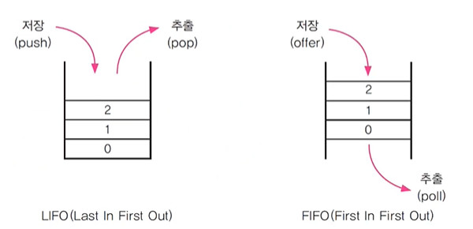

# Ch11 
- 컬렉션 프레임웍은 객체지향 다음으로 중요한 부분!
- 빠르게 전체적으로 여러번 반복하는 것이 중요!
## 컬렉션 프레임웍(collections framework)
- 컬렉션 
    - 여러 객체(데이터)를 모아 놓은 것을 의미
- 프레임웍(framework)
    - 표준화, 정형화된 체계적인 프로그래밍 방식
- 컬렉션 프레임웍
    - 컬렉션(다수의 객체)을 다루기 위한 표준화된 프로그래밍 방식
    - 컬렉션을 쉽고 편리하게 다룰 수 있는 다양한 클래스를 제공
    - java.util패키지에 포함.
- 컬렉션 클래스(collection class)
    - 다수의 데이터를 저장할 수 있는 클래스(ex. Vector, ArrayList, HashSet)

## 컬렉션 프레임웍의 핵심 인터페이스

- List와 Set의 공통 부분을 뽑아 Collection 인터페이스로 만듦

### Collection인터페이스의 메서드


### List인터페이스 - 순서O, 중복O

- ArrayList와 LinkedList가 핵심!


### Set인터페이스 - 순서X, 중복X


### Map인터페이스 - 순서X, 중복(키X, 값O)


## ArrayList
- ArrayList는 기존의 Vector를 개선한 것으로 구현원리와 기능적으로 동일
- ArrayList와 달리 Vector는 자체적으로 동기화 처리가 되어있다.
- List인터페이스를 구현하므로, 저장순서가 유지되고, 중복을 허용한다.
- 데이터의 저장공간으로 배열을 사용한다.(배열기반)
### ArrayList의 메서드
- `ArratList()`: 기본 생성자
- `ArrayList(Collection c)`: 컬렉션들끼리 변환할 때 많이 씀
- `ArrayList(int initialCapacity)`: 배열의 길이를 넉넉히 정해줌
```java
import java.util.*;

class Ex11_1 {
	public static void main(String[] args) {
		// 기본 길이(용량, capacity)가 10인 ArrayList를 생성 
		ArrayList list1 = new ArrayList(10);
		// ArrayList에는 객체만 저장가능
		
		list1.add(5);	// autoboxing에 의해 기본형이 참조형으로 자동 변환되는 것
		list1.add(new Integer(4));
		list1.add(new Integer(2));
		list1.add(new Integer(0));
		list1.add(new Integer(1));
		list1.add(new Integer(3));

		// subList의 내용은 읽기전용이기 때문에 새로운 ArrayList 만들어야함
		ArrayList list2 = new ArrayList(list1.subList(1,4));	 
		print(list1, list2);

		// Collection은 인터페이스, Collections는 유틸 클래스
		// Collection을 정렬할때는 Collections클래스의 sort메서드를 이용한다.
		Collections.sort(list1);	// list1과 list2를 정렬한다.
		Collections.sort(list2);	// Collections.sort(List l)
		print(list1, list2);
		
		//list1이 list2의 모든 요소 포함하는지 검사
		System.out.println("list1.containsAll(list2):"
                                               + list1.containsAll(list2));

		list2.add("B");
		list2.add("C");
		list2.add(3, "A");
		print(list1, list2);
		
		list1.add(0, "1");
		list1.remove(1);	// 인덱스가 1인 객체를 삭제
		list1.remove(new Integer(1)); // 1인 Integer객체를 삭제
		
		list2.set(3, "AA");
		print(list1, list2);

		// list1에서 list2와 겹치는 부분만 남기고 나머지는 삭제한다.
		System.out.println("list1.retainAll(list2):" + list1.retainAll(list2));

		print(list1, list2);

		//  list2에서 list1에 포함된 객체들을 삭제한다.
		for(int i= list2.size()-1; i >= 0; i--) {
			if(list1.contains(list2.get(i)))
				list2.remove(i);
		}
		print(list1, list2);
	} // main의 끝

	static void print(ArrayList list1, ArrayList list2) {
		System.out.println("list1:"+list1);
		System.out.println("list2:"+list2);
		System.out.println();		
	}
} // class
```
output
```
list1:[5, 4, 2, 0, 1, 3]
list2:[4, 2, 0]

list1:[0, 1, 2, 3, 4, 5]
list2:[0, 2, 4]

list1.containsAll(list2):true
list1:[0, 1, 2, 3, 4, 5]
list2:[0, 2, 4, A, B, C]

list1:[1, 2, 3, 4, 5]
list2:[0, 2, 4, AA, B, C]

list1.retainAll(list2):true
list1:[2, 4]
list2:[0, 2, 4, AA, B, C]

list1:[2, 4]
list2:[0, AA, B, C]
```
### ArrayList에 저장된 객체의 삭제과정
1. 앞에부터 삭제하는 경우 - 배열 복사 발생
2. 뒤에서부터 삭제하는 경우 - 배열 복사 발생 안함. 빠름.

## LinkedList 
- 배열의 장단점
    - 장점: 배열은 구조가 간단하고 데이터를 읽는 데 걸리는 시간이 짧다.
    - 단점1: 크기를 변경할 수 없다.
        - 크기를 변경해야 하는 경우 새로운 배열을 생성 후 데이터를 복사해야함.
        - 크기 변경을 피하기 위해 충분히 큰 배열을 생성하면, 메모리가 낭비됨
    - 단점2: 비순차적인 데이터의 추가, 삭제에 시간이 많이 걸린다.
        - 데이터를 추가하거나 삭제하기 위해, 다른 데이터를 옮겨야 함.
        - 그러나 순차적인 데이터 추가(끝에 추가)와 삭제(끝부터 삭제)는 빠르다.
## LinkedList - 배열의 단점을 보완
- 배열과 달리 링크드 리스트는 불연속적으로 존재하는 데이터를 연결(link)
- 데이터의 삭제: 단 한 번의 참조변경만으로 데이터 삭제 가능.
- 데이터의 추가: 한 번의 Node객체생성과 두 번의 참조변경만으로 가능
## LinkedList - 이중 연결 리스트


### ArrayList(배열기반) vs LinkedList(연결기반) 성능 비교


## 스택과 큐(Stack & Queue)
- 스택(Stack): LIFO구조. 마지막에 저장된 것을 제일 먼저 꺼내게 된다.
    - 배열로 구현하는 것이 유리
- 큐(Queue): FIFO구조. 제일 먼저 저장한 것을 제일 먼저 꺼내게 된다.
    - 링크드 리스트로 구현하는 것이 유리


## Stack 클래스의 메서드
- `boolean empty()`: Stack이 비어있는지 알려준다.
- `Object peek()`: Stack의 맨 위에 저장된 객체를 반환. pop()과 달리 Stack에서 객체를 꺼내지는 않음. (비었을 때는 EmptyStackException 발생)
- `Object pop()`: Stack의 맨 위에 저장된 객체를 꺼낸다.(비었을 때는 EmptyStackException 발생)
- `Object push(Object item)`: Stack에 객체(item)를 저장한다.
- `int search(Object o)`: Stack에서 주어진 객체(o)를 찾아서 그 위치를 반환. 못찾으면 -1을 반환.(배열과 달리 위치는 0이 아닌 1부터 시작)

## Queue 인터페이스의 메서드
- `boolean add(Object o)`: 지정된 객체를 Queue에 추가한다. 성공하면 true를 반환. 저장공간이 부족하면 IllegalStateException 발생
- `Object remove()`: Queue에서 객체를 꺼내 반환. 비어있으면 NoSuchElementException발생
- `Object element()`: 삭제없이 요소를 읽어온다. peek와 달리 Queue가 비었을 때 NoSuchElementException발생
- `boolean offer(Object o)`: Queue에 객체를 저장. 성공하면 true, 실패하면 false를 반환
- `Object poll()`: Queue에서 객체를 꺼내서 반환. 비어있으면 null을 반환
- `Object peek()`: 삭제없이 요소를 읽어온다. Queue가 비어있으면 null을 반환

## 스택과 큐의 활용
- 스택의 활용 예
    - 수식계산, 수식괄호검사, undo/redo, 웹브라우저의 뒤로/앞으로 버튼
- 큐의 활용 예
    - 최근 사용 문서, 인쇄작업 대기목록, 버퍼

### Stack 예제 - 괄호검사
```java
import java.util.*;

public class Ex11_3 {
	public static void main(String[] args) {

		Stack st = new Stack();
		String expression = "((3+5)*8-2)"; 

		System.out.println("expression:" + expression);

		try {
			for (int i = 0; i < expression.length(); i++) {
				char ch = expression.charAt(i);

				if (ch == '(') {
					st.push(ch + "");
				} else if (ch == ')') {
					st.pop();
				}
			}

			if (st.isEmpty()) {
				System.out.println("괄호가 일치합니다.");
			} else {
				System.out.println("괄호가 일치하지 않습니다.");
			}
		} catch (EmptyStackException e) {
			System.out.println("괄호가 일치하지 않습니다.");
		} // try
	}
}
```

### Queue 예제 - 명령어 사용 히스토리 보여주기
```java
import java.util.*;

class Ex11_4 {
	static Queue q = new LinkedList();
	static final int MAX_SIZE = 5;	// Queue에 최대 5개까지만 저장되도록 한다.

	public static void main(String[] args) {
		System.out.println("help를 입력하면 도움말을 볼 수 있습니다.");

		while(true) {
			System.out.print(">>");
			try {
				// 화면으로부터 라인단위로 입력받는다.
				Scanner s = new Scanner(System.in);  
				String input = s.nextLine().trim();

				if("".equals(input)) continue;

				if(input.equalsIgnoreCase("q")) {
					System.exit(0);
				} else if(input.equalsIgnoreCase("help")) {
					System.out.println(" help - 도움말을 보여줍니다.");
					System.out.println(" q 또는 Q - 프로그램을 종료합니다.");
					System.out.println(" history - 최근에 입력한 명령어를 "
                                                  + MAX_SIZE +"개 보여줍니다.");
				} else if(input.equalsIgnoreCase("history")) {
					// 입력받은 명령어를 저장하고,
					save(input);    

					// LinkedList의 내용을 보여준다.
					LinkedList list = (LinkedList)q;
					
					final int SIZE = list.size();
					for(int i=0;i<SIZE;i++)
						System.out.println((i+1)+"."+list.get(i));
				} else {
					save(input);    
					System.out.println(input);
				} // if(input.equalsIgnoreCase("q")) {
			} catch(Exception e) {
				System.out.println("입력오류입니다.");
			}
		} // while(true)
	} //  main()
	public static void save(String input) {
		// queue에 저장한다.
		if(!"".equals(input))	// if(input != null && !input.equals(""))
          q.offer(input);

		// queue의 최대크기를 넘으면 제일 처음 입력된 것을 삭제한다.
		if(q.size() > MAX_SIZE)  // size()는 Collection인터페이스에 정의
			q.remove();
	}
} // end of class
```
output
```
help를 입력하면 도움말을 볼 수 있습니다.
>>first
first

>>second
second

>>third
third

>>fourth
fourth

>>history
1.first
2.second
3.third
4.fourth
5.history

>>history
1.second
2.third
3.fourth
4.history
5.history
```
## Iterator, ListIterator, Enumeration
- 컬렉션에 저장된 데이터를 접근하는데 사용되는 인터페이스  
1. `boolean hasNext()`: 읽어올 요소가 남아있는지 확인한다. 있으면 true, 없으면 false를 반환한다.
2. `Object next()`: 다음 요소를 읽어온다. next()를 호출하기 전에 hasNext()를 호출해서 읽어올 요소가 있는지 확인하는 것이 안전하다.

- Enumeration은 Iterator의 구버전
    - 메서드 이름 살짝 다르다는것만 알면 됨
- ListIterator는 Iterator의 접근성을 향상시킨 것(단방향 -> 양방향)
	- next()와 previous() 둘 다 있다.

## Iterator
- 컬렉션에 저장된 요소들을 읽어오는 방법을 표준화한 것
`boolean hasNext()`, `Object next()`
- List를 쓰다가 Set으로 바꾸면 저장된 요소를 읽어오는 메서드나 방법이 다른데, Iterator를 이용해 읽어오면 컬렉션마다 읽어오는 방법을 배우지 않고도 쉽게 읽어올 수 있다.
- 컬렉션에 `iterator()`를 호출해서 Iterator를 구현한 객체를 얻어서 사용.
```java
List list = new ArrayList();		// 다른 컬렉션으로 변경할 때는 이 부분만 고치면 된다.
Iterator it = list.iterator();		

while(it.hasNext()) {				// boolean hasNext() 읽어올 요소가 있는지 확인
	System.out.println(it.next());	// Object next() 다음 요소를 읽어옴
}
```
### Iterator는 1회용이라 한 번 쓰고 나면 다시 얻어와야 한다.
```java
import java.util.*;

class Ex11_5 {
	public static void main(String[] args) {
		ArrayList list = new ArrayList();
		list.add("1");
		list.add("2");
		list.add("3");
		list.add("4");
		list.add("5");

		Iterator it = list.iterator();

		while(it.hasNext()) {
			Object obj = it.next();
			System.out.println(obj);
		}

		while(it.hasNext()) {
			Object obj = it.next();
			System.out.println(obj);
		}
	} // main
}
```
output : 두 번 출력되지 않는다.
```
1
2
3
4
5
```
```java
import java.util.*;

class Ex11_5 {
	public static void main(String[] args) {
		ArrayList list = new ArrayList();
		list.add("1");
		list.add("2");
		list.add("3");
		list.add("4");
		list.add("5");

		Iterator it = list.iterator();

		while(it.hasNext()) {
			Object obj = it.next();
			System.out.println(obj);
		}

		it = list.iterator();
		while(it.hasNext()) {
			Object obj = it.next();
			System.out.println(obj);
		}
	} // main
}
```
output: iterator를 한 번 더 얻어와야 두 번 출력된다.
```
1
2
3
4
5
1
2
3
4
5
```
### Iterator를 쓰는 이유
```java
import java.util.*;

class Ex11_5 {
	public static void main(String[] args) {
		ArrayList list = new ArrayList();
		list.add("1");
		list.add("2");
		list.add("3");
		list.add("4");
		list.add("5");

//		Iterator it = list.iterator();
//
//		while(it.hasNext()) {
//			Object obj = it.next();
//			System.out.println(obj);
//		}

		for (int i = 0; i<list.size(); i++) {
			Object obj = list.get(i);
			System.out.println(obj);
		}
	} // main
}
```
output: for문을 사용해도 똑같이 결과가 나온다. 하지만 Collection을 ArrayList에서 HashSet으로 바꾼다면?  
HashSet에는 get메서드가 없기때문에 오류가 발생한다.  
하지만 iterator를 사용하면 collection 클래스가 바뀌어도 동일하게 동작하며  
컬렉션마다 다른 구조를 염두에 두지 않아도 된다.
```java
import java.util.*;

class Ex11_5 {
	public static void main(String[] args) {
		Collection c = new HashSet();
		c.add("1");
		c.add("2");
		c.add("3");
		c.add("4");
		c.add("5");

		Iterator it = c.iterator();

		while(it.hasNext()) {
			Object obj = it.next();
			System.out.println(obj);
		}
	} // main
}
```
그리고 참조변수의 타입을 위와 같이 Collection으로 해놓으면 클래스를 변경해도 그 아래에 쓰인 코드를 검토하지 않아도 된다.

## Map과 Iterator
- Map은 collection의 자손이 아니기 때문에 iterator가 없다.
- keySet(), entrySet(), values() 등을 호출해 Set이나 Collection을 얻은 후 iterator 호출
```java
Map map = new HashMap();
Iterator it = map.entrySet().iterator();
```