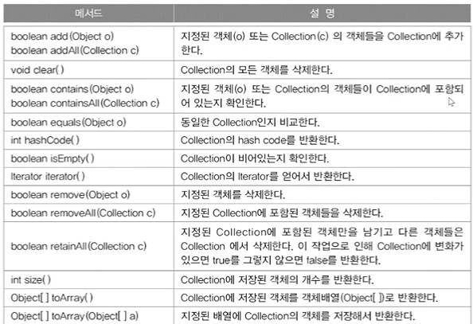
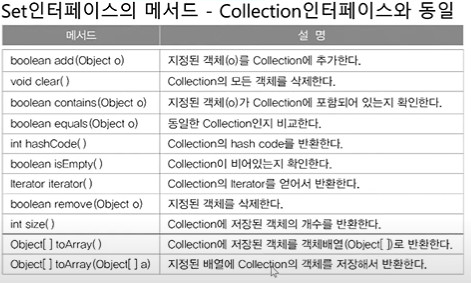
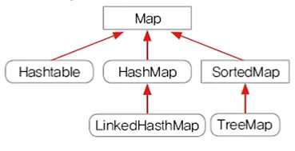

# Ch11 
- 컬렉션 프레임웍은 객체지향 다음으로 중요한 부분!
- 빠르게 전체적으로 여러번 반복하는 것이 중요!
## 컬렉션 프레임웍(collections framework)
- 컬렉션 
    - 여러 객체(데이터)를 모아 놓은 것을 의미
- 프레임웍(framework)
    - 표준화, 정형화된 체계적인 프로그래밍 방식
- 컬렉션 프레임웍
    - 컬렉션(다수의 객체)을 다루기 위한 표준화된 프로그래밍 방식
    - 컬렉션을 쉽고 편리하게 다룰 수 있는 다양한 클래스를 제공
    - java.util패키지에 포함.
- 컬렉션 클래스(collection class)
    - 다수의 데이터를 저장할 수 있는 클래스(ex. Vector, ArrayList, HashSet)

## 컬렉션 프레임웍의 핵심 인터페이스

- List와 Set의 공통 부분을 뽑아 Collection 인터페이스로 만듦

### Collection인터페이스의 메서드

### List인터페이스 - 순서O, 중복O

### Set인터페이스 - 순서X, 중복X

### Map인터페이스 - 순서X, 중복(키X, 값O)

