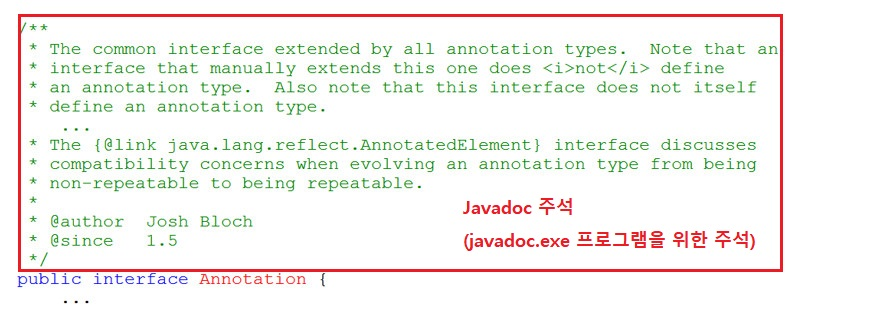
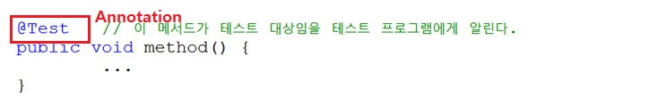
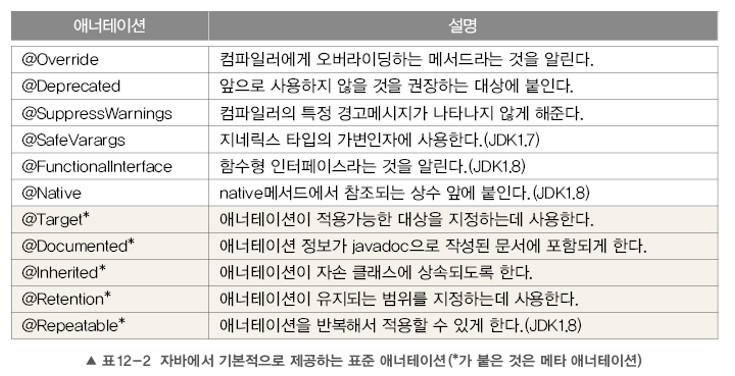
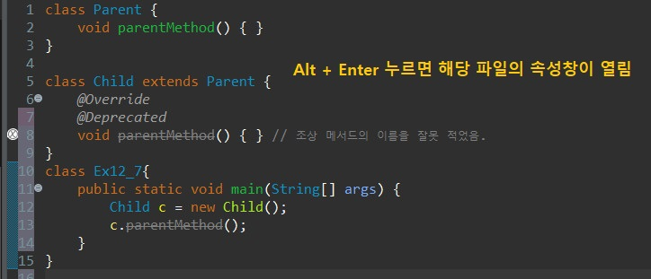
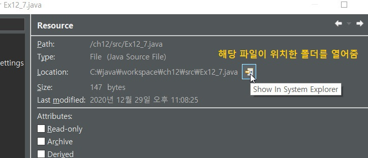
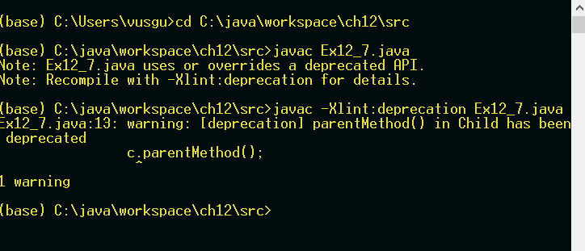
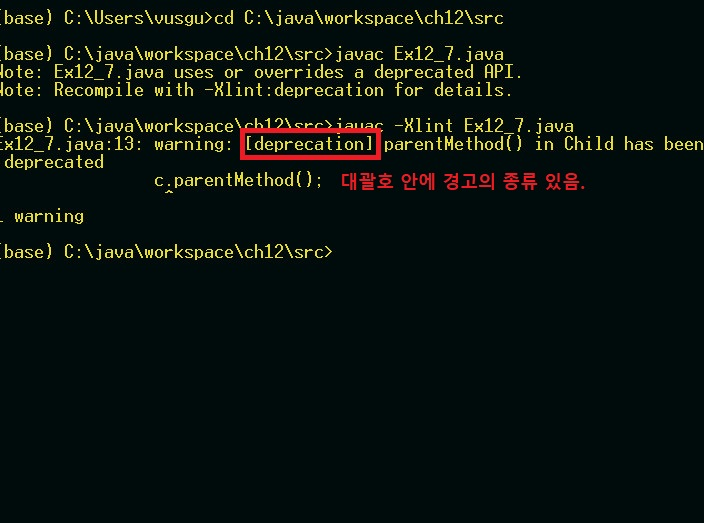

# Ch12 지네릭스
## 지네릭스란?
- 컴파일시 타입을 체크해 주는 기능(compile-time type check)
- 런타임에러를 예방 가능
- 객체의 타입 안정성을 높이고 형변환의 번거로움을 줄여줌
```java
// Tv객체만 저장할 수 있는 ArrayList를 생성
ArrayList<Tv> tvList = new ArrayList<Tv>();

tvList.add(new Tv());       // OK
tvList.add(new Audio());    // 컴파일 에러. Tv외에 다른 타입은 저장 불가
```
### 예제1. 지네릭스는 컴파일 에러를 발생시킴으로써 런타임에러를 막는다.
```java
import java.util.ArrayList;

public class GenericTest {
	public static void main(String[] args) {
		ArrayList list = new ArrayList();
		list.add(10);
		list.add(20);
		list.add("30");
		
		Integer s = (Integer)list.get(2);
		System.out.println(s);
	}
}
```
- 위의 코드는 list의 3번째 요소가 String임에도 불구하고 이클립스 상에서 빨간줄이 안뜬다.
- Object를 Integer로 형변환 하는 것만 인식되기 때문이다.
- 따라서 실행시키면 런타임 에러가 발생한다.
```java
import java.util.ArrayList;

public class GenericTest {
	public static void main(String[] args) {
		ArrayList<Integer> list = new ArrayList<Integer>();
		list.add(10);
		list.add(20);
		list.add("30");	// String 추가하면 컴파일에러
		
		Integer s = list.get(1);
		System.out.println(s);      // 형변환 생략 가능
	}
}
```
- 위의 코드처럼 지네릭스를 사용하면 다른 타입의 추가를 막아준다.
- `list.get(...)`은 Object타입을 반환하기 때문에 형변환이 필요했는데, 지네릭스를 사용하면 형변환을 생략할 수 있다.
- 또한 JDK1.5이후에는 다양한 타입의 객체를 담는 ArrayList여도 지네릭스를 쓰는 것을 권장한다.
```java
// 비권장
ArrayList list = new ArrayList();

// 권장
ArrayList<Object> list = new ArrayList<Object>();
```
### 일반 클래스 -> 지네릭클래스
```java
ArrayList // 일반 클래스
ArrayList<E> // 지네릭 클래스
```

## 타입 변수
- 지네릭 클래스를 작성할 떄, Object타입 대신 타입 변수(E)를 선언해서 사용.
- 객체를 생성시, 타입 변수(E) 대신 실제 타입을 대입
- 타입 변수 대신 실제 타입이 지정되면, 형변환 생략가능  
👀 이클립스에서 F3 누르면 소스를 볼수있고 Ctrl+O를 누르면 소스의 멤버 목록이 나온다.  
# 지네릭스 용어, 지네릭 타입과 다형성
## 지네릭스 용어
```
Box<T>  지네릭 클래스, 'T의 Box' 또는 'T Box'라고 읽는다.
T       타입 변수 또는 타입 매개변수. (T는 타입 문자)
Box     원시타입(raw type) (일반 클래스)
```
```java
Box<String> b = new Box<String>();
    ㄴ 대입된 타입(매개변수화된 타입, parameterized type)
```
## 지네릭 타입과 다형성
- 참조 변수와 생성자의 대입된 타입은 일치해야 한다.
```java
class Product {}
class Tv extends Product {}
class Audio extends Product {}
```
위와 같은 상속 관계일 때
```java
ArrayList<Tv>       list = new ArrayList<Tv>(); //OK. 일치
ArrayList<Product>  list = new ArrayList<Tv>(); //에러. 불일치
```
- 지네릭 클래스간의 다형성은 성립(여전히 대입된 타입은 일치해야)
```java
List<Tv> list = new ArrayList<Tv>();    // OK. 다형성. ArrayList가 List를 구현
List<Tv> list = new LinkedList<Tv>();   // OK. 다형성. LinkedList가 List를 구현
```
- 매개변수의 다형성도 성립.
```java
ArrayList<Product> list = new ArrayList<Product>();
list.add(new Product());
list.add(new Tv());     // OK.
list.add(new Audio());  // OK.
```
``` java
Product p = list.get(0);    // 형변환 필요 없음
Tv t = (Tv)list.get(1); // 형변환 필요
```
# Iterator, HashMap과 지네릭스
## Iterator<E>
- 클래스를 작성할 때, Object타입 대신 타입 변수를 사용
```java
// Iterator 소스
public interface Iterator {
    boolean hasNext();
    Object next();      // Object 반환
    void remove();
}
```
```java
Iterator it = list.iterator();
while(it.hasNext()) {
    Student s = (Student)it.next(); // 형변환 필요
}
```
- 원시 타입의 경우 형변환 해줘야했다.
```java
// Iterator 소스
public interface Iterator<E> {
    boolean hasNext();
    E next();      // 지정된 타입 반환
    void remove();
}
```
```java
Iterator<Student> it = list.iterator();
while(it.hasNext()) {
    Student s = it.next(); // 형변환 불필요
}
```
## HashMap<K,V>
- 여러개의 타입 변수가 필요한 경우, 콤마로 구분
```java
// HashMap 소스
public class HashMap<K,V> extends AbstractMap<K,V> {
    ...
    public V get(Object Key) { /* 내용 생략 */}
    public V put(K key, V value) { /* 내용 생략 */}
    public V remove(Object Key) { /* 내용 생략 */}
    ...
}
```
# 제한된 지네릭 클래스, 지네릭스의 제약
## 제한된 지네릭 클래스
- extends로 대입할 수 있는 타입을 제한
```java
class FruitBox<T extends Fruit> {   // Fruit의 자손만 타입으로 지정가능
    ArrayList<T> list = new ArrayList<T>();
}

// Apple이 Fruit의 자손일 때,
FruitBox<Apple> appleBox = new FruitBox<Apple>();   // OK.
FruitBox<Toy>   toyBox = new FruitBox<Toy>(); // 에러. Toy는 Fruit의 자손이 아님
```
- 인터페이스인 경우에도 implements가 아닌 extends를 사용
```java
interface Eatable {}
class FruitBox<T extends Eatable> {...}
```
### 예제
```java
import java.util.ArrayList;

interface Eatable {}

class Fruit implements Eatable {
	public String toString() { return "Fruit";}
}
class Apple extends Fruit { public String toString() { return "Apple";}}
class Grape extends Fruit { public String toString() { return "Grape";}}
class Toy                 { public String toString() { return "Toy"  ;}}

class Box<T> {
	ArrayList<T> list = new ArrayList<T>();
	void add(T item) { list.add(item);     }
	T get(int i)     { return list.get(i); }
	int size()       { return list.size(); }
	public String toString() { return list.toString();}
}

class FruitBox<T extends Fruit & Eatable> extends Box<T> {} 

class Ex12_3 {
	public static void main(String[] args) {
		FruitBox<Fruit> fruitBox = new FruitBox<Fruit>();
		FruitBox<Apple> appleBox = new FruitBox<Apple>();
		FruitBox<Grape> grapeBox = new FruitBox<Grape>();
//		FruitBox<Grape> grapeBox = new FruitBox<Apple>(); // 에러. 타입 불일치
//		FruitBox<Toy>   toyBox   = new FruitBox<Toy>();   // 에러.

		fruitBox.add(new Fruit());
		fruitBox.add(new Apple());
		fruitBox.add(new Grape());
		appleBox.add(new Apple());
//		appleBox.add(new Grape());  // 에러. Grape는 Apple의 자손이 아님
		grapeBox.add(new Grape());

		System.out.println("fruitBox-"+fruitBox);
		System.out.println("appleBox-"+appleBox);
		System.out.println("grapeBox-"+grapeBox);
	}  // main
}


```
- `class FruitBox<T extends Fruit & Eatable> extends Box<T> {}`
    - Fruit의 자손이면서 Eatable을 구현한 객체만 받음
    - 타입변수에 인터페이스를 같이 쓰려면 `,`가 아닌 `&`로 구분해야 함
    - 위의 예제에서는 `& Eatable`굳이 안써도 됨
## 지네릭스의 제약
- 타입 변수에 대입은 인스턴스 별로 다르게 가능
```java
Box<Apple> appleBox = new Box<Apple>(); // OK. Apple객체만 저장가능
Box<Grape> appleBox = new Box<Grape>(); // OK. Grape객체만 저장가능
```
- static멤버에 타입 변수 사용 불가(인스턴스 별로 다르게 대입 가능해야하니까. static은 모든 인스턴스에 공통적임.)
```java
class Box<T> {
    static T item;  // 에러
    static int compare(T t1, T t2) {...} // 에러
    ...
}
```
- 배열이나 객체를 생성할 때 타입 변수 사용 불가(new 연산자 뒤에 타입변수 사용 불가). 타입 변수로 배열 선언은 가능
    - new 연산자는 뒤의 타입이 확정되어 있어야한다.
```java
class Box<T> {
    T[] itemArr;    // OK. T타입의 배열을 위한 참조변수
    ...
    T[] toArray() {
        T[] tmpArr = new T[itemArr.length]; // 에러. 제네릭 배열 생성 불가
    }
}
```
# 와일드카드, 지네릭메서드
## 와일드 카드 <?>
- 하나의 참조 변수로 대입이 된 타입이 다른 객체를 참조 가능
```java
ArrayList<? extends Product> list = new ArrayList<Tv>();    // OK
ArrayList<? extends Product> list = new ArrayList<Audio>(); // OK
ArrayList<Product> list = new ArrayList<Tv>();  // 에러. 대입된 타입 불일치
```
와일드 카드
```
<? extends T>   와일드 카드의 상한 제한. T와 그 자손들만 가능
<? super T>     와일드 카드의 하한 제한. T와 그 조상들만 가능
<?>             제한없음. 모든 타입이 가능. <? extends Object>와 동일
```
- 메서드의 매개변수에 와일드 카드를 사용
```java
static Juice makeJuice(FruitBox<? extends Fruit> box) {
    String tmp = "";
    for(Fruit f: box.getList()) tmp += f + " ";
    return new Juice(tmp);
}
```
```java
System.out.println(Juicer.makeJuice(new FruitBox<Fruit>()));
System.out.println(Juicer.makeJuice(new FruitBox<Apple>()));
```
## 지네릭 메서드
- 지네릭 타입이 선언된 메서드(타입 변수는 메서드 내에서만 유효)
```java
static <T> void sort(List<T> list, Comparator<? super T> c)
```
- 클래스의 타입 매개변수 <T>와 메서드의 타입 매개변수 <T>는 별개
```java
class FruitBox<T> { // 지네릭 클래스 내의 타입변수
    ...
    static <T> void sort(List<T> list, Comparator<? super T> c){ // 지네릭 메서드 내의 타입변수
        ...
    }
}
```
- 메서드를 호출할 때마다 타입을 대입해야함(대부분 생략 가능)
```java
static <T extends Fruit> Juice makeJuice(FruitBox<T> box) {
    String tmp = "";
    for(Fruit f : box.getList()) tmp += f + " ";
    return new Juice(tmp);
}

FruitBox<Fruit> fruitBox = new FruitBox<Fruit>();
FruitBox<Apple> fruitBox = new FruitBox<Apple>();
...
System.out.println(Juicer.<Fruit>makeJuice(fruitBox));
System.out.println(Juicer.<Apple>makeJuice(appleBox));
```
- 메서드를 호출할 때 타입을 생략하지 않을 때는 클래스 이름 생략 불가
```java
System.out.println(<Fruit>makeJuice(fruitBox));         // 에러. 클래스 이름 생략불가
System.out.println(this.<Fruit>makeJuice(fruitBox));    // OK
System.out.println(Juicer.<Fruit>makeJuice(fruitBox));  // OK
```
### 아래 두 메서드는 같은 의미.
```java
static <T extends Fruit> Juice makeJuice(FruitBox<T> box) {
    String tmp = "";
    for(Fruit f : box.getList()) tmp += f + " ";
    return new Juice(tmp);
}
```
- 지네릭 메서드는 메서드를 호출할 때마다 다른 지네릭 타입을 대입할 수 있게 한 것
```java
static Juice makeJuice(FruitBox<? extends Fruit> box) {
    String tmp = "";
    for(Fruit f : box.getList()) tmp += f + " ";
    return new Juice(tmp);
}
```
- 와일드 카드는 하나의 참조변수로 서로 다른 타입이 대입된 여러 지네릭 객체를 다루기 위한 것


# 지네릭 형변환
## 지네릭 타입의 형변환
- 지네릭 타입과 원시 타입 간의 형변환은 바람직하지 않다. (경고 발생)
```java
Box<Object> objBox = null;
Box box = (Box)objBox;      // OK. 지네릭 타입 -> 원시 타입. 경고 발생
objBox = (Box<Object>)box;  // OK. 원시 타입 -> 지네릭 타입. 경고 발생
```
```java
objBox = (Box<Object>)strBox;   // 에러. Box<String> -> Box<Object>
strBox = (Box<String>)objBox;   // 에러. Box<Object> -> Box<String>
```
- 와일드 카드가 사용된 지네릭 타입으로는 형변환 가능
```java
Box<Object>         objBox = (Box<Object>)new Box<String>();            // 에러. 형변환 불가능
Box<? extends Object> wBox = (Box<? extends Object>)new Box<String>();  // OK
Box<? extends Object> wBox = new Box<String>();                         // 위 문장과 동일
```
```java
FruitBox<? extends Fruit> fbox = (FruitBox<? extends Fruit>)new FruitBox<Fruit>();

// FruitBox<Apple> -> FruitBox<? extends Fruit> 형변환 가능
FruitBox<? extends Fruit> abox = new FruitBox<Apple>();

// FruitBox<? extends Fruit> -> FruitBox<Apple> 이렇게 형변환도 가능
FruitBox<Apple> appleBox = (FruitBox<Apple>)abox;
```
## 지네릭 타입의 제거
- 컴파일러는 지네릭 타입을 제거하고, 필요한 곳에 형변환을 넣는다.
    1. 지네릭 타입의 경계(bound)를 제거 (하위호환성을 위해)
    ```java
    class Box<T extends Fruit> {
        void add(T t) {
            ...
        }
    }
    ```
    👇
    ```java
    class Box {
        void add(Fruit t) {

        }
    }
    ```
    2. 지네릭 타입 제거 후에 타입이 불일치하면, 형변환을 추가
    ```java
    T get(int i) {
        return list.get(i);
    }
    ```
    👇
    ```java
    Fruit get(int i) {
        return (Fruit)list.get(i);
    }
    ```
    3. 와일드 카드가 포함된 경우, 적절한 타입으로 형변환 추가
    ```java
    static Juice makeJuice(FruitBox<? extends Fruit> box) {
        String tmp = "";
        for(Fruit f : box.getList())
            tmp += f + " ";
        return new Juice(tmp);
    }
    ```
    👇
    ```java
    static Juice makeJuice(FruitBox box) {
        String tmp = "";
        Iterator it = box.getList().iterator();
        while(it.hasNext()){
            tmp += (Fruit)it.next() + " ";
        }
        return new Juice(tmp);
    }
    ```
# 열거형(enum)
- 관련된 상수들을 같이 묶어 놓은 것. Java는 타입에 안전한 열거형을 제공( 값과 타입 둘다 체크)
```java
class Card {
    static final int CLOVER = 0;
    static final int HEART = 1;
    static final int DIAMOND = 2;
    static final int SPADE = 3;

    static final int TWO = 0;
    static final int THREE = 1;
    static final int FOUR = 2;

    final int kind;
    final int num;
}
```
- `Card.CLOVER == Card.TWO`는 true가 나오지만 의미상 false가 나오는게 맞다.  
   
같은 것 끼리 묶어서 열거형 생성
```java
class Card {    //  0,    1,      2,      3 자동으로 값 부여
    enum Kind { CLOVER, HEART, DIAMOND, SPADE } // 열거형 Kind를 정의
    enum Value { TWO, THREE, FOUR }             // 열거형 Value를 정의

    final Kind  kind;   // 타입이 int가 아닌 Kind임에 유의하자.
    final Value value; 
}
```
- `Card.Kind.CLOVER == Card.Value.TWO` 는 컴파일 에러가 발생한다.
    - 타입이 달라서 비교 불가능하다.(Java는 타입에 안전한 열거형을 제공)

## 열거형의 정의와 사용
- 열거형을 정의하는 방법
```java
enum 열거형이름 { 상수명1, 상수명2, ... }
```
```java
enum Direction { EAST, SOUTH, WEST, NORTH }
```
- 열거형 타입의 변수를 선언하고 사용하는 방법
```java
class Unit {
    int x, y;       // 유닛의 위치
    Direction dir;  // 열거형 인스턴스 변수를 선언

    void init() {
        dir = Direction.EAST;   // 유닛의 방향을 EAST로 초기화
    }
}
```
- 열거형 상수의 비교에 `==`와 `compareTo()` 사용가능
```java
if(dir==Direction.EAST) {
    x++;
} else if (dir > Direction.WEST) {  // 에러. 열거형 상수에 비교연산자 사용불가 (이유는 다음 강에서 나옴)
    ...
} else if (dir.compareTo(Direction.WEST) > 0) { ... } // compareTo()는 사용가능
```
## 열거형의 조상 - java.lang.Enum
- 모든 열거형은 Enum의 자손이며, 아래의 메서드를 상속받는다.
    - `Class<E> getDeclaringClass()`: 열거형의 Class 객체를 반환 (잘 안씀)
    - `String name()`: 열거형 상수의 이름을 문자열로 반환
    - `int ordinal()`: 열거형 상수가 정의된 순서를 반환(0부터 시작)
    - `T valueOf(Class<T> enumType, String name)`: 지정된 열거형에서 name과 일치하는 열거형 상수를 반환
- `values()`, `valueOf()`는 컴파일러가 자동으로 추가
```
static E[] values()
static E valueOf(String name)
```
```java
Direction[] dArr = Direction.values();

for(Direction d : dArr)     // for(Direction d : Direction.values())
    System.out.printf("%s=%d\n", d.name(), d.ordinal());
```
```java
Direction d = Direction.valueOf("WEST");
// 위와 동일
Direction d = Direction.WEST;
```
### 예제
```java
enum Direction { EAST, SOUTH, WEST, NORTH }

class Ex12_5 {
	public static void main(String[] args) {
		Direction d1 = Direction.EAST;	// 3가지 방법 중 가장 많이 씀
		Direction d2 = Direction.valueOf("WEST");
		Direction d3 = Enum.valueOf(Direction.class, "EAST");

		System.out.println("d1="+d1);	// d1=EAST
		System.out.println("d2="+d2);	// d2=WEST
		System.out.println("d3="+d3);	// d3=EAST

		System.out.println("d1==d2 ? "+ (d1==d2));	// d1==d2 ? false
		System.out.println("d1==d3 ? "+ (d1==d3));	// d1==d3 ? true
		System.out.println("d1.equals(d3) ? "+ d1.equals(d3));	// d1.equals(d3) ? true
//		System.out.println("d2 > d3 ? "+ (d1 > d3)); // 에러
		System.out.println("d1.compareTo(d3) ? "+ (d1.compareTo(d3)));	// d1.compareTo(d3) ? 0
		System.out.println("d1.compareTo(d2) ? "+ (d1.compareTo(d2))); 	// d1.compareTo(d2) ? -2

		switch(d1) {
			case EAST: // Direction.EAST라고 쓸 수 없다.(그냥 문법임)
				System.out.println("The direction is EAST."); break;
			case SOUTH:
				System.out.println("The direction is SOUTH."); break;
			case WEST:
				System.out.println("The direction is WEST."); break;
			case NORTH:
				System.out.println("The direction is NORTH."); break;
			default:
				System.out.println("Invalid direction."); break;
		}	// 출력: The direction is EAST.

		Direction[] dArr = Direction.values();	// 열거형의 모든 상수를 배열로 반환

		for(Direction d : dArr)  // for(Direction d : Direction.values()) 
			System.out.printf("%s=%d%n", d.name(), d.ordinal());
			// 출력:
			// EAST=0
			// SOUTH=1
			// WEST=2
			// NORTH=3
	}
}
```
# 열거형 멤버 추가하기
- 불연속적인 열거형 상수의 경우, 원하는 값을 괄호()안에 적는다.
```java
enum Direction { EAST(1), SOUTH(5), WEST(-1), NORTH(10) }
```
- 괄호()를 사용하려면, 인스턴스 변수와 생성자를 새로 추가해줘야 한다.
```java
enum Direction {
    EAST(1), SOUTH(5), WEST(-1), NORTH(10);     // 끝에 ';'를 추가해야 한다.
    
    private final int value;    // 정수를 저장할 필드(인스턴스 변수)를 추가
    // private Direction(...) 과 같다. 생성자는 항상 private이기 때문에 생략 가능
    Direction(int value) { this.value = value; }    // 생성자를 추가

    public int getValue() { return value; }
}
```
- 열거형의 생성자는 묵시적으로 private이므로, 외부에서 객체생성 불가
```java
Direction d = new Direction(1); // 에러. 열거형의 생성자는 외부에서 호출불가
```
### 예제: 열거형 상수는 여러 값을 가질 수 있다.
```java
enum Direction2 { 
	EAST(1, ">"), SOUTH(2,"V"), WEST(3, "<"), NORTH(4,"^");

	private static final Direction2[] DIR_ARR = Direction2.values();
	private final int value;
	private final String symbol;

	Direction2(int value, String symbol) { // 접근 제어자 private이 생략됨
		this.value  = value;
		this.symbol = symbol;
	}

	public int getValue()     { return value;  }
	public String getSymbol() { return symbol; }

	public static Direction2 of(int dir) {
        if (dir < 1 || dir > 4) 
            throw new IllegalArgumentException("Invalid value :" + dir);

        return DIR_ARR[dir - 1];
	}	

	// 방향을 회전시키는 메서드. num의 값만큼 90도씩 시계방향으로 회전한다.
	public Direction2 rotate(int num) {
		num = num % 4;

		if(num < 0) num +=4; // num이 음수일 때는 시계반대 방향으로 회전 

		return DIR_ARR[(value-1+num) % 4];
	}

	public String toString() {
		return name()+getSymbol();
	}
} // enum Direction2

class Ex12_6 {
	public static void main(String[] args) {
		for(Direction2 d : Direction2.values()) 
			System.out.printf("%s=%d%n", d.name(), d.getValue()); 

		Direction2 d1 = Direction2.EAST;
		Direction2 d2 = Direction2.of(1);

		System.out.printf("d1=%s, %d%n", d1.name(), d1.getValue());
		System.out.printf("d2=%s, %d%n", d2.name(), d2.getValue());
		System.out.println(Direction2.EAST.rotate(1));
		System.out.println(Direction2.EAST.rotate(2));
		System.out.println(Direction2.EAST.rotate(-1));
		System.out.println(Direction2.EAST.rotate(-2));
	}
}
```
output
```
EAST=1
SOUTH=2
WEST=3
NORTH=4
d1=EAST, 1
d2=EAST, 1
SOUTHV
WEST<
NORTH^
WEST<
```


# 애너테이션
- 주석처럼 프로그래밍 언어에 영향을 미치지 않으며, 유용한 정보를 제공  
  
- 애너테이션의 사용 예

## 표준 애너테이션
- Java에서 제공하는 애너테이션

    -메타애너테이션 : 애너테이션을 만들 때 사용

# 표준 애너테이션
## @Override
- 오버라이딩을 올바르게 했는지 컴파일러가 체크하게 한다.
- 오버라이딩할 때 메서드이름을 잘못적는 실수를 하는 경우가 많다.
- 오버라이딩할 때는 메서드 선언부 앞에 @Override를 붙이자.
```java
class Parent {
	void parentMethod() { }
}

class Child extends Parent {
	@Override
	void parentmethod() { } // 조상 메서드의 이름을 잘못 적었음. 
}
```
## @Deprecated
-앞으로 사용하지 않을 것을 권장하는 필드나 메서드에 붙인다.
- @Deprecated의 사용 예, Date클래스의 getDate()
```java
@Deprecated
public int getDate() {
    return normalize().getDayOfMonth();
}
```  
  
    
  
## @FunctionalInterface
- 함수형 인터페이스에 붙이면, 컴파일러가 올바르게 작성했는지 체크
  함수형 인터페이스에는 하나의 추상메서드만 가져야 한다는 제약이 있음

## @SuppressWarnings
- 컴파일러의 경고메시지가 나타나지 않게 억제한다.
```java
@SuppressWarnings("unchecked")      // 지네릭스와 관련된 경고를 억제
ArrayList list = new ArrayList();   // 지네릭 타입을 지정하지 않았음.
list.add(obj);                      // 여기서 경고가 발생
```
- 둘 이상의 경고를 동시에 억제하려면 다음과 같이 한다.
`@SuppressWarnings( ["deprecation","unchecked","varargs"] )`  
<br>

  
위의 경우 `@SuppressWarnings("deprecation")` 을 추가하면 경고메시지가 나타나지 않는다.

# 메타 애너테이션
- 메타 애너테이션은 `애너테이션을 위한 애너테이션`
- 메타 애너테이션은 java.lang.annotation 패키지에 포함
## @Target
- 애너테이션을 정의할 때, 적용대상 지정에 사용  

|대상 타입|의미|
|---|---|
|ANNOTATION_TYPE|애너테이션|
|CONSTRUCTOR|생성자|
|FIELD|필드(멤버변수, enum상수)|
|LOCAL_VARIABLE|지역변수|
|METHOD|메서드|
|PACKAGE|패키지|
|PARAMETER|매개변수|
|TYPE|타입(클래스, 인터페이스, enum)|
|TYPE_PARAMETER|타입 매개변수(JDK1.8)|
|TYPE_USE|타입이 사용되는 모든 곳(JDK1.8)|


```java
@Target({TYPE, FIELD, METHOD, PARAMETER, CONSTRUCTOR, LOCAL_VARIABLE})
@Retention(RetentionPolicy.SOURCE)
public @interface SuppressWarnings {
    String[] value();
}
```
```java
@Target({FIELD, TYPE, TYPE_USE})    // 적용대상이 FIELD, TYPE, TYPE_USE
public @interface MyAnnotation { }  // MyAnnotation을 정의

@MyAnnotation           // 적용대상이 TYPE인 경우
class MyClass { 
    @MyAnnotation       // 적용대상이 FIELD인 경우
    int i;

    @MyAnnotation       // 적용대상이 TYPE_USE인 경우
    MyClass mc;
}
```
## @Retention
- 애너테이션이 유지(retention)되는 기간을 지정하는데 사용

|유지 정책|의미|
|---|---|
|SOURCE|소스 파일에만 존재. 클래스파일에는 존재하지 않음.|
|CLASS|클래스 파일에 존재. 실행시에 사용불가. 기본값(클래스 파일을 메모리에 올려주는 classloader까지 사용가능)(잘안씀)|
|RUNTIME|클래스 파일에 존재. 실행시에 사용가능.|  

- 컴파일러에 의해 사용되는 애너테이션의 유지정책은 SOURCE이다.
```java
@Target(ElementType.METHOD)
@Retention(RetentionPolicy.SOURCE)
public @interface Override { }
```
- 실행시에 사용 가능한 애너테이션의 정책은 RUNTIME이다.
```java
@Documented
@Retention(RetentionPolicy.RUNTIME)
@Target(ElementType.TYPE)
public @interface FunctionalInterface { }
```
## @Documented, @Inherited
- javadoc으로 작성한 문서에 포함시키려면 `@Documented`를 붙인다.(사용할 일 별로 없음)
- 애너테이션을 자손 클래스에 상속하고자 할 때, `@Inherited`를 붙인다.(별로 사용안함)
```java
@Inhereted
@interface SuperAnno {}

@SuperAnno
class Parent {}

// @SuperAnno   // Child에 애너테이션이 붙은 것으로 인식
class Child extends Parent {}
```
## @Repeatable(별로 사용 안함)
- 반복해서 붙일 수 있는 애너테이션을 정의할 때 사용
```java
@Repeatable(ToDos.Class)    // ToDo애너테이션을 여러번 반복해서 쓸 수 있게 한다.
@interface ToDo {
    String value();
}
```
- `@Repeatable`이 붙은 애너테이션은 반복해서 붙일 수 있다.
```java
@ToDo("delete test codes.")
@ToDo("Override inherited methods")
class MyClass {}
```
- @Repeatable인 @ToDo를 하나로 묶을 컨테이너 애너테이션도 정의해야 함
```java
@interface ToDos {  // 여러 개의 ToDo 애너테이션을 담을 컨테이너 애너테이션 ToDos
    ToDo[] value(); // ToDo애너테이션 배열타입의 요소를 선언. 이름이 반드시 value여야 함
}
```
# 애너테이션 타입 정의하기, 애너테이션의 요소
## 애너테이션 타입 정의하기
- 애너테이션을 직접 만들어 쓸 수 있다.
```java
@interface 애너테이션이름 {
    타입 요소이름();    // 애너테이션의 요소를 선언한다.
    ...
}
```
- 애너테이션의 메서드는 추상 메서드이며(구현할 필요X), 애너테이션을 적용할 때 지정(순서X)
```java
// 애너테이션 만들기
@interface DateTime {
    String yymmdd();
    String hhmmss();
}
```
```java
// 애너테이션 만들기
@interface TestInfo {
    int         count();
    String      testedBy();
    String[]    testTools();
    TestType    testType();    // enum TestType {FIRST, FINAL} . enum도 지정가능
    DateTime    testDate();    // 자신이 아닌 다른 애너테이션(@DateTime)을 포함할 수 있다.
}
```
```java
// 애너테이션 사용
@TestInfo(  // 요소를 빠짐없이 적어야한다.
    count=3, testedBy="Pyun", 
    testTools={"JUnit", "AutoTester"},
    testType=TestType.FIRST,
    testDate=@DateTime(yymmdd="210428", hhmmss="231659")
)
public class NewClass {...}
```
## 애너테이션의 요소
- 적용시 값을 지정하지 않을 때 사용될 수 있는 기본값 지정 가능(null제외)
```java
@interface TestInfo {
    int count() default 1;  // 기본값을 1로 지정
}
@TestInfo   // @TestInfo(count=1)과 동일
public class NewClass {...}
```
- 요소가 하나이고 이름이 value일 때는 요소의 이름 생략가능
```java
@interface TestInfo {
    String value();
}
@TestInfo("passed") // @TestInfo(value="passed")와 동일
class NewClass{...}
```
- 요소의 타입이 배열인 경우 중괄호{}를 사용해야한다.
```java
@interface TestInfo {
    String[] testTools();
}
```
```java
@TestInfo(testTools={"JUnit", "AutoTester"})
@TestInfo(testTools="JUnit")    // 하나일 때는 중괄호 생략 가능
@TestInfo(testTools={})         // 값이 없을 때는 빈 중괄호가 반드시 필요
```

## 모든 애너테이션의 조상 - `java.lang.annotation.Annotation`
- Annotation은 모든 애너테이션의 조상이지만 상속은 불가
```java
@interface TestInfo extends Annotation { // 에러. 허용되지 않는 표현
    ...
}
```
- 사실 Annotation은 인터페이스이다.
    - 모든 애너테이션은 Annotation의 추상메서드를 포함하고 있다.
    - 컴파일러가 자동으로 Annotation의 추상메서드를 구현해준다.
```java
package java.lang.annotation;

public interface Annotation {
    boolean equals(Object obj);
    int hashCode();
    String toString();

    Class<? extends Annotation> annotationType();   // 애너테이션의 타입을 반환
}
```

## 마커 애너테이션 - Marker Annotation
- 요소가 하나도 정의되지 않은 애너테이션
    - 애너테이션이 붙어있다는 것 만으로도 애너테이션을 사용하는 프로그램에게 충분한 정보를 주기 때문에 마커 애너테이션도 유용하다.
```java
@Target(ElementType.METHOD)
@Retention(RetentionPolicy.SOURCE)
public @interface Override {}   // 마커 애너테이션. 정의된 요소가 하나도 없다.

@Target(ElementType.METHOD)
@Retention(RetentionPolicy.SOURCE)
public @interface Test {}   // 마커 애너테이션. 정의된 요소가 하나도 없다.
```

## 애너테이션 요소의 규칙(달달 외울 필요는 없음)
- 애너테이션의 요소를 선언할 때 아래의 규칙을 반드시 지켜야 한다.
    - 요소의 타입은 기본형, String, enum, 애너테이션, Class만 허용됨
    - 추상메서드의 괄호()안에 매개변수를 선언할 수 없다.
    - 예외를 선언할 수 없다.
    - 요소를 타입 매개변수로 정의할 수 없다.
```java
@interface AnnoTest {
    int id = 100;   // (static final)생략. 상수OK. default메서드는 안되고 상수는 됨
    String major(int i, int j); // 에러. 매개변수 가질 수 없음.
    String minor() throws Exception; // 에러. 예외선언 할수 없음.
    ArrayList<T> list(); // 에러. 타입 매개변수 정의 불가
}
```
### 예제
```java
import java.lang.annotation.*;

@Deprecated
@SuppressWarnings("1111") // 일부러 잘못된 값 입력함. 유효하지 않은 애너테이션은 무시된다.
@TestInfo(testedBy="aaa", testTools= {"JUnit", "Pyun"}, testDate=@DateTime(yymmdd="160101",hhmmss="235959"))
class Ex12_8 {
	public static void main(String args[]) {
		// Ex12_8의 Class객체를 얻는다.
		Class<Ex12_8> cls = Ex12_8.class;
		
		// 애너테이션으로부터 정보를 얻는 프로그램이 정보를 읽는 방법
		TestInfo anno = cls.getAnnotation(TestInfo.class);
		System.out.println("anno.testedBy()="+anno.testedBy());
		System.out.println("anno.testDate().yymmdd()=" +anno.testDate().yymmdd());
		System.out.println("anno.testDate().hhmmss()=" +anno.testDate().hhmmss());

		for(String str : anno.testTools())
			System.out.println("testTools="+str);

		System.out.println();

		// Ex12_8에 적용된 모든 애너테이션을 가져온다.
		Annotation[] annoArr = cls.getAnnotations();

		for(Annotation a : annoArr)
			System.out.println(a);
		// 무시된 SuppressWarnings는 출력되지 않는다.
	} // main의 끝
}

@Retention(RetentionPolicy.RUNTIME)  // 실행 시에 사용가능하도록 지정 
@interface TestInfo {
	int       count()	  	default 1;
	String    testedBy();
	String[]  testTools() 	default "JUnit";
	TestType  testType()    default TestType.FIRST;
	DateTime  testDate();
}

@Retention(RetentionPolicy.RUNTIME)  // 실행 시에 사용가능하도록 지정
@interface DateTime {
	String yymmdd();
	String hhmmss();
}

enum TestType { FIRST, FINAL }
```
output
```
anno.testedBy()=aaa
anno.testDate().yymmdd()=160101
anno.testDate().hhmmss()=235959
testTools=JUnit
testTools=Pyun

@java.lang.Deprecated(forRemoval=false, since="")
@TestInfo(count=1, testType=FIRST, testTools={"JUnit", "Pyun"}, testedBy="aaa", testDate=@DateTime(yymmdd="160101", hhmmss="235959"))
```