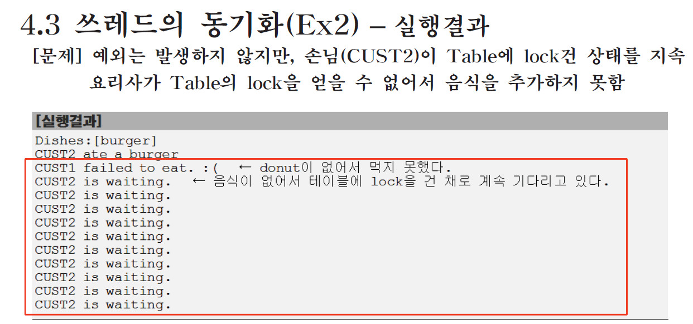

# 쓰레드
## 프로세스와 쓰레드
- 프로세스 : 실행 중인 프로그램. 자원과 스레드로 구성
- 스레드 : 프로세스 내에서 실제 작업을 수행
    - 모든 프로세스는 최소한 하나의 스레드를 가지고 있다.
- `프로세스 : 쓰레드 = 공장 : 일꾼`
- 하나의 새로운 프로세스를 생성하는 것보다 하나의 새로운 쓰레드를 생성하는 것이 더 적은 비용이 든다.
## 멀티쓰레드의 장단점
- 장점
    - 시스템 자원을 보다 효율적으로 사용할 수 있다.
    - 사용자에 대한 응답성(responseness)이 향상된다.
    - 작업이 분리되어 코드가 간결해진다.
- 단점
    - 동기화(synchronization)에 주의해야 한다.
    - 교착상태(dead-lock)가 발생하지 않도록 주의해야 한다.
    - 각 쓰레드가 효율적으로 고르게 실행될 수 있게 해야 한다.

# 쓰레드의 구현과 실행
1. Thread 클래스를 상속
```java
// 구현

class MyThread extends Thread {
    public void run() { ... }   // Thread클래스의 run()을 오버라이딩
}
```
```java
// 실행

MyThread t = new MyThread();    // 쓰레드의 생성
t.start(); // 쓰레드의 실행
```
2. Runnable 인터페이스를 구현
```java
// 구현

class MyThread implements Runnable {
    public void run() { ... }   // Runnable인터페이스의 추상메서드 run()을 구현
}
```
```java
// 실행

Runnable r = new MyThread();
Thread t = new Thread(r)    // Thread(Runnable r)
// Thread t = new Thread(new MyThread());
t.start();
```
### 예제
```java
public class Ex13_1 {

	public static void main(String[] args) {
		ThreadEx1_1 t1 = new ThreadEx1_1();
		
		Runnable r = new ThreadEx1_2();
		Thread t2 = new Thread(r);	// 생성자. Thread(Runnable target)
		
		t1.start();
		t2.start();
	}

}

class ThreadEx1_1 extends Thread {
	public void run() {
		for(int i=0; i<5; i++) {
			System.out.println(this.getName());
		}
	}
}

class ThreadEx1_2 implements Runnable {
	public void run() {
		for(int i=0; i<5; i++) {
			// Thread.currentThread() : 현재 실행중인 Thread를 반환한다.
			System.out.println(Thread.currentThread().getName());
		}
	}
}
```
## 쓰레드의 실행 - start()
- 쓰레드를 생성한 후에 start()를 호출해야 쓰레드가 작업을 시작한다.
    - start()를 호출했다고 즉시 실행되는 것은 아니다
    - 먼저 호출했다고 먼저 시작되는 것은 아니다.
    - 실행 순서는 OS의 스케줄러가 결정한다.(JVM이 OS에 독립적이라곤 하지만, 쓰레드는 OS에 종속적이다.)

## start()와 run()
1. main메서드가 호출되면서 start메서드가 호출스택에 올라온다.


2. start메서드가 새로운 호출스택을 생성한다.


3. 새롭게 만들어진 호출스택에 run메서드가 올라오고 start 메서드는 종료된다.


4. 각각의 스레드가 별도의 호출 스택을 가지며 서로 독립적으로 작업을 수행할 수 있게 된다.


# 싱글 쓰레드와 멀티 쓰레드, 쓰레드의 I/O 블락킹
## main 쓰레드
- main 메서드의 코드를 수행하는 쓰레드
- 쓰레드는 `사용자 쓰레드`와 `데몬 쓰레드` 두 종류가 있다.
- 프로그램은 실행중인 **사용자 쓰레드**가 하나도 없을 때 종료된다.
### 예제 : 메인 메서드가 종료되어도 다른 쓰레드가 실행중이면 프로그램이 종료되지 않는다.
```java
class Ex13_11 {
	static long startTime = 0;

	public static void main(String args[]) {
		ThreadEx11_1 th1 = new ThreadEx11_1();
		ThreadEx11_2 th2 = new ThreadEx11_2();
		th1.start();
		th2.start();
		startTime = System.currentTimeMillis();
		
		// 아래의 join메서드가 있는 try catch 블럭을 없애면 소요시간이 먼저 찍힘
		try {
			th1.join();	// th1의 작업이 끝날 때까지 main쓰레드를 기다리게 한다.
			th2.join();	// th2의 작업이 끝날 때까지 main쓰레드를 기다리게 한다.
		} catch(InterruptedException e) {}

		System.out.print("소요시간:" + (System.currentTimeMillis() - Ex13_11.startTime));
	}
}

class ThreadEx11_1 extends Thread {
	public void run() {
		for(int i=0; i < 300; i++) {
			System.out.print(new String("-"));
		}
	}
}

class ThreadEx11_2 extends Thread {
	public void run() {
		for(int i=0; i < 300; i++) {
			System.out.print(new String("|"));
		}
	}
}
```
output
```
------||||-||||||||||||||||||||||||||||||||||||||||||||||||||||
-----------------------------------||||||||||||||---------|||||
-------------------|||||||||||||||||||||||||||||||||||||||||||||||||||||||||||||||||||||||||||||||||||||||||||||||||||||||||||||
----------------------------------------------------------------------------------------------------------------------------------------------------------------
-------------------|||||||||||||||||||||||||||||||||||||||||||||||||||||||||||||
||||||||||||||||--|||||||||||||||||||||||||||||||||||||||
----------------------------------------
---------소요시간:11
```

## 싱글쓰레드와 멀티쓰레드

<br>

- 싱글 쓰레드의 경우보다 멀티 쓰레드의 경우가 총 소요시간이 더 많이 걸린다.
- 그 이유는 작업을 번갈아 수행하는 context switching이 발생할 때 시간이 소요되기 때문이다.
- 시간이 더 걸리더라도 동시에 두 작업을 수행할 수 있는 것이 더 장점이다.
    - 채팅을 하면서 파일을 다운로드 받을 수 없는 경우가 싱글쓰레드
    - 다운로드 시간이 더 걸리더라도 채팅과 동시에 파일 다운이 가능한 경우가 멀티쓰레드
## 쓰레드의 I/O 블락킹
```java
// 싱글 쓰레드

class ThreadEx6 {
    public static void main(String[] args) {
        String input = JOptionPane.showInputDialog("아무 값이나 입력하세요.");
        System.out.println("입력하신 값은" + input + "입니다.");

        for(int i=10; i>0; i--) {
            System.out.prinln(i);
            try {Thread.sleep(1000);} catch(Exception e) { }
        }
    }
}
```
```java
// 멀티 쓰레드

class ThreadEx7 {
    public static void main(String[] args) {
        ThreadEx7_1 th1 = new ThreadEx7_1();
        th1.start();

        String input = JOptionPane.showInputDialog("아무 값이나 입력하세요.");
        System.out.println("입력하신 값은" + input + "입니다.");
    }
}

class ThreadEx7_1 extends Thread {
    public void run() {
        for(int i=10; i>0; i--) {
            System.out.prinln(i);
            try {Thread.sleep(1000);} catch(Exception e) { }
    }
}
```


<br>

- 이런 경우 멀티 쓰레드가 싱글 쓰레드보다 작업을 빨리 마칠 수 있다.

# 쓰레드의 우선순위. 쓰레드 그룹
## 쓰레드의 우선순위(priority of thread)
- 작업의 중요도에 따라 쓰레드의 우선순위를 다르게 하여 특정 쓰레드가 더 많은 작업시간을 갖게 할 수 있다.
- Java에서는 우선순위를 1~10 사이의 값으로 지정할 수 있고, 별도의 지정이 없으면 보통 우선순위인 5로 설정된다.
```
void setPriority(int newPriority)  쓰레드의 우선순위를 지정한 값으로 변경한다.
int getPriority()                   쓰레드의 우선순위를 반환한다.
```
```java
public static final int MAX_PRIORITY  = 10  // 최대 우선순위
public static final int MIN_PRIORITY  = 1   // 최소 우선순위
public static final int NORM_PRIORITY = 5   // 보통 우선순위
```

## 쓰레드 그룹
- 서로 관련된 쓰레드를 그룹으로 묶어서 다루기 위한 것
- 모든 쓰레드는 반드시 하나의 쓰레드 그룹에 포함되어 있어야 한다.
- 쓰레드 그룹을 지정하지 않고 생성한 쓰레드는 'main쓰레드 그룹'에 속한다.
- 자신을 생성한 쓰레드(부모 쓰레드)의 그룹과 우선순위를 상속받는다.
```java
// 생성자

Thread(ThreadGroup group, String name)
Thread(ThreadGroup group, Runnable target)
Thread(ThreadGroup group, Runnable target, String name)
Thread(ThreadGroup group, Runnable target, String name, long stackSize)
```
- `ThreadGroup getThreadGroup()`: 쓰레드 자신이 속한 쓰레드 그룹을 반환한다.
- `void uncaughtException(Thread t, Throwable e)`: 처리되지 않은 예외에 의해 쓰레드 그룹의 쓰레드가 실행이 종료되었을 때, JVM에 의해 이 메서드가 자동적으로 호출된다.

### 쓰레드 그룹의 메서드


# 데몬 쓰레드, 쓰레드의 상태
## 데몬 쓰레드(daemon thread)
- 일반 쓰레드(non-daemon thread)의 작업을 돕는 보조적인 역할을 수행
- 일반 쓰레드가 모두 종료되면 자동적으로 종료된다.
- 가비지 컬렉터, 자동 저장, 화면 자동갱신 등에 사용된다.
- 무한루프와 조건문을 이용해서 실행 후 대기하다가 특정조건이 만족되면 작업을 수행하고 다시 대기하도록 작성한다.
```java
public void run() {
    while(true) {
        try {
            Thread.sleep(3 * 60 * 1000);    // 3분마다
        } catch(InterruptedException e) { }

        // autoSave의 값이 true이면 autoSave()를 호출한다.
        if(autoSave) {
            autoSave();
        }
    }
}
```
- `boolean isDaemon()` : 쓰레드가 데몬 쓰레드인지 확인한다. 데몬 쓰레드이면 true를 반환
- `void setDaemon(boolean on)` : 쓰레드를 데몬 쓰레드로 또는 사용자 쓰레드로 변경.
    - 매개변수 on을 true로 지정하면 데몬 쓰레드가 된다.
    - 반드시 start()를 호출하기 전에 실행되어야 한다. 
      그렇지 않으면 `IllegalThreadStateException`이 발생한다.

### 예제
```java
class Ex13_7 implements Runnable  {
	static boolean autoSave = false;

	public static void main(String[] args) {
		Thread t = new Thread(new Ex13_7()); // Thread(Runnable r)
		t.setDaemon(true);		// 이 부분이 없으면 종료되지 않는다.
		t.start();

		for(int i=1; i <= 10; i++) {
			try{
				Thread.sleep(1000);
			} catch(InterruptedException e) {}
			System.out.println(i);

			if(i==5) autoSave = true;
		}

		System.out.println("프로그램을 종료합니다.");
	}

	public void run() {
		while(true) {
			try { 
				Thread.sleep(3 * 1000); // 3초마다
			} catch(InterruptedException e) {}

			// autoSave의 값이 true이면 autoSave()를 호출한다.
			if(autoSave) autoSave();
		}
	}

	public void autoSave() {
		System.out.println("작업파일이 자동저장되었습니다.");
	}
}
```
output
```
1
2
3
4
5
작업파일이 자동저장되었습니다.
6
7
8
작업파일이 자동저장되었습니다.
9
10
프로그램을 종료합니다.
```

## 쓰레드의 상태

|상태|설명|
|---|---|
|NEW|쓰레드가 생성되고 아직 start()가 호출되지 않은 상태|
|RUNNABLE|실행 중 또는 실행 가능한 상태|
|BLOCKED|동기화블럭에 의해서 일시정지된 상태(lock이 풀릴 때까지 기다리는 상태)|
|WAITING, TIMED_WAITING|쓰레드의 작업이 종료되지는 않았지만 실행가능하지 않은(unrunnable) 일시정지상태. <br>TIMED_WAITING은 일시정지시간이 지정된 경우를 의미|
|TERMINATED|쓰레드의 작업이 종료된 상태|


## 쓰레드의 실행제어
- 쓰레드의 실행을 제어할 수 있는 메서드가 제공된다.
  이 들을 활용해서 보다 효율적인 프로그램을 작성할 수 있다.
### 메서드

|메서드|설명|
|---|---|
|`static void sleep(long millis)`<br>`static void sleep(long millis, int nanos)`|지정된 시간(천분의 일초 단위)동안 쓰레드를 일시정지시킨다. 지정한 시간이 지나고 나면, 자동적으로 다시 실행대기상태가 된다.|
|`void join()`<br>`void join(long millis)`<br>`void join(long millis, int nanos)`|다른 쓰레드 기다리기.<br>지정된 시간동안 쓰레드가 실행되도록 한다. 지정된 시간이 지나거나 작업이 종료되면 join()을 호출한 쓰레드로 다시 돌아와 실행을 계속한다.|
|`void interrupt()`|깨우기.<br>sleep()이나 join()에 의해 일시정지상태인 쓰레드를 깨워서 실행대기상태로 만든다. 해당 쓰레드에서는 Interrupted Exception이 발생함으로써 일시정지 상태를 벗어나게 된다.|
|`void stop()`|쓰레드를 즉시 종료시킨다.|
|`void suspend()`|쓰레드를 일시정지시킨다. resume()을 호출하면 다시 실행대기상태가 된다.|
|`void resume()`|suspend()에 의해 일시정지상태에 있는 쓰레드를 실행대기상태로 만든다.|
|`static void yield()`|실행 중에 자신에게 주어진 실행시간을 다른 쓰레드에게 양보(yield)하고 자신은 실행대기상태가 된다.|

- static 메서드는 쓰레드 자기 자신에게만 호출 가능.(ex. interrupt()는 다른 쓰레드를 깨울 수 있지만 static 메서드는 자기 자신에게만 적용된다.)

# sleep(), interrupt()
## sleep()
- 현재 쓰레드를 지정된 시간동안 멈추게 한다.
- 예외처리를 해야한다. (InterruptedException이 발생하면 깨어남)
```java
try {
	Thread.sleep(1, 500000);	// 쓰레드를 0.0015초동안 멈추게한다.
} catch(InterruptedException e) { }
```
예외처리를 매번 하기 귀찮으면 별도의 메서드로 만들면 된다.
```java
void delay(long millis) {
	try {
		Thread.sleep(millis);
	} catch(InterruptedException e) { }
}
```
- 특정 쓰레드를 지정해서 멈추게 하는 것은 불가능하다.
```java
public static void main(String args[]) {
	ThreadEx8_1 th1 = new ThreadEx8_1();
	ThreadEx8_2 th2 = new ThreadEx8_2();
	th1.start();
	th2.start();

	try {
		// 의도한 대로 th1이 멈추는 것이 아닌 해당 메서드를 실행하는 main 쓰레드가 멈추게 된다.
		th1.sleep(2000);	
	} catch(InterruptedException e) { }
}
```

## interrupt()
- 대기상태(WAITING)인 쓰레드를 실행대기 상태(RUNNABLE)로 만든다.
```
void 	interrupt()		쓰레드의 interrupted상태를 false에서 true로 변경.
boolean isInterrupted()		쓰레드의 interrupted상태를 반환.
static boolean interrupted()	현재 쓰레드의 interrupted상태를 알려주고, false로 초기화.
```

### interrupt() 예제
```java
import javax.swing.JOptionPane;

class Ex13_9 {
	public static void main(String[] args) throws Exception {
		ThreadEx9_1 th1 = new ThreadEx9_1();
		th1.start();

		String input = JOptionPane.showInputDialog("아무 값이나 입력하세요."); 
		System.out.println("입력하신 값은 " + input + "입니다.");
		th1.interrupt();  // interrupt()를 호출하면, interrupted상태가 true가 된다.
	
	}
}

class ThreadEx9_1 extends Thread {
	public void run() {
		int i = 10;

		while(i!=0 && !isInterrupted()) {
			System.out.println(i--);
			for(long x=0;x<2500000000L;x++); // 시간 지연
		}
		
		System.out.println("isInterrupted(): "+this.isInterrupted());	// true
		System.out.println("isInterrupted(): "+this.isInterrupted());	// true
		System.out.println("interrupted(): "+Thread.interrupted());		// true
		System.out.println("interrupted(): "+Thread.interrupted());		// false
		
		System.out.println("카운트가 종료되었습니다.");
	} 
}
```
output
```
10
9
8
7
입력하신 값은 good입니다.
isInterrupted(): true
isInterrupted(): true
interrupted(): true
interrupted(): false
카운트가 종료되었습니다.
```

# suspend(), resume()
## suspend(), resume(), stop()
- 쓰레드의 실행을 일시정지, 재개, 완전정지 시킨다.
```
void suspend()	쓰레드를 일시정지 시킨다.
void resume()	suspend()에 의해 일시정지된 쓰레드를 실행대기상태로 만든다.
void stop()	쓰레드를 즉시 종료시킨다.
```
- suspend(), resume(), stop()은 교착상태에 빠지기 쉬워서 deprecated되었다.
  그래서 직접 작성하기도 한다.
```java
class ThreadEx17_1 implements Runnable {
	boolean suspended = false;
	boolean stopped = false;

	public void run() {
		while(!stopped) {
			if(!suspended) {
				/* 쓰레드가 수행할 코드를 작성 */
			}
		}
	}

	public void suspend() { suspended = true; }
	public void resume() { suspended = false; }
	public void stop() { stopped = true; }
}
```

# join(), yield()
## join()
- 지정된 시간동안 특정 쓰레드가 작업하는 것을 기다린다.
```
void join()				작업이 모두 끝날 때까지
void join(long millis)			천분의 일초 동안
void join(long millis, int nanos)	천분의 일초 + 나노초 동안
```
- 예외처리를 해야한다. (InterruptedException이 발생하면 작업 재개)
### 예제 1
```java
class Ex13_11 {
	static long startTime = 0;

	public static void main(String args[]) {
		ThreadEx11_1 th1 = new ThreadEx11_1();
		ThreadEx11_2 th2 = new ThreadEx11_2();
		th1.start();
		th2.start();
		startTime = System.currentTimeMillis();
		
		// 아래의 join메서드가 있는 try catch 블럭을 없애면 소요시간이 먼저 찍힘
		try {
			th1.join();	// th1의 작업이 끝날 때까지 main쓰레드를 기다리게 한다.
			th2.join();	// th2의 작업이 끝날 때까지 main쓰레드를 기다리게 한다.
		} catch(InterruptedException e) {}

		System.out.print("소요시간:" + (System.currentTimeMillis() - Ex13_11.startTime));
	}
}

class ThreadEx11_1 extends Thread {
	public void run() {
		for(int i=0; i < 100; i++) {
			System.out.print(new String("-"));
		}
	}
}

class ThreadEx11_2 extends Thread {
	public void run() {
		for(int i=0; i < 100; i++) {
			System.out.print(new String("|"));
		}
	}
}
```
output
```
----------------------------------------------------------------------------------------------------||||||||||||||||||||||||||||||||||||||||||||||||||||||||||||||||||||||||||||||||||||||||||||||||||||소요시간:4
```
join메서드 없이 실행하면 main메서드의 쓰레드가 두개의 쓰레드를 기다리지 않고 먼저 끝나버린다.
```java
class Ex13_11 {
	static long startTime = 0;

	public static void main(String args[]) {
		ThreadEx11_1 th1 = new ThreadEx11_1();
		ThreadEx11_2 th2 = new ThreadEx11_2();
		th1.start();
		th2.start();
		startTime = System.currentTimeMillis();
		
		// 아래의 join메서드가 있는 try catch 블럭을 없애면 소요시간이 먼저 찍힘
//		try {
//			th1.join();	// th1의 작업이 끝날 때까지 main쓰레드를 기다리게 한다.
//			th2.join();	// th2의 작업이 끝날 때까지 main쓰레드를 기다리게 한다.
//		} catch(InterruptedException e) {}

		System.out.print("소요시간:" + (System.currentTimeMillis() - Ex13_11.startTime));
	}
}

class ThreadEx11_1 extends Thread {
	public void run() {
		for(int i=0; i < 100; i++) {
			System.out.print(new String("-"));
		}
	}
}

class ThreadEx11_2 extends Thread {
	public void run() {
		for(int i=0; i < 100; i++) {
			System.out.print(new String("|"));
		}
	}
}
```
output
```
|||||||||||||||||||||||소요시간:0--------------------------------------------------------------------------------------|||||||||||||||||||||||||||||||||||||||||||||||||||--------------||||||||||||||||||||||||||
```
## yield()
- 남은 시간을 다음 쓰레드에게 양보하고, 자신(현재 쓰레드)은 실행대기한다.
```java
class ThreadEx17_1 implements Runnable {
	boolean suspended = false;
	boolean stopped = false;

	public void run() {
		while(!stopped) {
			if(!suspended) {
				/* 쓰레드가 수행할 코드를 작성 */
			}
		}
	}

	public void suspend() { suspended = true; }
	public void resume() { suspended = false; }
	public void stop() { stopped = true; }
}
```
위의 코드의 경우 suspended가 true이면 아무것도 수행하지 않고 while문만 바쁘게 계속 돌면서 busy-waiting한다.  
따라서 차라리 다른 쓰레드에게 자원을 양보하는 것이 낫다.
```java
class ThreadEx17_1 implements Runnable {
	boolean suspended = false;
	boolean stopped = false;

	public void run() {
		while(!stopped) {
			if(!suspended) {
				/* 쓰레드가 수행할 코드를 작성 */
			} else {
				Thread.yield();
			}
		}
	}

	public void suspend() { suspended = true; }
	public void resume() { suspended = false; }
	public void stop() { stopped = true; }
}
```

# 쓰레드의 동기화
## 쓰레드의 동기화 (synchronization)
- 멀티 쓰레드 프로세스에서는 여러 쓰레드가 같은 자원을 공유하기 때문에 다른 쓰레드의 작업에 영향을 미칠 수 있다.
- 진행중인 작업이 다른 쓰레드에게 간섭받지 않게 하려면 '동기화'가 필요  
`쓰레드의 동기화 - 한 쓰레드가 진행중인 작업을 다른 쓰레드가 간섭하지 못하게 막는 것`  
- 동기화하려면 간섭받지 않아야 하는 문장들을 '임계 영역'으로 설정
- 임계영역은 락(lock)을 얻은 단 하나의 쓰레드만 출입가능(객체 1개에 락 1개)
## synchronized를 이용한 동기화
- synchronized로 임계영역(lock이 걸리는 영역)을 설정하는 방법 2가지

1. 메서드 전체를 임계영역으로 지정
```
public synchronized void calcSum() {
	...
}
```
2. 특정한 영역을 임계 영역으로 지정
```
synchronized(객체의 참조변수) {
	...
}
```

### 예제
동기화 되어있지 않은 경우
```java
class Ex13_12 {
	public static void main(String args[]) {
		Runnable r = new RunnableEx12();
		new Thread(r).start(); // ThreadGroup에 의해 참조되므로 gc대상이 아니다.
		new Thread(r).start(); // ThreadGroup에 의해 참조되므로 gc대상이 아니다.
	}
}

class Account {
	private int balance = 1000;

	public  int getBalance() {
		return balance;
	}

	public void withdraw(int money){
		if(balance >= money) {
			try { Thread.sleep(1000);} catch(InterruptedException e) {}
			balance -= money;
		}
	} // withdraw
}

class RunnableEx12 implements Runnable {
	Account acc = new Account();

	public void run() {
		while(acc.getBalance() > 0) {
			// 100, 200, 300중의 한 값을 임으로 선택해서 출금(withdraw)
			int money = (int)(Math.random() * 3 + 1) * 100;
			acc.withdraw(money);
			System.out.println("balance:"+acc.getBalance());
		}
	} // run()
}
```
output
```
balance:600
balance:600
balance:500
balance:300
balance:200
balance:100
balance:100
balance:-100
balance:-200
```
음수인 잔고가 나오게 된다. 따라서 출금 메서드에 synchronized 키워드를 붙여야한다.
```java
class Ex13_12 {
	public static void main(String args[]) {
		Runnable r = new RunnableEx12();
		new Thread(r).start(); // ThreadGroup에 의해 참조되므로 gc대상이 아니다.
		new Thread(r).start(); // ThreadGroup에 의해 참조되므로 gc대상이 아니다.
	}
}

class Account {
	private int balance = 1000;	// private으로 해야 동기화의 의미가 있다.

	public  synchronized int getBalance() {
		return balance;
	}

	public synchronized void withdraw(int money){
		if(balance >= money) {
			try { Thread.sleep(1000);} catch(InterruptedException e) {}
			balance -= money;
		}
	} // withdraw
}

class RunnableEx12 implements Runnable {
	Account acc = new Account();

	public void run() {
		while(acc.getBalance() > 0) {
			// 100, 200, 300중의 한 값을 임으로 선택해서 출금(withdraw)
			int money = (int)(Math.random() * 3 + 1) * 100;
			acc.withdraw(money);
			System.out.println("balance:"+acc.getBalance());
		}
	} // run()
}
```
# wait()과 notify()
- 동기화의 효율을 높이기 위해 wait(), notify()를 사용.
- Object클래스에 정의되어 있으며, 동기화 블록 내에서만 사용할 수 있다.
```
wait()		객체의 lock을 풀고 쓰레드를 해당 객체의 waiting pool에 넣는다.
notify()	waiting pool에서 대기중인 쓰레드 중의 하나를 깨운다.
notifyAll()	waiting pool에서 대기중인 모든 쓰레드를 깨운다.
```
```java
class Account {
	int balance = 1000;

	public synchronized void withdraw(int money) {
		while(balance < money) {	// 출금할 돈보다 잔고가 적으면
			try {
				wait();	// 대기 - 락을 풀고 기다린다. 통지를 받으면 락을 재획득(ReEntrance)
			} catch(InterruptedException e) { }
		}

		balance -= money;
	}

	public synchronized void deposit(int money) {
		balance += money;
		notify();	// 통지 - 대기중인 쓰레드 중 하나에게 알림.
	}
}
```
### 예제1: 동기화를 안한 경우
- 요리사는 Table에 음식을 추가. 손님은 Table의 음식을 소비
- 요리사와 손님이 같은 객체(Table)를 공유하므로 동기화가 필요

<br>


<br>

- `ConcurrentModificationException`: ArrayList와 같은 컬렉션 읽기 수행 중 변경이 발생할 때 생기는 에러
- `IndexOutofBoundException`
### 예제 1의 문제점 해결

<br>



<br>

### 예제 2: 위의 경우 에러는 안나지만 진행이 안됨


- 손님이 기다리는 경우: 테이블에 음식이 없는 경우
- 요리사가 기다리는 경우: 테이블에 음식이 가득 찬 경우
<br>


- wait()과 notify()를 손님에게 하는지 요리사에게 하는지 구별이 안된다는 문제점이 있음.
	- Lock & Condition으로 이를 해소할 수 있음.
<br>

전체 코드
```java
import java.util.ArrayList;

class Customer2 implements Runnable {
	private Table2  table;
	private String food;

	Customer2(Table2 table, String food) {
		this.table = table;  
		this.food  = food;
	}

	public void run() {
		while(true) {
			try { Thread.sleep(100);} catch(InterruptedException e) {}
			String name = Thread.currentThread().getName();
			
			table.remove(food);
			System.out.println(name + " ate a " + food);
		} // while
	}
}

class Cook2 implements Runnable {
	private Table2 table;
	
	Cook2(Table2 table) { this.table = table; }

	public void run() {
		while(true) {
			int idx = (int)(Math.random()*table.dishNum());
			table.add(table.dishNames[idx]);
			try { Thread.sleep(10);} catch(InterruptedException e) {}
		} // while
	}
}

class Table2 {
	String[] dishNames = { "donut","donut","burger" }; // donut의 확률을 높인다.
	final int MAX_FOOD = 6;
	private ArrayList<String> dishes = new ArrayList<>();

	public synchronized void add(String dish) {
		while(dishes.size() >= MAX_FOOD) {
				String name = Thread.currentThread().getName();
				System.out.println(name+" is waiting.");
				try {
					wait(); // COOK쓰레드를 기다리게 한다.
					Thread.sleep(500);
				} catch(InterruptedException e) {}	
		}
		dishes.add(dish);
		notify();  // 기다리고 있는 CUST를 깨우기 위함.
		System.out.println("Dishes:" + dishes.toString());
	}

	public void remove(String dishName) {
		synchronized(this) {	
			String name = Thread.currentThread().getName();

			while(dishes.size()==0) {
					System.out.println(name+" is waiting.");
					try {
						wait(); // CUST쓰레드를 기다리게 한다.
						Thread.sleep(500);
					} catch(InterruptedException e) {}	
			}

			while(true) {
				for(int i=0; i<dishes.size();i++) {
					if(dishName.equals(dishes.get(i))) {
						dishes.remove(i);
						notify(); // 잠자고 있는 COOK을 깨우기 위함 
						return;
					}
				} // for문의 끝

				try {
					System.out.println(name+" is waiting.");
					wait(); // 원하는 음식이 없는 CUST쓰레드를 기다리게 한다.
					Thread.sleep(500);
				} catch(InterruptedException e) {}	
			} // while(true)
		} // synchronized
	}
	public int dishNum() { return dishNames.length; }
}

class Ex13_15 {
	public static void main(String[] args) throws Exception {
		Table2 table = new Table2();

		new Thread(new Cook2(table), "COOK").start();
		new Thread(new Customer2(table, "donut"),  "CUST1").start();
		new Thread(new Customer2(table, "burger"), "CUST2").start();
		Thread.sleep(2000);
		System.exit(0);
	}
}
```