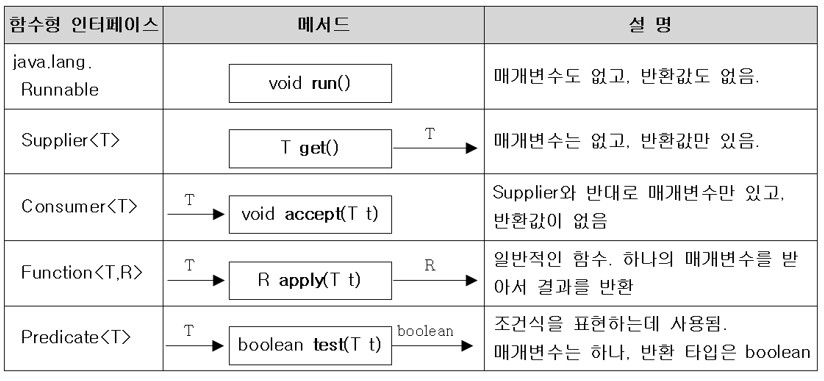
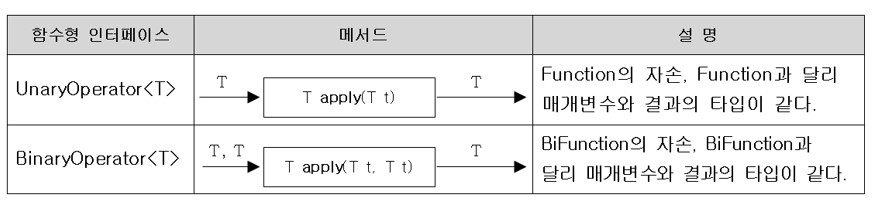

# 람다식이란? 람다식 작성하기
## 람다식(Lambda Expression)
- 함수(메서드)를 간단한 `식(expression)`으로 표현하는 방법
- 익명함수(이름이 없는 함수, anonymous function)
- 함수와 메서드의 차이
    - 근본적으로 동일. 함수는 일반적 용어, 메서드는 객체지향개념 용어
    - 함수는 클래스에 독립적, 메서드는 클래스에 종속적

## 람다식 작성하기
1. 메서드의 이름과 반환타입을 제거하고 `->`를 블록 {} 앞에 추가한다.
```java
int max(int a, int b) {
    return a>b ? a : b;
}
```
👇
```java
(int a, int b) -> {
    return a>b ? a : b;
}
```
2. 반환값이 있는 경우 식이나 값만 적고 return문은 생략가능, 세미콜론은 안붙임
```java
(int a, int b) -> a>b ? a : b
```
3. 매개변수의 타입이 추론 가능하면 생략가능(대부분의 경우 생략 가능)
```java
(a, b) -> a>b ? a : b
```
## 람다식 작성하기 - 주의사항
1. 매개변수가 하나인 경우, 괄호`()` 생략 가능 (타입이 없을 때만)
```java
    (a) -> a*a
(int a) -> a*a
```
👇
```java
    a -> a*a    // OK
int a -> a*a    // 에러
```
2. 블록 안의 문장이 하나뿐 일 때, 괄호`{}` 생략 가능(끝에 `;` 안 붙임)
```java
(int i) -> {
    System.out.println(i);
}
```
👇
```java
(int i) -> System.out.printlnt(i)
```
단, 하나뿐인 문장이 return문이면 괄호 생략 불가
```java
(int a, int b) -> { return a>b ? a : b; }   // OK
(int a, int b) ->   return a>b ? a : b      // 에러
```
## 람다식의 예
### 메서드
```java
int max(int a, int b) {
    return a>b ? a : b;
}
```
### 람다식
```java
(a, b) -> a>b ? a : b;
```
<br>

### 메서드
```java
int printVar(String name, int i) {
    System.out.println(name + "=" + i);
}
```
### 람다식
```java
(name, i) -> System.out.println(name + "=" + i)
```
<br>

### 메서드
```java
int square(int x) {
    return x * x;
}
```
### 람다식
```java
x -> x * x
```
<br>

### 메서드
```java
int roll() {
    return (int)(Math.random() * 6);
}
```
### 람다식
```java
() -> (int)(Math.random() * 6)
```
## 람다식은 익명 함수? 익명 객체!
- 람다식은 익명 함수가 아니라 익명 객체이다.
```java
(a, b) -> a>b ? a : b
```
👇 위의 람다식은 아래의 익명 객체와 같다.
```java
new Object() {
    int max(int a, int b) {
        return a>b ? a : b;
    }
};
```
- 람다식(익명 객체)을 다루기 위한 참조변수가 필요. 참조변수의 타입은?
```java
Object obj = new Object() {
    int max(int a, int b) {
        return a>b ? a : b;
    }
};

int value = obj.max(3, 5);  // 에러. 참조변수의 타입 Object에는 max라는 리모콘이 없다.
```
# 함수형 인터페이스
- 함수형 인터페이스: 단 하나의 추상 메서드만 선언된 인터페이스
```java
public class Ex14_0 {
	public static void main(String[] args) {
		// 익명 클래스의 선언과 객체 생성을 동시에 한 코드
		MyFunction f = new MyFunction() {
			public int max(int a, int b) {
				return a>b ? a : b;
			}
		};
		System.out.println(f.max(3, 5));
	}
}

@FunctionalInterface
interface MyFunction {
	public abstract int max(int a, int b);
}
```
- 함수형 인터페이스 타입의 참조변수로 람다식을 참조할 수 있음.
  (단, 함수형 인터페이스의 메서드와 람다식의 **매개변수 개수와 반환 타입**이 일치해야 함.)

```java
public class Ex14_0 {
	public static void main(String[] args) {
        // 람다식(익명 객체)을 다루기 위한 참조변수의 타입은 함수형 인터페이스로 한다.
		MyFunction f = (a, b) -> a>b ? a : b;   // 람다식. 익명 객체
		System.out.println(f.max(3, 5));
	}
}

@FunctionalInterface
interface MyFunction {
	public abstract int max(int a, int b);
}
```
## 함수형 인터페이스 - example
- 익명 객체를 람다식으로 대체
```java
List<String> list = Arrays.asList("abc", "aaa", "bbb", "ddd", "aaa");

Collections.sort(list, new Comparator<String>() {
                            public int compare(String s1, String s2) {
                                return s2.compareTo(s1);
                            }
});
```
👇
```java
Collections.sort(list, (s1, s2) -> s2.compareTo(s1));   // sort(List list, Comparator c)
```
## 함수형 인터페이스 타입의 매개변수, 반환타입
- 함수형 인터페이스 타입의 매개변수
```java
@FunctionalInterface
interface MyFunction {
    void myMethod();
}
```
위와 같은 함수형 인터페이스가 있을 때, 아래와 같은 메서드를 작성했다고 가정하자.
```java
void aMethod(Myfunction f) {
    f.myMethod();   // MyFunction에 의해 정의된 메서드 호출
}
```
위의 메서드를 호출하는 코드는 아래와 같다.
```java
MyFunction f = () -> System.out.println("myMethod()");
aMethod(f);
```
위의 두 문장을 한 줄로 합칠 수 있다.
```java
aMethod(()-> System.out.println("myMethod()"));
```
- 함수형 인터페이스 타입의 반환타입
```java
MyFunction myMethod() {
    MyFunction f = () -> {};
    return f;
}
```
아래와 같이 줄여쓸 수 있다.
```java
MyFunction myMethod() {
    return () -> {};
}
```
### 예제 - 람다식을 주고받는 방법
```java
@FunctionalInterface
interface MyFunction {
	void run();  // public abstract void run();
}

class Ex14_1 {
	static void execute(MyFunction f) { // 매개변수의 타입이 MyFunction인 메서드
		f.run();
	}

	static MyFunction getMyFunction() { // 반환 타입이 MyFunction인 메서드 
		MyFunction f = () -> System.out.println("f3.run()");
		return f;
	}

	public static void main(String[] args) {
		// 람다식으로 MyFunction의 run()을 구현
		MyFunction f1 = ()-> System.out.println("f1.run()");

		MyFunction f2 = new MyFunction() {  // 익명클래스로 run()을 구현
			public void run() {   // public을 반드시 붙여야 함
				System.out.println("f2.run()");
			}
		};

		MyFunction f3 = getMyFunction();

		f1.run();
		f2.run();
		f3.run();

		execute(f1);
		execute( ()-> System.out.println("run()") );
	}
}
```
output
```
f1.run()
f2.run()
f3.run()
f1.run()
run()
```
# java.util.function 패키지
## java.util.function 패키지 1
- 자주 사용되는 다양한 함수형 인터페이스를 제공.

<br>

### Predicate<T> 사용 예제
```java
Predicate<String> isEmptyStr = s -> s.length()==0;
String s = "";

if(isEmptyStr.test(s))  // if(s.length()==0) 과 동일
    System.out.println("This is an empty String.");
```
### Quiz. 아래의 빈칸에 알맞은 함수형 인터페이스(java.util.function패키지)를 적으시오
```java
[1번] f = () -> (int)(Math.random()*100) + 1;
[2번] f = i -> System.out.print(i + ",");
[3번] f = i -> i%2==0;
[4번] f = i -> i/10*10;
```
#### Answer
```java
Supplier<Integer> f = () -> (int)(Math.random()*100) + 1;
Consumer<Integer> f = i -> System.out.print(i + ",");
Predicate<Integer> f = i -> i%2==0;
Function<Integer, Integer> f = i -> i/10*10;
```
## java.util.function 패키지 2
- 매개변수가 2개인 함수형 인터페이스

<br>

- `BiSupplier`는 없다. 반환값이 두개이상일 수는 없기 때문.
- 매개변수를 세개 입력받는 함수형 인터페이스를 사용하고 싶으면 아래와 같이 직접 만들면 됨
```java
@FunctionalInterface
interface TriFunction<T, U, V, R> {
    R apply(T t, U u, V v);
}
```
## java.util.function 패키지 3
- 매개변수의 타입과 반환타입이 일치하는 함수형 인터페이스

<br>

### 예제
```java
import java.util.function.*;
import java.util.*;

class Ex14_2 {
	public static void main(String[] args) {
		Supplier<Integer>  s = ()-> (int)(Math.random()*100)+1;
		Consumer<Integer>  c = i -> System.out.print(i+", "); 
		Predicate<Integer> p = i -> i%2==0; 
		Function<Integer, Integer> f = i -> i/10*10; // i의 일의 자리를 없앤다.
		
		List<Integer> list = new ArrayList<>();	
		makeRandomList(s, list);
		System.out.println(list);
		printEvenNum(p, c, list);
		List<Integer> newList = doSomething(f, list);
		System.out.println(newList);
	}

	static <T> List<T> doSomething(Function<T, T> f, List<T> list) {
		List<T> newList = new ArrayList<T>(list.size());

		for(T i : list) {
			newList.add(f.apply(i));
		}	

		return newList;
	}

	static <T> void printEvenNum(Predicate<T> p, Consumer<T> c, List<T> list) {
		System.out.print("[");
		for(T i : list) {
			if(p.test(i))
				c.accept(i);
		}	
		System.out.println("]");
	}

	static <T> void makeRandomList(Supplier<T> s, List<T> list) {
		for(int i=0;i<10;i++) {
			list.add(s.get());
		}
	}
}
```
# Predicatd의 결합. CF와 함수형 인터페이스
## Predicate의 결합
- and(), or(), negate()로 두 Predicate를 하나로 결합(default메서드)
```java
Predicate<Integer> p = i -> i<100;
Predicate<Integer> q = i -> i<200;
Predicate<Integer> r = i -> i%2==0;
```
```java
Predicate<Integer> notP = p.negate();   // i>=100
Predicate<Integer> all = notP.and(q).or(r);	// 100<= i && i < 200 || i%2==0
Predicate<Integer> all2 = notP.and(q.or(r));	// 100 <= i && (i<200 || i%2 ==0)
```
```java
System.out.println(all.test(2));	// true
System.out.println(all2.test(2));	// false
```
- 등가비교를 위한 Predicate의 작성에는 isEqual()를 사용(static메서드)
```java
Predicate<String> p = Predicate.isEqual(str1);	// isEquals()은 static메서드
Boolean result = p.test(str2);	// str1과 str2가 같은지 비교한 결과를 반환
// 위의 두 줄과 같다.
boolean result = Predicate.isEqual(str1).test(str2);
```
### 예제
```java
import java.util.function.*;

class Ex14_3 {
	public static void main(String[] args) {
		Function<String, Integer>	f  = (s) -> Integer.parseInt(s, 16);
		Function<Integer, String>	g  = (i) -> Integer.toBinaryString(i);

		Function<String, String>    h  = f.andThen(g);	// 합성함수. f를 적용 후 g를 적용하라. f의 출력과 g의 입력 타입이 같아야함
		Function<Integer, Integer>  h2 = f.compose(g);	// g.andThen(f);

		System.out.println(h.apply("FF")); // "FF" → 255 → "11111111"
		System.out.println(h2.apply(2));   // 2 → "10" → 16

		Function<String, String> f2 = x -> x; // 항등 함수(identity function)
		System.out.println(f2.apply("AAA"));  // AAA가 그대로 출력됨

		Predicate<Integer> p = i -> i < 100;
		Predicate<Integer> q = i -> i < 200;
		Predicate<Integer> r = i -> i%2 == 0;
		Predicate<Integer> notP = p.negate(); // i >= 100

		Predicate<Integer> all = notP.and(q.or(r));
		System.out.println(all.test(150));       // true

		String str1 = "abc";
		String str2 = "abc";
		
		// str1과 str2가 같은지 비교한 결과를 반환
		Predicate<String> p2 = Predicate.isEqual(str1); 
		boolean result = p2.test(str2);   
		System.out.println(result);	// true
	}
}
```
## 컬렉션 프레임웍과 함수형 인터페이스
### 함수형 인터페이스를 사용하는 컬렉션 프레임웍의 메서드(와일드 카드 생략)
- Collection
	- `boolean removeIf(Predicate<E> filter)`: 조건에 맞는 요소를 삭제
- List
	- `void replaceAll(UnaryOperator<E> operator)`: 모든 요소를 변환하여 대체
- Iterable
	- `void forEach(Consumer<T> action)`: 모든 요소에 작업 action을 수행
- Map
	- `V compute(K key, BiFunction<K,V,V> f)`: 지정된 키의 값에 작업 f를 수행
	- `V computeIfAbsent(K key, Function<K,V> f)`: 키가 없으면, 작업 f 수행 후 추가
	- `V computeIfPresent(K key, BiFunction<K,V,V> f)`: 지정된 키가 있을 때 작업 f 수행
	- `V merge(K key, V value, BiFunction<V,V,V> f)`: 모든 요소에 병합작업 f를 수행
	- `void forEach(BiConsumer<K,V> action)`: 모든 요소에 작업 action을 수행
	- `void replaceAll(BiFunction<K,V,V> f)`: 모든 요소에 치환작업 f를 수행

### 사용 예시
```java
list.forEach(i -> System.out.print(i+","));	// list의 모든 요소를 출력
list.removeIf(x -> x%2==0 || x%3==0);	// 2 또는 3의 배수를 제거
list.replaceAll(i -> i*10);	// 모든 요소에 10을 곱한다.

// map의 모든 요소를 {k, v}의 형식으로 출력
map.forEach((k, v) -> System.out.print("{" + k + ", " + v + "}, "));
```
### 예제
```java
import java.util.*;

class Ex14_4 {
	public static void main(String[] args) 	{
		ArrayList<Integer> list = new ArrayList<>();
		for(int i=0;i<10;i++)
			list.add(i);

		// list의 모든 요소를 출력
		list.forEach(i->System.out.print(i+","));
		System.out.println();
		// iterator를 쓰면 코드가 이렇게 길어진다.(출력형식 무시하고 이해하셈)
//		Iterator it = list.iterator();
//		while(it.hasNext()) {
//			System.out.println(it.next());
//		}

		// list에서 2 또는 3의 배수를 제거한다.
		list.removeIf(x-> x%2==0 || x%3==0);
		System.out.println(list);

		list.replaceAll(i->i*10); // list의 각 요소에 10을 곱한다.
		System.out.println(list);

		Map<String, String> map = new HashMap<>();
		map.put("1", "1");
		map.put("2", "2");
		map.put("3", "3");
		map.put("4", "4");

		// map의 모든 요소를 {k,v}의 형식으로 출력한다.
		map.forEach((k,v)-> System.out.print("{"+k+","+v+"},"));
		System.out.println();
		// iterator를 쓰면 코드가 이렇게 길어진다.(출력형식 무시하고 이해하셈)
//		Iterator it = map.entrySet().iterator();
//		while(it.hasNext()) {
//			System.out.println(it.next());
//		}
	}
}
```
output
```
0,1,2,3,4,5,6,7,8,9,
[1, 5, 7]
[10, 50, 70]
{1,1},{2,2},{3,3},{4,4},
```

# 메서드 참조, 생성자의 메서드 참조
## 메서드 참조(method reference)
- 하나의 메서드만 호출하는 람다식은 '메서드 참조'로 간단히 할 수 있다.
	- 메서드 참조를 람다식으로 바꿔 생각할 수 있는 연습을 해야함.
|종류|람다|메서드 참조|
|---|---|---|
|static메서드 참조|`(x) -> ClassName.method(x)`|`ClassName::method`|
|인스턴스메서드 참조|`(obj.x) -> obj.method(x)`|`ClassName::method`|
|특정 객체 인스턴스메서드 참조(거의 안씀!)|`(x) -> obj.method(x)`|obj::method|

### static메서드 참조
```java
Integer method(String s) {	// 그저 Integer.parseInt(String s)만 호출
	return Integer.parseInt(s);
}
```
람다식 변환
```java
Function<String, Integer> f = (String s) -> Integer.parseInt(s);
```
메서드 참조
```java
Function<String, Integer> f = Integer::parseInt;
```
### 생성자와 메서드 참조
- 생성자에 매개변수 없는 경우
```java
Supplier<MyClass> s = () -> new MyClass();	// 람다식

Supplier<MyClass> s = MyClass::new;		// 메서드 참조
```
- 생성자에 매개변수 있는 경우
```java
Function<Integer, MyClass> s = (i) -> new MyClass(i);	// 람다식

Function<Integer, MyClass> s = MyClass::new;		// 메서드 참조
```
### 배열과 메서드 참조
```java
Function<Integer, int[]> f = x -> new int[x];	// 람다식

Function<Integer, int[]> f = int[]::new;	// 메서드 참조
```

# 스트림, 스트림의 특징
## 스트림
- 다양한 데이터 소스를 표준화된 방법으로 다루기 위한 것
1. 스트림 만들기
2. 중간연산 (0~n번)
3. 최종연산 (1번)
- 스트림이 제공하는 기능 - 중간 연산과 최종 연산
> 중간 연산 - 연산결과가 스트림인 연산. 반복적으로 적용가능
> 최종 연산 - 연산 결과가 스트림이 아닌 연산. 단 한번만 적용가능(스트림의 요소를 소모)
## 스트림의 특징 1
- 스트림은 데이터 소스로부터 데이터를 읽기만할 뿐 변경하지 않는다.
```java
List<Integer> list = Arrays.asList(3,1,5,4,2);
List<Integer> sortedList = list.stream().sorted()	// list를 정렬해서
			.collect(Collcetors.toList());	// 새로운 List에 저장
System.out.println(list);	// [3,1,5,4,2]
System.out.println(sortedList);	// [1,2,3,4,5]
```
- 스트림은 Iterator처럼 일회용이다. (필요하면 다시 스트림을 생성해야 함)

```java
strStream.forEach(System.out::println);	// 모든 요소를 화면에 출력(최종연산)
int.numOfStr = strStream.count();	// 에러. 스트림이 이미 닫혔음.
```
- 최종 연산 전까지 중간연산이 수행되지 않는다. - 지연된 연산
```java
IntStream intStream = new Random().ints(1, 46);	// 1~45범위의 무한 스트림
intStream.distinct().limit(6).sorted()		// 중간 연산 (무한 스트림을 어떻게 중복제거하냐고 생각할 수도 있지만 지연된 연산때문에 가능하다)
	.forEach(i->System.out.print(i+","));	// 최종 연산
```
## 스트림의 특징 2
- 스트림은 작업을 내부 반복으로 처리한다.
```java
for(String str : strList) {
	System.out.println(str);
}

// 스트림 사용
stream.forEach(System.out::println);
```
for문이 내부에 들어감
```java
void forEach(Consumer<? super T> action) {
	Object.requireNonNull(action);	// 매개변수의 널 체크

	for(T t : src)	// 내부 반복(for문을 메서드 안으로 넣음)
		action.accept(T);
}
```
### 스트림의 특징 3
- 스트림의 작업을 병렬로 처리 - 병렬스트림
	- parallel의 반대는 sequential이고 디폴트이다.
```java
Stream<String> strStream = Stream.of("dd", "aaa", "CC", "cc", "b");
int sum = strStream.parallel()	// 병렬 스트림으로 전환(속성만 변경)
		.mapToInt(s->s.length()).sum();	// 모든 문자열의 길이의 합
```
- 기본형 스트림 - IntStream, LongStream, DoubleStream
	- 오토박싱&언박싱의 비효율이 제거됨(Stream<Integer>대신 IntStream사용)
	- 숫자와 관련된 유용한 메서드를 Stream<T>보다 더 많이 제공

# 스트림만들기
## 스트림 만들기 - 컬렉션
- Collection인터페이스의 stream()으로 컬렉션을 스트림으로 변환
> Stream<E> stream()	// Collection 인터페이스의 메서드

```java
List<Integer>	list = Arrays.asList(1,2,3,4,5);
Stream<Integer>	intStream = list.stream();	// list를 스트림으로 변환

// 스트림의 모든 요소를 출력
intStream.forEach(System.out::print);	// 12345
intStream.forEach(System.out::print);	// 에러. 스트림이 이미 닫혔다.
```
## 스트림 만들기 - 배열
- 객체 배열로부터 스트림 생성하기
```java
Stream<T> Stream.of(T... values) // 가변 인자
Stream<T> Stream.of(T[])
Stream<T> Arrays.stream(T[])
Stream<T> Arrays.stream(T[] array, int startInclusive, int endExclusive)
```
```java
Stream<String> strStream = Stream.of("a","b","c");	// 가변 인자
Stream<String> strStream = Stream.of(new String[]{"a","b","c"});
Stream<String> strStream = Arrays.stream(new String[]{"a","b","c"});
Stream<String> strStream = Arrays.stream(new String[]{"a","b","c"}, 0, 3);
```
- 기본형 배열로부터 스트림 생성하기
```java
IntStream IntStream.of(int... values)	// Stream이 아니라 IntStream
IntStream IntStream.of(int[])
IntStream Arrays.stream(int[])
IntStream Arrays.stream(int[] array, int startInclusive, int endExclusive)
```
## 스트림 만들기 - 임의의 수
- 난수를 요소로 갖는 스트림 생성하기
```java
IntStream intStream = new Random().ints();		// 무한 스트림
intStream.limit(5).forEach(System.out::println);	// 5개의 요소만 출력한다.

IntStream intStream = new Random().ints(5);	// 크기가 5인 난수 스트림을 반환
```
> Random클래스에 정의된 메서드의 반환범위
> Integer.MIN_VALUE <= ints() <= Integer.MAX_VALUE
> Long.MIN_VALUE <= longs() <= Long.MAX_VALUE
> 0.0 <= doubles() < 1.0

\* 지정된 범위의 난수를 요소로 갖는 스트림을 생성하는 메서드(Random클래스)
```java
IntStream	 ints(int begin, int end)	// 무한 스트림
LongStream	 long(long begin, long end)
DoubleStream doubles(double begin, double end)

IntStream	 ints(long streamSize, int begin, int end)	// 유한 스트림
LongStream	 longs(long streamSize, long begin, long end)
DoubleStream doubles(long streamSize, double begin, double end)
```

## 스트림 만들기 - 특정 범위의 정수
- 특정 범위의 정수를 요소로 갖는 스트림 생성하기(IntStream, LongStream)
```
IntStream IntStream.range(int begin, int end)
IntStream IntStream.rangeClosed(int begin, int end)
```

```java
IntStream intStream = IntStream.range(1,5);		// 1,2,3,4
IntStream intStream = IntStream.rangeClosed(1,5);	// 1,2,3,4,5
```
## 스트림 만들기 - 람다식 iterate(), generate()
- 람다식을 소스로 하는 스트림 생성하기
```
static <T> Stream<T> iterate(T seed, UnaryOperator<T> f)	// 이전 요소에 종속적
static <T> Stream<T> generate(Supplier<T> s)			// 이전 요소에 독립적
```
- iterate()는 이전 요소를 seed로 해서 다음 요소를 계산한다.
```java
Stream<Integer> evenStream = Stream.iterate(0, n->n+2);	// 0, 2, 4, 6, ...
```
- generate()는 seed를 사용하지 않는다.
```java
Stream<Double> 	randomStream	= Stream.generate(Math::random);
Stream<Integer>	oneStream		= Stream.generate(()->1);
```

## 스트림 만들기 - 파일과 빈 스트림
- 파일을 소스로 하는 스트림 생성하기
```java
Stream<Path>	Files.List(Path dir)	// Path는 파일 또는 디렉토리

Stream<String>	Files.lines(Path path)	// 파일 내용을 라인단위로 읽어서 String으로 반환
Stream<String>	Files.lines(Path path, Charset cs)
Stream<String>	lines()	// BufferedReader클래스의 메서드
```
- 비어있는 스트림 생성하기
```java
Stream emptyStream = Stream.empty();	// empty()는 빈 스트림을 생성해서 반환한다.
long count = emptyStream.count();	// count의 값은 0
```

# 스트림의 중간연산
## 스트림의 중간연산 1
- 스트림 자르기 - skip(), limit()
```java
Stream<T> skip(long n)		// 앞에서부터 n개 건너뛰기
Stream<T> limit(long maxSize)	// maxSize 이후의 요소는 잘라냄
```