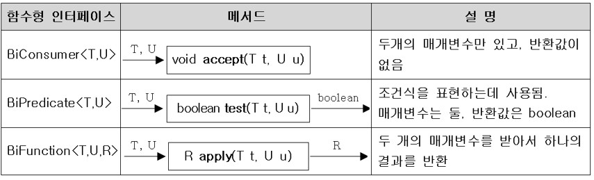

# 람다식이란? 람다식 작성하기
## 람다식(Lambda Expression)
- 함수(메서드)를 간단한 `식(expression)`으로 표현하는 방법
- 익명함수(이름이 없는 함수, anonymous function)
- 함수와 메서드의 차이
    - 근본적으로 동일. 함수는 일반적 용어, 메서드는 객체지향개념 용어
    - 함수는 클래스에 독립적, 메서드는 클래스에 종속적

## 람다식 작성하기
1. 메서드의 이름과 반환타입을 제거하고 `->`를 블록 {} 앞에 추가한다.
```java
int max(int a, int b) {
    return a>b ? a : b;
}
```
👇
```java
(int a, int b) -> {
    return a>b ? a : b;
}
```
2. 반환값이 있는 경우 식이나 값만 적고 return문은 생략가능, 세미콜론은 안붙임
```java
(int a, int b) -> a>b ? a : b
```
3. 매개변수의 타입이 추론 가능하면 생략가능(대부분의 경우 생략 가능)
```java
(a, b) -> a>b ? a : b
```
## 람다식 작성하기 - 주의사항
1. 매개변수가 하나인 경우, 괄호`()` 생략 가능 (타입이 없을 때만)
```java
    (a) -> a*a
(int a) -> a*a
```
👇
```java
    a -> a*a    // OK
int a -> a*a    // 에러
```
2. 블록 안의 문장이 하나뿐 일 때, 괄호`{}` 생략 가능(끝에 `;` 안 붙임)
```java
(int i) -> {
    System.out.println(i);
}
```
👇
```java
(int i) -> System.out.printlnt(i)
```
단, 하나뿐인 문장이 return문이면 괄호 생략 불가
```java
(int a, int b) -> { return a>b ? a : b; }   // OK
(int a, int b) ->   return a>b ? a : b      // 에러
```
## 람다식의 예
### 메서드
```java
int max(int a, int b) {
    return a>b ? a : b;
}
```
### 람다식
```java
(a, b) -> a>b ? a : b;
```
<br>

### 메서드
```java
int printVar(String name, int i) {
    System.out.println(name + "=" + i);
}
```
### 람다식
```java
(name, i) -> System.out.println(name + "=" + i)
```
<br>

### 메서드
```java
int square(int x) {
    return x * x;
}
```
### 람다식
```java
x -> x * x
```
<br>

### 메서드
```java
int roll() {
    return (int)(Math.random() * 6);
}
```
### 람다식
```java
() -> (int)(Math.random() * 6)
```
## 람다식은 익명 함수? 익명 객체!
- 람다식은 익명 함수가 아니라 익명 객체이다.
```java
(a, b) -> a>b ? a : b
```
👇 위의 람다식은 아래의 익명 객체와 같다.
```java
new Object() {
    int max(int a, int b) {
        return a>b ? a : b;
    }
};
```
- 람다식(익명 객체)을 다루기 위한 참조변수가 필요. 참조변수의 타입은?
```java
Object obj = new Object() {
    int max(int a, int b) {
        return a>b ? a : b;
    }
};

int value = obj.max(3, 5);  // 에러. 참조변수의 타입 Object에는 max라는 리모콘이 없다.
```
# 함수형 인터페이스
- 함수형 인터페이스: 단 하나의 추상 메서드만 선언된 인터페이스
```java
public class Ex14_0 {
	public static void main(String[] args) {
		// 익명 클래스의 선언과 객체 생성을 동시에 한 코드
		MyFunction f = new MyFunction() {
			public int max(int a, int b) {
				return a>b ? a : b;
			}
		};
		System.out.println(f.max(3, 5));
	}
}

@FunctionalInterface
interface MyFunction {
	public abstract int max(int a, int b);
}
```
- 함수형 인터페이스 타입의 참조변수로 람다식을 참조할 수 있음.
  (단, 함수형 인터페이스의 메서드와 람다식의 **매개변수 개수와 반환 타입**이 일치해야 함.)

```java
public class Ex14_0 {
	public static void main(String[] args) {
        // 람다식(익명 객체)을 다루기 위한 참조변수의 타입은 함수형 인터페이스로 한다.
		MyFunction f = (a, b) -> a>b ? a : b;   // 람다식. 익명 객체
		System.out.println(f.max(3, 5));
	}
}

@FunctionalInterface
interface MyFunction {
	public abstract int max(int a, int b);
}
```
## 함수형 인터페이스 - example
- 익명 객체를 람다식으로 대체
```java
List<String> list = Arrays.asList("abc", "aaa", "bbb", "ddd", "aaa");

Collections.sort(list, new Comparator<String>() {
                            public int compare(String s1, String s2) {
                                return s2.compareTo(s1);
                            }
});
```
👇
```java
Collections.sort(list, (s1, s2) -> s2.compareTo(s1));   // sort(List list, Comparator c)
```
## 함수형 인터페이스 타입의 매개변수, 반환타입
- 함수형 인터페이스 타입의 매개변수
```java
@FunctionalInterface
interface MyFunction {
    void myMethod();
}
```
위와 같은 함수형 인터페이스가 있을 때, 아래와 같은 메서드를 작성했다고 가정하자.
```java
void aMethod(Myfunction f) {
    f.myMethod();   // MyFunction에 의해 정의된 메서드 호출
}
```
위의 메서드를 호출하는 코드는 아래와 같다.
```java
MyFunction f = () -> System.out.println("myMethod()");
aMethod(f);
```
위의 두 문장을 한 줄로 합칠 수 있다.
```java
aMethod(()-> System.out.println("myMethod()"));
```
- 함수형 인터페이스 타입의 반환타입
```java
MyFunction myMethod() {
    MyFunction f = () -> {};
    return f;
}
```
아래와 같이 줄여쓸 수 있다.
```java
MyFunction myMethod() {
    return () -> {};
}
```
### 예제 - 람다식을 주고받는 방법
```java
@FunctionalInterface
interface MyFunction {
	void run();  // public abstract void run();
}

class Ex14_1 {
	static void execute(MyFunction f) { // 매개변수의 타입이 MyFunction인 메서드
		f.run();
	}

	static MyFunction getMyFunction() { // 반환 타입이 MyFunction인 메서드 
		MyFunction f = () -> System.out.println("f3.run()");
		return f;
	}

	public static void main(String[] args) {
		// 람다식으로 MyFunction의 run()을 구현
		MyFunction f1 = ()-> System.out.println("f1.run()");

		MyFunction f2 = new MyFunction() {  // 익명클래스로 run()을 구현
			public void run() {   // public을 반드시 붙여야 함
				System.out.println("f2.run()");
			}
		};

		MyFunction f3 = getMyFunction();

		f1.run();
		f2.run();
		f3.run();

		execute(f1);
		execute( ()-> System.out.println("run()") );
	}
}
```
output
```
f1.run()
f2.run()
f3.run()
f1.run()
run()
```
# java.util.function 패키지
## java.util.function 패키지 1
- 자주 사용되는 다양한 함수형 인터페이스를 제공.

<br>

### Predicate<T> 사용 예제
```java
Predicate<String> isEmptyStr = s -> s.length()==0;
String s = "";

if(isEmptyStr.test(s))  // if(s.length()==0) 과 동일
    System.out.println("This is an empty String.");
```
### Quiz. 아래의 빈칸에 알맞은 함수형 인터페이스(java.util.function패키지)를 적으시오
```java
[1번] f = () -> (int)(Math.random()*100) + 1;
[2번] f = i -> System.out.print(i + ",");
[3번] f = i -> i%2==0;
[4번] f = i -> i/10*10;
```
#### Answer
```java
Supplier<Integer> f = () -> (int)(Math.random()*100) + 1;
Consumer<Integer> f = i -> System.out.print(i + ",");
Predicate<Integer> f = i -> i%2==0;
Function<Integer, Integer> f = i -> i/10*10;
```
## java.util.function 패키지 2
- 매개변수가 2개인 함수형 인터페이스

<br>

- `BiSupplier`는 없다. 반환값이 두개이상일 수는 없기 때문.
- 매개변수를 세개 입력받는 함수형 인터페이스를 사용하고 싶으면 아래와 같이 직접 만들면 됨
```java
@FunctionalInterface
interface TriFunction<T, U, V, R> {
    R apply(T t, U u, V v);
}
```
## java.util.function 패키지 3
- 매개변수의 타입과 반환타입이 일치하는 함수형 인터페이스

<br>

### 예제
```java
import java.util.function.*;
import java.util.*;

class Ex14_2 {
	public static void main(String[] args) {
		Supplier<Integer>  s = ()-> (int)(Math.random()*100)+1;
		Consumer<Integer>  c = i -> System.out.print(i+", "); 
		Predicate<Integer> p = i -> i%2==0; 
		Function<Integer, Integer> f = i -> i/10*10; // i의 일의 자리를 없앤다.
		
		List<Integer> list = new ArrayList<>();	
		makeRandomList(s, list);
		System.out.println(list);
		printEvenNum(p, c, list);
		List<Integer> newList = doSomething(f, list);
		System.out.println(newList);
	}

	static <T> List<T> doSomething(Function<T, T> f, List<T> list) {
		List<T> newList = new ArrayList<T>(list.size());

		for(T i : list) {
			newList.add(f.apply(i));
		}	

		return newList;
	}

	static <T> void printEvenNum(Predicate<T> p, Consumer<T> c, List<T> list) {
		System.out.print("[");
		for(T i : list) {
			if(p.test(i))
				c.accept(i);
		}	
		System.out.println("]");
	}

	static <T> void makeRandomList(Supplier<T> s, List<T> list) {
		for(int i=0;i<10;i++) {
			list.add(s.get());
		}
	}
}
```
# Predicatd의 결합. CF와 함수형 인터페이스
## Predicate의 결합
- and(), or(), negate()로 두 Predicate를 하나로 결합(default메서드)
```java
Predicate<Integer> p = i -> i<100;
Predicate<Integer> q = i -> i<200;
Predicate<Integer> r = i -> i%2==0;
```
```java
Predicate<Integer> notP = p.negate();   // i>=100
Predicate<Integer> all = notP.and(q).or(r); // 100<= i && i < 200 || i%2==0
Predicate<Integer>