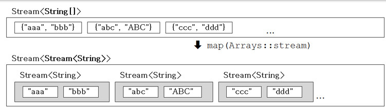
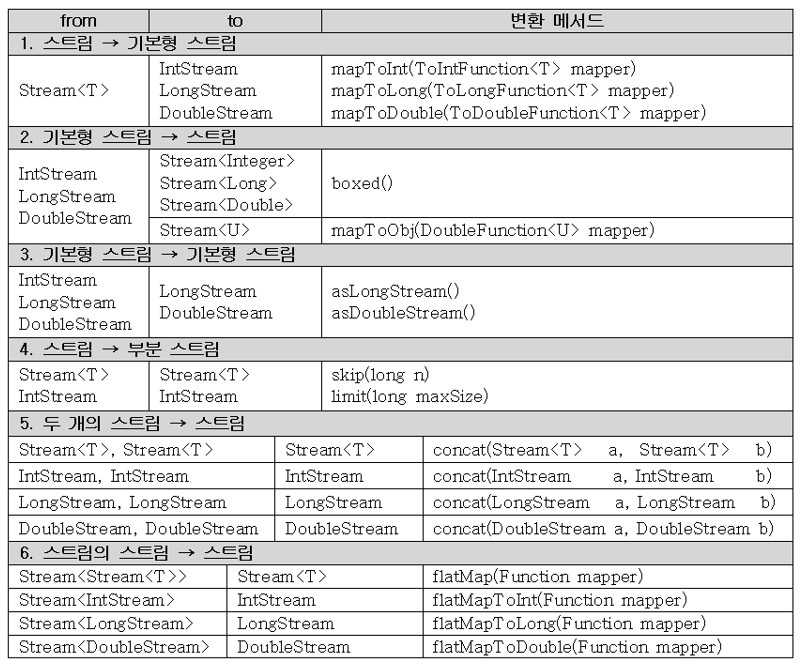

# 스트림, 스트림의 특징
## 스트림
- 다양한 데이터 소스를 표준화된 방법으로 다루기 위한 것
1. 스트림 만들기
2. 중간연산 (0~n번)
3. 최종연산 (1번)
- 스트림이 제공하는 기능 - 중간 연산과 최종 연산
> 중간 연산 - 연산결과가 스트림인 연산. 반복적으로 적용가능
> 최종 연산 - 연산 결과가 스트림이 아닌 연산. 단 한번만 적용가능(스트림의 요소를 소모)
## 스트림의 특징 1
- 스트림은 데이터 소스로부터 데이터를 읽기만할 뿐 변경하지 않는다.
```java
List<Integer> list = Arrays.asList(3,1,5,4,2);
List<Integer> sortedList = list.stream().sorted()	// list를 정렬해서
			.collect(Collcetors.toList());	// 새로운 List에 저장
System.out.println(list);	// [3,1,5,4,2]
System.out.println(sortedList);	// [1,2,3,4,5]
```
- 스트림은 Iterator처럼 일회용이다. (필요하면 다시 스트림을 생성해야 함)

```java
strStream.forEach(System.out::println);	// 모든 요소를 화면에 출력(최종연산)
int.numOfStr = strStream.count();	// 에러. 스트림이 이미 닫혔음.
```
- 최종 연산 전까지 중간연산이 수행되지 않는다. - 지연된 연산
```java
IntStream intStream = new Random().ints(1, 46);	// 1~45범위의 무한 스트림
intStream.distinct().limit(6).sorted()		// 중간 연산 (무한 스트림을 어떻게 중복제거하냐고 생각할 수도 있지만 지연된 연산때문에 가능하다)
	.forEach(i->System.out.print(i+","));	// 최종 연산
```
## 스트림의 특징 2
- 스트림은 작업을 내부 반복으로 처리한다.
```java
for(String str : strList) {
	System.out.println(str);
}

// 스트림 사용
stream.forEach(System.out::println);
```
for문이 내부에 들어감
```java
void forEach(Consumer<? super T> action) {
	Object.requireNonNull(action);	// 매개변수의 널 체크

	for(T t : src)	// 내부 반복(for문을 메서드 안으로 넣음)
		action.accept(T);
}
```
### 스트림의 특징 3
- 스트림의 작업을 병렬로 처리 - 병렬스트림
	- parallel의 반대는 sequential이고 디폴트이다.
```java
Stream<String> strStream = Stream.of("dd", "aaa", "CC", "cc", "b");
int sum = strStream.parallel()	// 병렬 스트림으로 전환(속성만 변경)
		.mapToInt(s->s.length()).sum();	// 모든 문자열의 길이의 합
```
- 기본형 스트림 - IntStream, LongStream, DoubleStream
	- 오토박싱&언박싱의 비효율이 제거됨(Stream<Integer>대신 IntStream사용)
	- 숫자와 관련된 유용한 메서드를 Stream<T>보다 더 많이 제공

# 스트림만들기
## 스트림 만들기 - 컬렉션
- Collection인터페이스의 stream()으로 컬렉션을 스트림으로 변환
> Stream<E> stream()	// Collection 인터페이스의 메서드

```java
List<Integer>	list = Arrays.asList(1,2,3,4,5);
Stream<Integer>	intStream = list.stream();	// list를 스트림으로 변환

// 스트림의 모든 요소를 출력
intStream.forEach(System.out::print);	// 12345
intStream.forEach(System.out::print);	// 에러. 스트림이 이미 닫혔다.
```
## 스트림 만들기 - 배열
- 객체 배열로부터 스트림 생성하기
```java
Stream<T> Stream.of(T... values) // 가변 인자
Stream<T> Stream.of(T[])
Stream<T> Arrays.stream(T[])
Stream<T> Arrays.stream(T[] array, int startInclusive, int endExclusive)
```
```java
Stream<String> strStream = Stream.of("a","b","c");	// 가변 인자
Stream<String> strStream = Stream.of(new String[]{"a","b","c"});
Stream<String> strStream = Arrays.stream(new String[]{"a","b","c"});
Stream<String> strStream = Arrays.stream(new String[]{"a","b","c"}, 0, 3);
```
- 기본형 배열로부터 스트림 생성하기
```java
IntStream IntStream.of(int... values)	// Stream이 아니라 IntStream
IntStream IntStream.of(int[])
IntStream Arrays.stream(int[])
IntStream Arrays.stream(int[] array, int startInclusive, int endExclusive)
```
## 스트림 만들기 - 임의의 수
- 난수를 요소로 갖는 스트림 생성하기
```java
IntStream intStream = new Random().ints();		// 무한 스트림
intStream.limit(5).forEach(System.out::println);	// 5개의 요소만 출력한다.

IntStream intStream = new Random().ints(5);	// 크기가 5인 난수 스트림을 반환
```
> Random클래스에 정의된 메서드의 반환범위
> Integer.MIN_VALUE <= ints() <= Integer.MAX_VALUE
> Long.MIN_VALUE <= longs() <= Long.MAX_VALUE
> 0.0 <= doubles() < 1.0

\* 지정된 범위의 난수를 요소로 갖는 스트림을 생성하는 메서드(Random클래스)
```java
IntStream	 ints(int begin, int end)	// 무한 스트림
LongStream	 long(long begin, long end)
DoubleStream doubles(double begin, double end)

IntStream	 ints(long streamSize, int begin, int end)	// 유한 스트림
LongStream	 longs(long streamSize, long begin, long end)
DoubleStream doubles(long streamSize, double begin, double end)
```

## 스트림 만들기 - 특정 범위의 정수
- 특정 범위의 정수를 요소로 갖는 스트림 생성하기(IntStream, LongStream)
```
IntStream IntStream.range(int begin, int end)
IntStream IntStream.rangeClosed(int begin, int end)
```

```java
IntStream intStream = IntStream.range(1,5);		// 1,2,3,4
IntStream intStream = IntStream.rangeClosed(1,5);	// 1,2,3,4,5
```
## 스트림 만들기 - 람다식 iterate(), generate()
- 람다식을 소스로 하는 스트림 생성하기
```
static <T> Stream<T> iterate(T seed, UnaryOperator<T> f)	// 이전 요소에 종속적
static <T> Stream<T> generate(Supplier<T> s)			// 이전 요소에 독립적
```
- iterate()는 이전 요소를 seed로 해서 다음 요소를 계산한다.
```java
Stream<Integer> evenStream = Stream.iterate(0, n->n+2);	// 0, 2, 4, 6, ...
```
- generate()는 seed를 사용하지 않는다.
```java
Stream<Double> 	randomStream	= Stream.generate(Math::random);
Stream<Integer>	oneStream	= Stream.generate(()->1);
```

## 스트림 만들기 - 파일과 빈 스트림
- 파일을 소스로 하는 스트림 생성하기
```java
Stream<Path>	Files.List(Path dir)	// Path는 파일 또는 디렉토리

Stream<String>	Files.lines(Path path)	// 파일 내용을 라인단위로 읽어서 String으로 반환
Stream<String>	Files.lines(Path path, Charset cs)
Stream<String>	lines()	// BufferedReader클래스의 메서드
```
- 비어있는 스트림 생성하기
```java
Stream emptyStream = Stream.empty();	// empty()는 빈 스트림을 생성해서 반환한다.
long count = emptyStream.count();	// count의 값은 0
```

# 스트림의 중간연산
## 스트림의 중간연산 1
### 스트림 자르기 - skip(), limit()
>```java
>Stream<T> skip(long n)		// 앞에서부터 n개 건너뛰기
>Stream<T> limit(long maxSize)	// maxSize 이후의 요소는 잘라냄
>```
```java
IntStream intStream = IntStream.rangeClosed(1, 10);	// 12345678910
intStream.skip(3).limit(5).forEach(System.out::print);	// 45678
```
### 스트림의 요소 걸러내기 - filter(), distinct()
>```java
>Stream<T> filter (Predicate<? super T> predicate)	// 조건에 맞지 않는 요소 제거
>Stream<T> distinct()	// 중복제거
>```
```java
IntStream intStream = IntStream.of(1,2,2,3,3,3,4,5,5,6);
intStream.distinct().forEach(System.our::print);	// 123456
```
```java
IntStream intStream = IntStream.rangeClosed(1,10);	// 12345678910
intStream.filter(i->i%2==0).forEach(System.out::print);	// 246810
```
```java
// 중간연산은 여러번 사용가능하다.
intStream.filter(i->i%2!=0 && i%3!=0).forEach(System.out::print);
intStream.filter(i->i%2!=0).filter(i->i%3!=0).forEach(System.out::print);	// 157
```
### 스트림 정렬하기 - sorted()
>```java
>Stream<T> sorted()	// 스트림 요소의 기본 정렬(Comparable)로 정렬
>Stream<T> sorted(Comparator<? super T> Comparator)	// 지정된 Comparator로 정렬
>```

- Comparator의 comparing()으로 정렬 기준을 제공
>```java
>comparing(Function<T, U> keyExtractor)
>comparing(Function<T, U> keyExtractor, Comparator<U> keyComparator)
>```
```java
studentStream.sorted(Comparator.comparing(Student::getBan))	// 반별로 정렬
		.forEach(System.out::println);
```
### 추가 정렬 기준을 제공할 때는 thenComparing()을 사용
>```java
>thenComparing(Comparator<T> other)
>thenComparing(Function<T, U> keyExtractor)
>thenComparing(Function<T, U> keyExtractor, Comparator<U> keyComp)
>```
```java
studentStream.sorted(Comparator.comparing(Student::getBan))	// 반별로 정렬
		.thenComparing(Student::getTotalScore)		// 총점별로 정렬
		.thenComparing(Student::getName)		// 이름별로 정렬
		.forEach(System.out::println);
```
### 예제
```java
import java.util.*;
import java.util.stream.*;

class Ex14_5 {
	public static void main(String[] args) {
		Stream<Student> studentStream = Stream.of(
						new Student("이자바", 3, 300),
						new Student("김자바", 1, 200),
						new Student("안자바", 2, 100),
						new Student("박자바", 2, 150),
						new Student("소자바", 1, 200),
						new Student("나자바", 3, 290),
						new Student("감자바", 3, 180)
					);

		studentStream.sorted(Comparator.comparing(Student::getBan) // 반별 정렬
		// studentStream.sorted(Comparator.comparing((Student s) -> s.getBan())) // 람다식으로
		 	.thenComparing(Comparator.naturalOrder()))     	// 기본 정렬
			.forEach(System.out::println);
	}
}

class Student implements Comparable<Student> {
	String name;
	int ban;
	int totalScore;
	Student(String name, int ban, int totalScore) { 
		this.name =name;
		this.ban =ban;
		this.totalScore =totalScore;
	}

	public String toString() { 
	   return String.format("[%s, %d, %d]", name, ban, totalScore); 
	}

	String getName()     { return name;}
	int getBan()         { return ban;}
	int getTotalScore()  { return totalScore;}

   // 총점 내림차순을 기본 정렬로 한다.
	public int compareTo(Student s) { 
		return s.totalScore - this.totalScore;
	}
}
```
output
```
[김자바, 1, 200]
[소자바, 1, 200]
[박자바, 2, 150]
[안자바, 2, 100]
[이자바, 3, 300]
[나자바, 3, 290]
[감자바, 3, 180]
```
# 스트림의 중간연산 2
### 스트림의 요소 변환하기 - map()
>```java
>Stream<R> map(Function<? super T, ? extends R> mapper)	// Stream<T> -> Stream<R>
>```
```java
Stream<File> fileStream = Stream.of(
	new File("Ex1.java"),
	new File("Ex1"),
	new File("Ex1.bak"),
	new File("Ex2.java"),
	new File("Ex1.txt")
);
// Stream<String> filenameStream = fileStream.map((File f) -> f.getName());
Stream<String> filenameStream = fileStream.map(File::getName);
filenameStream.forEach(System.out::println);	// 스트림의 모든 파일의 이름을 출력
```
ex) 파일스트림(Stream<File>)에서 파일 확장자(대문자)를 중복없이 뽑아내기
```java
fileStream.map(File::getName)			// Stream<file> -> Stream<String>
	.filter(s->s.indexOf('.') != -1)	// 확장자가 없는 것은 제외
	.map(s->s.substring(s.indexOf('.')+1))	// Stream<String> -> Stream<String>
	.map(String::toUpperCase)		// Stream<String> -> Stream<String>
	.distinct()
	.forEach(System.out::print)	// JAVABAKTXT
```
### 스트림의 요소를 소비하지 않고 엿보기 - peek()

>```java
>Stream<T>	peek(Consumer<? super T> >action)	// 중간 연산(스트림을 소비X)
>void		forEach(Consumer<? super T> >action)	// 최종 연산(스트림을 소비O)
>```

### 스트림의 스트림을 스트림으로 변환 - flatMap()
```java
Stream<String[]> strArrStrm = Stream.of(new String[]{"abc", "def", "ghi"},
					new String[]{"ABC","GHI","JKLMN"});
```
```java
Stream<Stream<String>> strStrStrm = strArrStrm.map(Arrays::stream);
```

```java
Stream<String> strStrStrm = strArrStrm.flatMap(Arrays::stream);	// Arrays.stream(T[])
```

### 예제
```java
import java.util.*;
import java.util.stream.*;

class Ex14_7 {
	public static void main(String[] args) {
		Stream<String[]> strArrStrm = Stream.of(
			new String[]{"abc", "def", "jkl"},
			new String[]{"ABC", "GHI", "JKL"}
		);

//		Stream<Stream<String>> strStrmStrm = strArrStrm.map(Arrays::stream);
		Stream<String> strStrm = strArrStrm.flatMap(Arrays::stream);

		strStrm.map(String::toLowerCase)
			   .distinct()
			   .sorted()
			   .forEach(System.out::println);
		System.out.println();

		String[] lineArr = {
			"Believe or not It is true",
			"Do or do not There is no try",
		};

		Stream<String> lineStream = Arrays.stream(lineArr);
		lineStream.flatMap(line -> Stream.of(line.split(" +")))	// 하나이상의 공백을 나타내는 정규식
			.map(String::toLowerCase)
			.distinct()
			.sorted()
			.forEach(System.out::println);
		System.out.println();
	}
}
```
output
```
abc
def
ghi
jkl

believe
do
is
it
no
not
or
there
true
try
```

# Optional
## Optional<T>
- T타입 객체의 래퍼클래스 - Optional<T>
	- 모든 종류의 객체 저장가능(null도 가능)
	- 1) null을 직접 다루는 것은 위험(NullPointerException 발생 가능)하기 때문에 간접적으로 null을 다룰 수 있다.
	- 2) null 체크를 위해 if문 필수이기 때문에 코드가 지저분해지는 것을 방지
>```java
>public final class Optional<T> {
>	private final T value;	// T타입의 참조변수
>		...
>}
>```

## Optional<T> 객체 생성하기
### Optional<T> 객체를 생성하는 다양한 방법
```java
String str = "abc";
Optional<String> optVal = Optional.of(str);
Optional<String> optVal = Optional.of("abc");
Optional<String> optVal = Optional.of(null);		// NullPointerException 발생
Optional<String> optVal = Optional.ofNullable(null);	// OK
```
### null대신 빈 Optional<T> 객체를 사용하자
```java
Optional<String> optVal = null;	// null로 초기화. 바람직하지 않음
Optional<String> optVal = Optional.empty();	// 빈 객체로 초기화. 바람직.
```

## Optional<T> 객체의 값 가져오기
### Optional객체의 값 가져오기 - get(), orElse(), orElseGet(), orElseThrow()
>```java
>T orElseGet(Supplier<? extends T> other)
>T orElseThrow(Supplier<? extends X> exceptionSupplier)
>```
```java
Optional<String> optVal = Optional.of("abc");			
String str1 = optVal.get();					// optVal에 저장된 값을 반환. null이면 예외발생
String str2 = optVal.orElse("");				// optVal에 저장된 값이 null일 때는, ""를 반환
String str3 = optVal.orElseGet(String::new);			// 람다식 사용가능. () -> new String()
String str4 = optVal.orElseThrow(NullPointerException::new);	// 널이면 예외발생
```
### isPresent() - Optional객체의 값이 null이면 false, 아니면 true를 반환
```java
if(Optional.ofNullable(str).isPresent()){	// if(str!=null)
	System.out.println(str)
}
```
>```java
>ifPresent(Consumer)	// null이 아닐 때만 작업을 수행하고 null이면 아무 작업도 하지 않는다.
>```
```java
Optional.ofNullable(str).ifPresent(System.out::println);
```

## OptionalInt, OptionalLong, OptionalDouble
- 기본형 값을 감싸는 래퍼클래스
	- Optional<T>보다 성능이 좋다.
>```java
>public final class OptionalInt {
>	...
>	private final boolean isPresent;	// 값이 저장되어 있으면 true
>	private final int value;		// int타입의 변수
>}
>```
- OptionalInt의 값 가져오기 - int getAsInt()

|Optional클래스|값을 반환하는 메서드|
|---|---|
|Optional<T>|T get()|
|OptionalInt|int getAsInt()|
|OptionalLong|long getAsLong()|
|OptionalDouble|double getAsDouble()|

- 빈 Optioanl객체와의 비교
```java
OptionalInt opt  = OptionalInt.of(0);	// OptionalInt에 0을 저장. value = 0
OptionalInt opt2 = OptionalInt.empty();	// 빈 객체를 생성

System.out.println(opt.isPresent());	// true
System.out.println(opt2.isPresent());	// false
System.out.println(opt.equals(opt2));	// false
```
### 예제
```java
import java.util.*;

class Ex14_8 {
	public static void main(String[] args) {
		Optional<String>  optStr = Optional.of("abcde");
		Optional<Integer> optInt = optStr.map(String::length);
//		Optional<Integer> optInt = optStr.map(s -> s.length);
		System.out.println("optStr="+optStr.get());
		System.out.println("optInt="+optInt.get());

		int result1 = Optional.of("123")
				.filter(x->x.length() >0)
				.map(Integer::parseInt).get();

		int result2 = Optional.of("")
				.filter(x->x.length() >0)
				.map(Integer::parseInt).orElse(-1);

		System.out.println("result1="+result1);
		System.out.println("result2="+result2);

		Optional.of("456").map(Integer::parseInt)
				.ifPresent(x->System.out.printf("result3=%d%n",x));

		OptionalInt optInt1  = OptionalInt.of(0);   // 0을 저장
		OptionalInt optInt2  = OptionalInt.empty(); // 빈 객체를 생성

		System.out.println(optInt1.isPresent());   // true
		System.out.println(optInt2.isPresent());   // false

		System.out.println(optInt1.getAsInt());  // 0
//		System.out.println(optInt2.getAsInt());  // NoSuchElementException
		System.out.println("optInt1="+optInt1);
		System.out.println("optInt2="+optInt2);
	  	System.out.println("optInt1.equals(optInt2)?"+optInt1.equals(optInt2));
	}
}
```
output
```
optStr=abcde
optInt=5
result1=123
result2=-1
result3=456
true
false
0
optInt1=OptionalInt[0]
optInt2=OptionalInt.empty
optInt1.equals(optInt2)?false
```
# 스트림의 최종연산
- 중간 연산은 n번 가능하고, stream을 반환
- 최종 연산은 1번 가능하고 스트림 요소를 소모하며, 스트림이 닫힘
## 스트림의 최종연산 - forEach()
### 스트림의 모든 요소에 지정된 작업을 수행 - forEach(), forEachOrdered()
>```java
>void forEach(Consumer<? super T> action)	// 병렬스트림인 경우 순서가 보장되지 않음
>void forEachOrdered(Consumer<? super T> action)	// 병렬스트림인 경우에도 순서가 보장됨
>```
```java
IntStream.range(1, 10).sequential().forEach(System.out::print);		// 123456789
IntStream.range(1, 10).sequential().forEachOrdered(System.out::print);	// 123456789
```
```java
IntStream.range(1, 10).parallel().forEach(System.out::print);		// 683295714
IntStream.range(1, 10).parallel().forEachOrdered(System.out::print);	// 123456789
```
## 스트림의 최종연산 - 조건 검사
### 조건검사 - allMatch(), anyMatch(), noneMatch()
>```java
>boolean allMatch (Predicate<? super T> predicate)	// 모든 요소가 조건을 만족시키면 true
>boolean anyMatch (Predicate<? super T> predicate)	// 한 요소라도 조건을 만족시키면 true
>boolean noneMatch(Predicate<? super T> predicate)	// 모든 요소가 조건을 만족시키지 않으면 true
>```
```java
boolean hasFailedStu = stuStream.anyMatch(s -> s.getTotalScore()<=100);	// 낙제자가 있는지?
```
### 조건에 일치하는 요소 찾기 - findFirst(), findAny()
>```java
>Optional<T> findFirst()	// 첫 번째 요소를 반환. 순차 스트림에 사용
>Optional<T> findAny()	// 아무거나 하나를 반환. 병렬 스트림에 사용
>```
```java
Optional<Student> result = stuStream.filter(s -> s.getTotalScore() <= 100).findFirst();
Optional<Student> result = parallelStream.filter(s -> s.getTotalScore() <= 100).findAny();
```

## 스트림의 최종연산 - reduce()
### 스트림의 요소를 하나씩 줄여가며 누적연산 수행 - reduce()
>```java
>Optional<T>	reduce(BinaryOperator<T> accumulator)
>T		reduce(T identity, BinaryOperator<T> accumulator)
>U		reduce(U identity, BiFunction<U,T,U> accumulator, BinaryOperator<U> combiner)
>```
```
identity : 초기값
accumulator : 이전 연산결과와 스트림의 요소에 수행할 연산
combiner : 병렬처리된 결과를 합치는데 사용할 연산 (병렬 스트림)
```
```java
// int reduce(int identity, IntBinaryOperator op)
int count = intStream.reduce(0, (a,b) -> a+1);				// count()
int sum   = intStream.reduce(0, (a,b) -> a+b);				// sum()
int max   = intStream.reduce(Integer.MIN_VALUE, (a,b) -> a>b?a:b);	// max()
int min   = intStream.reduce(Integer.MAX_VALUE, (a,b) -> a<b?a:b);	// min()
```
위의 코드에서 sum을 만드는 원리
```java
int a = identity;
for(int b : stream)
	a = a + b;	// sum()
```
### 예제
```java
import java.util.*;
import java.util.stream.*;

class Ex14_9 {
	public static void main(String[] args) {
		String[] strArr = {
			"Inheritance", "Java", "Lambda", "stream",
			"OptionalDouble", "IntStream", "count", "sum"
		};

		Stream.of(strArr).forEach(System.out::println);

		boolean noEmptyStr = Stream.of(strArr).noneMatch(s->s.length()==0);
		Optional<String> sWord = Stream.of(strArr)
					               .filter(s->s.charAt(0)=='s').findFirst();

		System.out.println("noEmptyStr="+noEmptyStr);
		System.out.println("sWord="+ sWord.get());

		
		IntStream intStream1 = Stream.of(strArr).mapToInt(String::length);
		IntStream intStream2 = Stream.of(strArr).mapToInt(String::length);
		IntStream intStream3 = Stream.of(strArr).mapToInt(String::length);
		IntStream intStream4 = Stream.of(strArr).mapToInt(String::length);

		int count = intStream1.reduce(0, (a,b) -> a + 1);
		int sum   = intStream2.reduce(0, (a,b) -> a + b);

		OptionalInt max = intStream3.reduce(Integer::max);
		OptionalInt min = intStream4.reduce(Integer::min);
		System.out.println("count="+count);
		System.out.println("sum="+sum);
		System.out.println("max="+ max.getAsInt());
		System.out.println("min="+ min.getAsInt());
	}
}
```
output
```
Inheritance
Java
Lambda
stream
OptionalDouble
IntStream
count
sum
noEmptyStr=true
sWord=stream
count=8
sum=58
max=14
min=3
```

# collect(), Collectors
- reduce() : 전체 리듀싱
- collect() : 그룹별 리듀싱
<br>

- collect() : 최종연산
- Collector : 인터페이스
- Collectors : Collector를 구현한 클래스
## collect()와 Collectors
- collect()는 Collector를 매개변수로 하는 스트림의 최종연산
>```java
>Object collect(Collector collector)	// Collector를 구현한 클래스의 객체를 매개변수로
>Object collect(Supplier supplier, BiConsumer accumulator, BiConsumer combiner)	// 잘 안쓰임
>```
- Collector는 수집(collect)에 필요한 메서드를 정의해 놓은 인터페이스
```java
public interface Collector<T,A,R> {	// T(요소)를 A에 누적한 다음, 결과로 R로 변환해 반환
	Supplier<A>		supplier();		// StringBuilder::new			누적할 곳
	BiConsumer<A, T>	accumulator();		// (sb, s) -> sb.append(s)		누적방법
	BinaryOperator<A>	combiner();		// (sb1, sb2) -> sb1.append(sb2)	결합방법(병렬)
	Function<A, R>		finisher();		// sb -> sb.toString()			최종변환
	Set<Characteristics>	characteristics();	// 컬렉터의 특성이 담긴 Set을 반환
}
```
이걸 다 직접 구현해야 하느냐? NO! Collectors 클래스를 가져다 쓰기만 하면 됨
- Collectors클래스는 다양한 기능의 컬렉터(Collector를 구현한 클래스)를 제공

>변환 - `mapping()`, `toList()`, `toSet()`, `toMap()`, `toCollection()`, ...
>통계 - `counting()`, `summingInt()`, `averagingInt()`, `maxBy()`, `minBy()`, `summarizingInt()`, ...
>문자열 결합 - `joining()`
>리듀싱 - `reducing()`
>그룹화와 분할 = `groupingBy()`, `partitioningBy()`, `collectingAndThen()`

## 스트림을 컬렉션, 배열로 변환
### 스트림을 컬렉션 변환 - `toList()`, `toSet()`, `toMap()`, `toCollection()`
```java
List<String> names = stuStream.map(Student::getName)	// Stream<Student> -> Stream<String>
			.collect(Collectors.toList());	// Stream<String> -> List<String>

ArrayList<String> list = names.stream()
		.collect(Collectors.toCollection(ArrayList::new));	// Stream<String> -> ArrayList<String>

Map<String, Person> map = personStream
		.collect(Collectors.toMap(p->p.getRegId(), p->p));	// Stream<Person> -> Map<String, Person>
```
### 스트림을 배열로 변환 - `toArray()`
```java
Student[] stuNames = studentStream.toArray(Student[]::new);	// OK
Student[] stuNames = studentStream.toArray();	// 에러
Object[]  stuNames = studentStream.toArray();	// OK
```
## 스트림의 통계 - counting(), summingInt()
### 스트림의 통계정보 제공 - `counting()`, `summingInt()`, `maxBy()`, `minBy()`,...
```java
// 전체 카운팅
long count = stuStream.count();

// 그룹별 카운팅 가능
long count = stuStream.collect(counting());	// Collectors.counting()
```
```java
// 전체 합계
long totalScore = stuStream.mapToInt(Student::getTotalScore).sum();	// IntStream의 sum()
// 그룹별 합계 구할수 있음
long totalScore = stuStream.collect(summingInt(Student::getTotalScore));
```
```java
OptionalInt topScore = studentStream.mapToInt(Student::getTotalScore).max();

Optional<Student> topStudent = stuStream
			.max(Comparator.comparingInt(Student::getTotalScore));

Optional<Student> topStudent = stuStream
			.collect(maxBy(Comparator.comparingInt(Student::getTotalScore)));
```
## 스트림을 리듀싱 - reducing()
### 스트림을 리듀싱 - `reducing()`
>```java
>Collector reducing(BinaryOperator<T> op)
>Collector reducing(T identity, BinaryOperator<T> op/*누적작업*/)
>Collector reducing(U identity, Function<T, U> mapper/*변환작업*/, BinaryOperator<U> op)	// map + reduce
>```
```java
IntStream intStream = new Random().ints(1, 46).distinct().limit(6);

OptionalInt		max = intStream.reduce(Integer::max);
Optional<Integer>	max = intStream.boxed().collect(reducint(Integer::max));
```
```java
long sum = intStream.reduce(0, (a, b -> a + b));
long sum = intStream.bosed().collect(reducing(0, (a, b)-> a + b));
```
```java
int grandTotal = stuStream.map(Student::getTotalScore).reduce(0, Integer::sum);
int grandTotal = stuStream.collect(reducing(0, Student::getTotalScore, Integer::sum));
```
### 문자열 스트림의 요소를 모두 연결 - `joining()`
```java
String studentNames = stuStream.map(Student::getName).collect(joining());
String studentNames = stuStream.map(Student::getName).collect(joining(","));	// 구분자
String studentNames = stuStream.map(Student::getName).collect(joining(",", "[", "]"));
String studentNames = stuStream.collect(joining(","));	// Student의 toString()으로 결합
```
# 스트림의 그룹화와 분할
## 스트림의 그룹화와 분할
- `partitioningBy()`는 스트림을 2분할한다.
- `groupingBy()`는 스트림을 n분할한다.
## 스트림의 분할 - `partitioningBy()`
- 스트림의 요소를 2분할
>```java
>Collector partitioningBy(Predicate predicate)
>Collector partitioningBy(Predicate predicate, Collector downstream)
>```
```java
Map<Boolean, List<Student>> stuBySex = stuStream
		.collect(partitioningBy(Student::isMale));	// 학생들을 성별로 분할

List<Student> maleStudent   = stuBySex.get(true)	// Map에서 남학생 목록을 얻는다.
List<Student> femaleStudent = stuBySex.get(false)	// Map에서 여학생 목록을 얻는다.
```
```java
Map<Boolean, Long> stuNumBySex = stuStream
		.collect(partitioningBy(Student::isMale, counting()));	// 분할 + 통계
System.out.println("남학생 수 :" + stuNumBySex.get(true));	// 남학생 수 :8
System.out.println("여학생 수 :" + stuNumBySex.get(false));	// 여학생 수 :10
```
```java
Map<Boolean, Optional<Student>> topScoreBySex = stuStream		// 분할 + 통계
		.collect(partitioningBy(Student::isMale, maxBy(comparingInt(Student::getScore))));
System.out.println("남학생 1등 :" + topScoreBySex.get(true));	// 남학생 1등 :Optional[[나자바, 남, 1, 1, 300]]
System.out.println("여학생 1등 :" + topScoreBySex.get(false));	// 여학생 1등 :Optional[[김지미, 여, 1, 1, 250]]
```
```java
Map<Boolean, Map<Boolean, List<Student>>> failedStuBySex = stuStream		// 다중 분할
		.collect(partitioningBy(Student::isMale,			// 1. 성별로 분할(남/녀)
				partitioningBy(s -> s.getScore() < 150)));	// 2. 성적으로 분할(불합격/합격)
List<Student> failedMaleStu		= failedStuBySex.get(true).get(true);
List<Student> failedfeMaleStu	= failedStuBySex.get(false).get(true);
```
### 예제
```java
import java.util.*;
import java.util.function.*;
import java.util.stream.*;
import static java.util.stream.Collectors.*;
import static java.util.Comparator.*;

class Student2 {
	String name;
	boolean isMale; // 성별
	int hak;        // 학년
	int ban;        // 반
	int score;

	Student2(String name, boolean isMale, int hak, int ban, int score) { 
		this.name	= name;
		this.isMale	= isMale;
		this.hak	= hak;
		this.ban	= ban;
		this.score  = score;
	}
	String	getName()    { return name;	}
	boolean  isMale()     { return isMale;	}
	int      getHak()     { return hak;	}
	int      getBan()     { return ban;	}
	int      getScore()   { return score;	}

	public String toString() { 
		return String.format("[%s, %s, %d학년 %d반, %3d점]",
			name, isMale ? "남":"여", hak, ban, score); 
	}
   // groupingBy()에서 사용
	enum Level { HIGH, MID, LOW }  // 성적을 상, 중, 하 세 단계로 분류
}

class Ex14_10 {
	public static void main(String[] args) {
		Student2[] stuArr = {
			new Student2("나자바", true,  1, 1, 300),	
			new Student2("김지미", false, 1, 1, 250),	
			new Student2("김자바", true,  1, 1, 200),	
			new Student2("이지미", false, 1, 2, 150),	
			new Student2("남자바", true,  1, 2, 100),	
			new Student2("안지미", false, 1, 2,  50),	
			new Student2("황지미", false, 1, 3, 100),	
			new Student2("강지미", false, 1, 3, 150),	
			new Student2("이자바", true,  1, 3, 200),	
			new Student2("나자바", true,  2, 1, 300),	
			new Student2("김지미", false, 2, 1, 250),	
			new Student2("김자바", true,  2, 1, 200),	
			new Student2("이지미", false, 2, 2, 150),	
			new Student2("남자바", true,  2, 2, 100),	
			new Student2("안지미", false, 2, 2,  50),	
			new Student2("황지미", false, 2, 3, 100),	
			new Student2("강지미", false, 2, 3, 150),	
			new Student2("이자바", true,  2, 3, 200)	
		};

		System.out.printf("1. 단순분할(성별로 분할)%n");
		Map<Boolean, List<Student2>> stuBySex =  Stream.of(stuArr)
				.collect(partitioningBy(Student2::isMale));

		List<Student2> maleStudent   = stuBySex.get(true);
		List<Student2> femaleStudent = stuBySex.get(false);

		for(Student2 s : maleStudent)   System.out.println(s);
		for(Student2 s : femaleStudent) System.out.println(s);

		System.out.printf("%n2. 단순분할 + 통계(성별 학생수)%n");
		Map<Boolean, Long> stuNumBySex = Stream.of(stuArr)
				.collect(partitioningBy(Student2::isMale, counting()));

		System.out.println("남학생 수 :"+ stuNumBySex.get(true));
		System.out.println("여학생 수 :"+ stuNumBySex.get(false));

		System.out.printf("%n3. 단순분할 + 통계(성별 1등)%n");
		Map<Boolean, Optional<Student2>> topScoreBySex = Stream.of(stuArr)
				.collect(partitioningBy(Student2::isMale, 
					maxBy(comparingInt(Student2::getScore))
				));
		System.out.println("남학생 1등 :"+ topScoreBySex.get(true));
		System.out.println("여학생 1등 :"+ topScoreBySex.get(false));

		Map<Boolean, Student2> topScoreBySex2 = Stream.of(stuArr)
			.collect(partitioningBy(Student2::isMale, 
				collectingAndThen(
					maxBy(comparingInt(Student2::getScore)), Optional::get
				)
			));

		System.out.println("남학생 1등 :"+ topScoreBySex2.get(true));
		System.out.println("여학생 1등 :"+ topScoreBySex2.get(false));
		
		System.out.printf("%n4. 다중분할(성별 불합격자, 100점 이하)%n");

		Map<Boolean, Map<Boolean, List<Student2>>> failedStuBySex = 
			Stream.of(stuArr).collect(partitioningBy(Student2::isMale, 
				partitioningBy(s -> s.getScore() <= 100))
			); 
		List<Student2> failedMaleStu   = failedStuBySex.get(true).get(true);
		List<Student2> failedFemaleStu = failedStuBySex.get(false).get(true);

		for(Student2 s : failedMaleStu)   System.out.println(s);
		for(Student2 s : failedFemaleStu) System.out.println(s);
	}
}

```
output
```
1. 단순분할(성별로 분할)
[나자바, 남, 1학년 1반, 300점]
[김자바, 남, 1학년 1반, 200점]
[남자바, 남, 1학년 2반, 100점]
[이자바, 남, 1학년 3반, 200점]
[나자바, 남, 2학년 1반, 300점]
[김자바, 남, 2학년 1반, 200점]
[남자바, 남, 2학년 2반, 100점]
[이자바, 남, 2학년 3반, 200점]
[김지미, 여, 1학년 1반, 250점]
[이지미, 여, 1학년 2반, 150점]
[안지미, 여, 1학년 2반,  50점]
[황지미, 여, 1학년 3반, 100점]
[강지미, 여, 1학년 3반, 150점]
[김지미, 여, 2학년 1반, 250점]
[이지미, 여, 2학년 2반, 150점]
[안지미, 여, 2학년 2반,  50점]
[황지미, 여, 2학년 3반, 100점]
[강지미, 여, 2학년 3반, 150점]

2. 단순분할 + 통계(성별 학생수)
남학생 수 :8
여학생 수 :10

3. 단순분할 + 통계(성별 1등)
남학생 1등 :Optional[[나자바, 남, 1학년 1반, 300점]]
여학생 1등 :Optional[[김지미, 여, 1학년 1반, 250점]]
남학생 1등 :[나자바, 남, 1학년 1반, 300점]
여학생 1등 :[김지미, 여, 1학년 1반, 250점]

4. 다중분할(성별 불합격자, 100점 이하)
[남자바, 남, 1학년 2반, 100점]
[남자바, 남, 2학년 2반, 100점]
[안지미, 여, 1학년 2반,  50점]
[황지미, 여, 1학년 3반, 100점]
[안지미, 여, 2학년 2반,  50점]
[황지미, 여, 2학년 3반, 100점]

```
## 스트림의 그룹화 - groupingBy()
- 스트림의 요소를 그룹화
>```java
>Collector groupingBy(Function classifier)
>Collector groupingBy(Function classifier, Collector downstream)
>Collector groupingBy(Function classifier, Supplier mapFactory, Collector downstream)
>```
```java
Map<Integer, List<Student>> stuByBan = stuStream		 // 학생을 반별로 그룹화
		.collect(groupingBy(Student::getBan, toList())); // toList() 생략가능
```
```java
Map<Integer, MAp<Integer, List<Student>>> stuByHakAndBan = stuStream	// 다중 그룹화
		.collect(groupingBy(Student::getHak,			// 1. 학년별 그룹화
				groupingBy(Student::getBan)		// 2. 반별 그룹화
				));
```
```java
Map<Integer, Map<Integer, Set<Student.Level>>> stuByHakAndBan = stuStream
	.collect(
		groupingBy(Student::getHak, groupingBy(Student::getBan,	// 다중 그룹화(학년별, 반별)
			mapping(s-> {		// 성적등급(Level)으로 변환. List<Student> -> Set<Student.Level>
				if	(s.getScore() >= 200) return Student.Level.HIGH;
				else if	(s.getScore() >= 100) return Student.Level.MID;
				else			      return Student.Level.LOW;
			}, toSet())	//mapping()		// enum Level {HIGH, MID, LOW}
			))	// groupingBy()
	);	// collect()
```
### 예제
```java
import java.util.*;
import java.util.function.*;
import java.util.stream.*;
import static java.util.stream.Collectors.*;
import static java.util.Comparator.*;

class Student3 {
	String name;
	boolean isMale; // 성별
	int hak;        // 학년
	int ban;        // 반
	int score;

	Student3(String name, boolean isMale, int hak, int ban, int score) { 
		this.name	= name;
		this.isMale	= isMale;
		this.hak   	= hak;
		this.ban	= ban;
		this.score 	= score;
	}

	String	getName() 	 { return name;    }
	boolean isMale()  	 { return isMale;  }
	int		getHak()   	 { return hak;	   }
	int		getBan()  	 { return ban;	   }
	int		getScore()	 { return score;   }

	public String toString() {
		return String.format("[%s, %s, %d학년 %d반, %3d점]", name, isMale ? "남" : "여", hak, ban, score);
	}

	enum Level {
		HIGH, MID, LOW
	}
}

class Ex14_11 {
	public static void main(String[] args) {
		Student3[] stuArr = {
			new Student3("나자바", true,  1, 1, 300),	
			new Student3("김지미", false, 1, 1, 250),	
			new Student3("김자바", true,  1, 1, 200),	
			new Student3("이지미", false, 1, 2, 150),	
			new Student3("남자바", true,  1, 2, 100),	
			new Student3("안지미", false, 1, 2,  50),	
			new Student3("황지미", false, 1, 3, 100),	
			new Student3("강지미", false, 1, 3, 150),	

			new Student3("이자바", true,  1, 3, 200),	
			new Student3("나자바", true,  2, 1, 300),	
			new Student3("김지미", false, 2, 1, 250),	
			new Student3("김자바", true,  2, 1, 200),	
			new Student3("이지미", false, 2, 2, 150),	
			new Student3("남자바", true,  2, 2, 100),	
			new Student3("안지미", false, 2, 2,  50),	
			new Student3("황지미", false, 2, 3, 100),	
			new Student3("강지미", false, 2, 3, 150),	
			new Student3("이자바", true,  2, 3, 200)	
		};

		System.out.printf("1. 단순그룹화(반별로 그룹화)%n");
		Map<Integer, List<Student3>> stuByBan = Stream.of(stuArr)
				.collect(groupingBy(Student3::getBan));

		for(List<Student3> ban : stuByBan.values()) {
			for(Student3 s : ban) {
				System.out.println(s);
			}
		}

		System.out.printf("%n2. 단순그룹화(성적별로 그룹화)%n");
		Map<Student3.Level, List<Student3>> stuByLevel = Stream.of(stuArr)
				.collect(groupingBy(s-> {
						 if(s.getScore() >= 200) return Student3.Level.HIGH;
					else if(s.getScore() >= 100) return Student3.Level.MID;
					else                         return Student3.Level.LOW;
				}));

		TreeSet<Student3.Level> keySet = new TreeSet<>(stuByLevel.keySet());

		for(Student3.Level key : keySet) {
			System.out.println("["+key+"]");

			for(Student3 s : stuByLevel.get(key))
				System.out.println(s);
			System.out.println();
		}

		System.out.printf("%n3. 단순그룹화 + 통계(성적별 학생수)%n");
		Map<Student3.Level, Long> stuCntByLevel = Stream.of(stuArr)
				.collect(groupingBy(s-> {
					     if(s.getScore() >= 200) return Student3.Level.HIGH;
					else if(s.getScore() >= 100) return Student3.Level.MID;
					else                         return Student3.Level.LOW;
				}, counting()));
		for(Student3.Level key : stuCntByLevel.keySet())
			System.out.printf("[%s] - %d명, ", key, stuCntByLevel.get(key));
		System.out.println();
/*
		for(List<Student3> level : stuByLevel.values()) {
			System.out.println();
			for(Student3 s : level) {
				System.out.println(s);
			}
		}
*/
		System.out.printf("%n4. 다중그룹화(학년별, 반별)");
		Map<Integer, Map<Integer, List<Student3>>> stuByHakAndBan =
          Stream.of(stuArr)
				.collect(groupingBy(Student3::getHak,
						 groupingBy(Student3::getBan)
				));

		for(Map<Integer, List<Student3>> hak : stuByHakAndBan.values()) {
			for(List<Student3> ban : hak.values()) {
				System.out.println();
				for(Student3 s : ban)
					System.out.println(s);
			}
		}

		System.out.printf("%n5. 다중그룹화 + 통계(학년별, 반별 1등)%n");
		Map<Integer, Map<Integer, Student3>> topStuByHakAndBan =
          Stream.of(stuArr)
				.collect(groupingBy(Student3::getHak,
						 groupingBy(Student3::getBan,
						     collectingAndThen(
						         maxBy(comparingInt(Student3::getScore))
						         , Optional::get
						     )
						 )
				));

		for(Map<Integer, Student3> ban : topStuByHakAndBan.values())
			for(Student3 s : ban.values())
				System.out.println(s);


		System.out.printf("%n6. 다중그룹화 + 통계(학년별, 반별 성적그룹)%n");
		Map<String, Set<Student3.Level>> stuByScoreGroup = Stream.of(stuArr)
			.collect(groupingBy(s-> s.getHak() + "-" + s.getBan(),
					mapping(s-> {
						 if(s.getScore() >= 200) return Student3.Level.HIGH;
					else if(s.getScore() >= 100) return Student3.Level.MID;
						 else                    return Student3.Level.LOW;
					} , toSet())
			));

		Set<String> keySet2 = stuByScoreGroup.keySet();

		for(String key : keySet2) {
			System.out.println("["+key+"]" + stuByScoreGroup.get(key));
		}
	}  // main의 끝
}
```
output
```
1. 단순그룹화(반별로 그룹화)
[나자바, 남, 1학년 1반, 300점]
[김지미, 여, 1학년 1반, 250점]
[김자바, 남, 1학년 1반, 200점]
[나자바, 남, 2학년 1반, 300점]
[김지미, 여, 2학년 1반, 250점]
[김자바, 남, 2학년 1반, 200점]
[이지미, 여, 1학년 2반, 150점]
[남자바, 남, 1학년 2반, 100점]
[안지미, 여, 1학년 2반,  50점]
[이지미, 여, 2학년 2반, 150점]
[남자바, 남, 2학년 2반, 100점]
[안지미, 여, 2학년 2반,  50점]
[황지미, 여, 1학년 3반, 100점]
[강지미, 여, 1학년 3반, 150점]
[이자바, 남, 1학년 3반, 200점]
[황지미, 여, 2학년 3반, 100점]
[강지미, 여, 2학년 3반, 150점]
[이자바, 남, 2학년 3반, 200점]

2. 단순그룹화(성적별로 그룹화)
[HIGH]
[나자바, 남, 1학년 1반, 300점]
[김지미, 여, 1학년 1반, 250점]
[김자바, 남, 1학년 1반, 200점]
[이자바, 남, 1학년 3반, 200점]
[나자바, 남, 2학년 1반, 300점]
[김지미, 여, 2학년 1반, 250점]
[김자바, 남, 2학년 1반, 200점]
[이자바, 남, 2학년 3반, 200점]

[MID]
[이지미, 여, 1학년 2반, 150점]
[남자바, 남, 1학년 2반, 100점]
[황지미, 여, 1학년 3반, 100점]
[강지미, 여, 1학년 3반, 150점]
[이지미, 여, 2학년 2반, 150점]
[남자바, 남, 2학년 2반, 100점]
[황지미, 여, 2학년 3반, 100점]
[강지미, 여, 2학년 3반, 150점]

[LOW]
[안지미, 여, 1학년 2반,  50점]
[안지미, 여, 2학년 2반,  50점]


3. 단순그룹화 + 통계(성적별 학생수)
[LOW] - 2명, [MID] - 8명, [HIGH] - 8명, 

4. 다중그룹화(학년별, 반별)
[나자바, 남, 1학년 1반, 300점]
[김지미, 여, 1학년 1반, 250점]
[김자바, 남, 1학년 1반, 200점]

[이지미, 여, 1학년 2반, 150점]
[남자바, 남, 1학년 2반, 100점]
[안지미, 여, 1학년 2반,  50점]

[황지미, 여, 1학년 3반, 100점]
[강지미, 여, 1학년 3반, 150점]
[이자바, 남, 1학년 3반, 200점]

[나자바, 남, 2학년 1반, 300점]
[김지미, 여, 2학년 1반, 250점]
[김자바, 남, 2학년 1반, 200점]

[이지미, 여, 2학년 2반, 150점]
[남자바, 남, 2학년 2반, 100점]
[안지미, 여, 2학년 2반,  50점]

[황지미, 여, 2학년 3반, 100점]
[강지미, 여, 2학년 3반, 150점]
[이자바, 남, 2학년 3반, 200점]

5. 다중그룹화 + 통계(학년별, 반별 1등)
[나자바, 남, 1학년 1반, 300점]
[이지미, 여, 1학년 2반, 150점]
[이자바, 남, 1학년 3반, 200점]
[나자바, 남, 2학년 1반, 300점]
[이지미, 여, 2학년 2반, 150점]
[이자바, 남, 2학년 3반, 200점]

6. 다중그룹화 + 통계(학년별, 반별 성적그룹)
[1-1][HIGH]
[2-1][HIGH]
[1-2][LOW, MID]
[2-2][LOW, MID]
[1-3][MID, HIGH]
[2-3][MID, HIGH]
```
## 스트림의 변환
### 스트림의 변환 1

### 스트림의 변환 2
