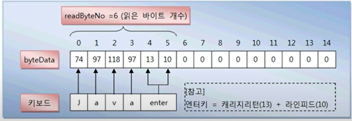

# java.io 패키지
## JAVA의 기본적인 데이터 입출력 API 제공
|java.io 패키지의 주요 클래스|설명|
|---|---|
|File|파일 시스템의 파일의 정보를 얻기 위한 클래스|
|Console|콘솔로부터 문자를 입출력하기 위한 클래스|
|InputStream / OutputStream|바이트 단위 입출력을 위한 최상위 입출력 스트림 클래스|
|FileInputStream / FileOutputStream<br>DataInputStream / DataOutputStream<br>ObjectInputStream / ObjectOutputStream<br>PrintStream<br>BufferedInputStream / BufferedOutputStream|바이트 단위 입출력을 위한 하위 스트림 클래스|
|Reader / Writer|문자 단위 입출력을 위한 최상위 입출력 스트림 클래스|
|FileReader / FileWriter<br>InputStreamReader / OutputStreamWriter<br>PrintWriter<br>BufferedReader / BufferedWriter|문자 단위 입출력을 위한 하위 스트림 클래스|

# 바이트 기반 스트림과 문자 기반 스트림
- 바이트 기반 스트림
    - 그림, 멀티미디어, 문자 등 모든 종류의 데이터를 받고 보낼 수 있다.
- 문자 기반 스트림
    - 문자만 받고 보낼 수 있도록 특화되어 있다.

## InputStream
- 바이트 기반 입력 스트림의 최상위 클래스로 추상 클래스이다.
### InputStream의 주요 메서드
|리턴타입|메서드|설명|
|---|---|---|
|int|read()|입력 스트림으로부터 1바이트를 읽고 읽은 바이트를 리턴한다.|
|int|read(byte[] b)|입력 스트림으로부터 읽은 바이트들을 매개값으로 주어진 바이트 배열 b에 저장하고 실제로 읽은 바이트 수를 리턴한다.|
|int|read(byte[] b, int off, int len)|입력 스트림으로부터 `len`개의 바이트만큼 읽고 매개값으로 주어진 바이트 배열 `b[off]`부터 `len`개까지 저장한다.<br>그리고 실제로 읽은 바이트 수인 `len`개를 리턴한다. 만약 len개를 모두 읽지 못하면 실제로 읽은 바이트 수를 리턴한다.|
|void|close()|사용한 시스템 자원을 반납하고 입력 스트림을 닫는다.|

#### read() 메서드
```java
InputStream is = new FileInputStream("C:/test.txt");
int readByte;   // input stream으로 부터 읽은 데이터가 저장됨
while((readByte = is.read()) != -1) { // "abcde"인 5byte의 데이터를 읽으면 5번 실행됨.
    System.out.println(readByte);
} 
is.close();
```
output
```
97
98
99
100
101
```
- `read()` 메서드는 더이상 읽을 데이터가 없으면 -1을 리턴
    - 매개변수가 없는 `read()` 메서드는 읽은 데이터를 리턴

#### read(byte[] b) 메서드
```java
InputStream is = new FileInputStream("C:/test.txt"); // "abcde"인 5byte 저장되어있다고 가정
int readByteNo;
byte[] readBytes = new byte[3];
String data = "";

while((readByteNo = is.read(readBytes)) != -1) {
    System.out.println("readByteNo = " + readByteNo);
    if(readByteNo == -1) break;
    data += new String(readBytes, 0, readByteNo); // 배열의 0부터 readByteNo 인덱스까지를 계속 저장
}

System.out.println("data = " + data);
is.close();
```
output
```
readByteNo = 3
readByteNo = 2
data = abcde
```
- 매개변수가 있는 `read(byte[] b)` 메서드는 읽은 바이트 수를 리턴하고, 읽은 데이터는 byte배열 b에 저장

#### read(byte[] b, int off, int len) 메서드
- `int off`: 시작 인덱스, `int len`: 길이
- len만큼 읽어서 b의 off 인덱스부터 저장해라
```java
InputStream is = new FileInputStream("C:/test.txt");
int readByteNo;
byte[] readBytes = new byte[8];
readByteNo = is.read(readBytes, 2, 3);
for(int i = 0; i < readBytes.length; i++>) {
    System.out.println(readBytes[i]);
}
is.close();
```
output
```
0
0
97
98
99
0
0
0
```

#### close() 메서드
- InputStream을 더 이상 사용하지 않을 경우 호출해준다.
- InputStream에서 사용했던 시스템 자원을 풀어준다.

## OutputStream
- 바이트 기반 출력 스트림의 최상위 클래스로 추상 클래스이다.
### OutputStream의 주요 메서드
|리턴타입|메서드|설명|
|---|---|---|
|void|write(int b)|출력 스트림으로 1바이트를 보낸다.|
|void|write(byte[] b)|출력 스트림에 매개값으로 주어진 바이트 배열 b의 바이트를 보낸다.|
|void|write(byte[] b, int off, int len)|출력 스트림에 매개값으로 주어진 바이트 배열 b[off] 부터 len개까지의 바이트를 보낸다.|
|void|**flush()**|버퍼에 잔류하는 모든 바이트를 출력한다.|
|void|close()|사용한 시스템 자원을 반납하고 출력 스트림을 닫는다.|

#### write(int b) 메서드
```java
OutputStream os = new FileOutputStream("C:/test.txt");   // 데이터가 저장될 파일 경로
byte[] data = "ABC".getBytes();
for(int i = 0; i < data.length; i++) {
    os.write(data[i])   // "A", "B", "C"를 하나씩 출력
}
os.flush(); // 버퍼에 남아있는 데이터를 마저 출력시켜야함
os.close();
```
#### write(byte[] b) 메서드
```java
OutputStream os = new FileOutputStream("C:/test.txt");
byte[] data = "ABC".getBytes();
os.write(data);
os.flush();
os.close();
```
- 위의 메서드보다 더 효율적임
#### write(byte[] b, int off, int len) 메서드
```java
OutputStream os = new FileOutputStream("C:/test.txt");
byte[] data = "ABC".getBytes();
os.write(data, 1, 2); // "BC"만 출력
os.flush();
os.close();
```

## Reader
- 문자 기반 입력 스트림의 최상위 클래스로 추상 클래스이다.
- 하나의 문자는 2byte로 구성.
### Reader의 주요 메서드
|리턴타입|메서드|설명|
|---|---|---|
|int|read()|입력 스트림으로부터 1개의 문자를 읽고 리턴한다.|
|int|read(char[] cbuf)|입력 스트림으로부터 읽은 문자들을 매개값으로 주어진 배열 cbuf에 저장하고 실제로 읽은 문자 수를 리턴한다.|
|int|read(char[] cbuf, int off, int len)|입력 스트림으로부터 `len`개의 문자를 읽고 매개값으로 주어진 문자 배열 `cbuf[off]`부터 `len`개까지 저장한다.<br>그리고 실제로 읽은 문자 수인 `len`개를 리턴한다. |
|void|close()|사용한 시스템 자원을 반납하고 입력 스트림을 닫는다.|

#### read() 메서드
```java
Reader reader = new FileReader("C:/test.txt");  // "AB"
int readData;
while((readData = reader.read()) != -1) {
    char charData = (char) readData; // byte to char
    System.out.print(charData); // "AB"
}

reader.close();
```
#### read(char[] cbuf) 메서드
```java
Reader reader = new FileReader("C:/test.txt");  // "ABC"
int readCharNo;
char[] cbuf = new char[2];
String data = "";
while((readCharNo = reader.read(cbuf)) != -1) {
    data += new String(cbuf, 0, readCharNo);
}
System.out.println(data);

reader.close();
```
#### read(char[] cbuf, int off, int len)
```java
Reader reader = new FileReader("C:/test.txt");  // "ABC"
int readCharNo;
char[] cbuf = new char[4];
readCharNo = reader.read(cbuf, 1, 2);
for(int i = 0; i < cbuf.length; i++) {
    System.out.println(cbuf[i]);
}
reader.close();
```
output
```

A
B

```

## Writer
- 문자 기반 출력 스트림의 최상위 클래스로 추상 클래스이다.
### Writer의 주요 메서드
|리턴타입|메서드|설명|
|---|---|---|
|void|write(int c)|출력 스트림으로 매개값으로 주어진 한 문자를 보낸다.|
|void|write(char[] cbuf)|출력 스트림에 매개값으로 주어진 문자 배열 cbuf의 문자를 보낸다.|
|void|write(char[] cbuf, int off, int len)|출력 스트림에 매개값으로 주어진 문자 배열 cbuf[off] 부터 len개까지의 바이트를 보낸다.|
|void|write(String str)|출력 스트림에 매개값으로 주어진 문자열을 전부 보낸다.|
|void|write(String str, int off, int len)|출력 스트림에 매개값으로 주어진 문자열 off인덱스부터 len개까지의 문자를 보낸다.|
|void|**flush()**|버퍼에 잔류하는 모든 문자열을 출력한다.|
|void|close()|사용한 시스템 자원을 반납하고 출력 스트림을 닫는다.|

#### write(int c) 메서드
```java
Writer writer = new FileWriter("C:/test.txt");
char[] data = "홍길동".toCharArray();
for(int i = 0; i < data.length; i++) {
    writer.write(data[i]);
}   // "홍길동"

writer.flush();
writer.close();
```

output
```
// test.txt
홍길동
```

#### write(char[] cbuf) 메서드
```java
Writer writer = new FileWriter("C:/test.txt");
char[] data = "홍길동".toCharArray();
writer.write(data); // "홍길동"

writer.flush();
writer.close();
```


#### write(char[] cbuf, int off, int len) 메서드
```java
Writer writer = new FileWriter("C:/test.txt");
char[] data = "홍길동".toCharArray();
writer.write(data, 1, 2); // "길동"

writer.flush();
writer.close();
```

#### write(String str) 메서드
```java
Writer writer = new FileWriter("C:/test.txt");

String data = "안녕 자바 프로그램";
writer.write(data); // "안녕 자바 프로그램"

writer.flush();
writer.close();
```

#### write(String str, int off, int len) 메서드
```java
Writer writer = new FileWriter("C:/test.txt");

String data = "안녕 자바 프로그램";
writer.write(data, 3, 2); // "자바"

writer.flush();
writer.close();
```

# 콘솔 입출력
- 시스템을 사용하기 위해 키보드로 입력을 받고 화면으로 출력하는 소프트웨어
    - Unix, Linux: 터미널
    - Windows: 명령 프롬프트
    - 이클립스: Console 뷰
## `System.in` 필드
- InputStream 타입의 입력 스트림이므로 InputStream 변수에 대입할 수 있다.
`InputStream is = System.in;`
- 읽은 byte는 키보드의 아스키 코드이다.
`int asciiCode = is.read();`
- 아스키 코드로부터 문자 읽기
`char inputChar = (char) is.read();`
## 키보드로부터 입력된 한글 읽기

```java
byte[] byteData = new byte[15];
int readByteNo = System.in.read(byteData);  // byteData에 실제로 읽은 바이트가 저장됨
```


```java
String strData = new String(byteData, 0, readByteNo - 2); // new String(바이트배열, 시작인덱스, 읽은바이트수-2)
```

## `System.out` 필드
- PrintStream 타입의 출력 스트림이므로 OutputStream으로 타입 변환할 수 있다.
`OutputStream os = System.out;`
- 아스키 코드를 출력하면 콘솔에는 문자가 출력된다.
```java
byte b = 97;
os.write(b);
os.flush();
```
- 문자열을 출력하려면 바이트 배열을 얻어야 한다.
```java
String name = "홍길동";
byte[] nameBytes = name.getBytes();
os.write(nameBytes); // 바이트 배열의 모든 바이트를 콘솔에 출력
os.flush();
```
### 예제
```java
OutputStream os = System.out;
for(byte b = 48; b < 58; b++>) {
    os.write(b);
}

os.write(13); // 개행

for(byte b = 97; b < 123; b++>) {
    os.write(b);
}

os.write(13); // 개행

String hangul = "가나다라마바사아자차카타파하"
byte[] hangulBytes = hangul.getBytes();
os.write(hangulBytes);

os.flush();
```
output
```
0123456789
abcdefghijklmnopqrstuvwxyz
가나다라마바사아자차카타파하
```
## Console 클래스
- 자바6부터 콘솔에서 입력된 문자열을 쉽게 읽을 수 있도록 Console 클래스 제공
`Console console = System.console();`
    - 이클립스에서 System.console()은 null을 리턴하기 때문에 반드시 명령 프롬프트에서 실행해야 한다.

- Console의 읽기

|리턴타입|메서드|설명|
|---|---|---|
|String|readLine()|엔터키를 입력하기 전의 모든 문자열을 읽음|
|char[]|readPassword()|키보드 입력 문자를 콘솔에 보여주지 않고 문자열을 읽음|

### 예제
```java
Console console = System.console();

System.out.println("아이디: ");
String id = console.readLine();

System.out.print("패스워드: ");
char[] charPass = console.readPassword();
String strPassword = new String(charPass);
```

## Scanner 클래스
- Console 클래스의 단점
    - 문자열은 읽을 수 있지만 기본 타입(정수, 실수)값을 바로 읽을 수는 없다.
- java.util.Scanner
    - 콘솔로부터 기본 타입의 값을 바로 읽을 수 있다.
`Scanner scanner = new Scanner(System.in);`
### 제공하는 메서드

|리턴타입|메서드|설명|
|---|---|---|
|boolean|nextBoolean()|boolean(true/false) 값을 읽는다.|
|byte|nextByte()|byte 값을 읽는다.|
|short|nextShort()|short 값을 읽는다.|
|int|nextInt()|int 값을 읽는다.|
|long|nextLong()|long 값을 읽는다.|
|float|nextFloat()|float 값을 읽는다.|
|double|nextDouble()|double 값을 읽는다.|
|String|nextLine()|String 값을 읽는다.|


# 파일 입출력
## File 클래스
- 파일 시스템의 파일을 표현하는 클래스
    - 파일 크기, 파일 속성, 파일 이름등의 정보 제공
    - 파일 생성 및 삭제 기능 제공
    - 디렉토리를 생성하고 디렉토리에 존재하는 파일 리스트를 얻어내는 기능 제공
- 파일 객체 생성
```java
File file = new File("C:\\Temp\\file.txt"); 
File file = new File("C:/Temp/file.txt");
```
- 파일 또는 디렉토리 존재 유무 확인 메서드
`boolean isExist = file.exists();`
- 파일 및 디렉토리 생성 및 삭제 메서드

|리턴타입|메서드|설명|
|---|---|---|
|boolean|createNewFile()|새로운 파일을 생성|
|boolean|mkdir()|새로운 디렉토리를 생성|
|boolean|mkdirs()|경로상에 없는 모든 디렉토리를 생성|
|boolean|delete()|파일 또는 디렉토리 삭제|

- 파일 및 디렉토리의 정보를 리턴하는 메서드

|리턴타입|메서드|설명|
|---|---|---|
|boolean|canExecute()|실행할 수 있는 파일인지 여부|
|boolean|canRead()|읽을 수 있는 파일인지 여부|
|boolean|canWrite()|수정 및 저장할 수 있는 파일인지 여부|
|String|getName()|파일의 이름을 리턴|
|String|getParent()|부모 디렉토리를 리턴|
|File|getParentFile()|부모 디렉토리를 File 객체로 생성 후 리턴|
|String|getPath()|전체 경로를 리턴|
|boolean|isDirectory()|디렉토리인지 여부|
|boolean|isFile()|파일인지 여부|
|boolean|isHidden()|숨김 파일인지 여부|
|long|lastModified()|마지막 수정 날짜 및 시간을 리턴|
|long|length()|파일의 크기 리턴|
|String[]|list()|디렉토리에 포함된 파일 및 서브디렉토리 목록 전부를 String 배열로 리턴|
|String[]|list(FilenameFilter filter)|디렉토리에 포함된 파일 및 서브디렉토리 목록 중에 FilenameFilter에 맞는 것만 String 배열로 리턴|
|File[]|listFiles()|디렉토리에 포함된 파일 및 서브디렉토리 목록 전부를 File 배열로 리턴|
|File[]|listFiles(FilenameFilter filter)|디렉토리에 포함된 파일 및 서브디렉토리 목록 중에 FilenameFilter에 맞는 것만 File 배열로 리턴|


```java
File dir = new File("C:/Temp/Dir");
File file1 = new File("C:/Temp/file1.txt");
File file2 = new File("C:/Temp/file2.txt");
File file3 = new File(new URI("file:///C:/Temp/file3.txt"));
```


```